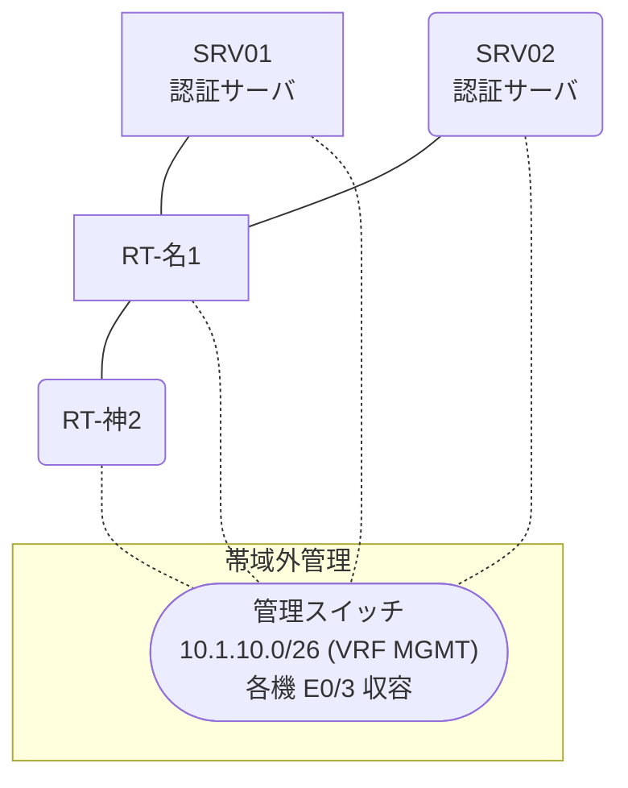

# 問題 20260808-062

> **本問は機器に接続せずに解答すること。追加の show 実行は認めない。**

## シナリオ

あなたは、下記のネットワークの保守を担当する技術者です。2 つの拠点のルータが、共通の認証サーバ群を用いて、管理者の認証を行うように構成されています。一方のルータはサーバと直結しており、他方はそのルーターを経由してサーバに到達します。通信の一部において、想定されていない挙動が、観測されています。あなたは、提示されているところの情報のみを使用して、要求されている状態が満たされていない理由を、特定しなければなりません。名古屋・神戸 の両拠点で、利用者 noc-hanako が権限レベル 15 で機器を操作できること。既定の方式リストは変更しないこと。認証は認証サーバ群 AAA-SRV を用いること。



### 認証サーバの仕様

| 項目 | SRV01 | SRV02 |
|---|---|---|
| アドレス | 10.99.46.2 | 10.99.47.2 |
| 待受ポート | 1812 / 1813 | 1645 / 1646 |
| 共有鍵 | Sh4red-Key | Sh4red-Key |
| 受理する送信元 | 10.4.0.1 ・ 10.6.0.2 | 同左 |
| 台帳 | noc-hanako(15) ・ helpdesk(1) ・ SUZUKI(15) | 同左 |
| 現在の稼働状態 | 稼働中 | 稼働中 |

### ルータのアドレス

| ルータ | Loopback0 | 認証サーバ方向のインタフェース |
|---|---|---|
| RT-名1(名古屋) | 10.4.0.1 | Ethernet0/0 = 10.99.46.1 |
| RT-神2(神戸) | 10.6.0.2 | Ethernet0/0 = 10.20.12.2 |

## 出力

| 拠点 | ユーザ | 結果 |
|---|---|---|
| 名古屋 | noc-hanako | ログイン可(権限レベル 15) |
| 名古屋 | helpdesk | ログイン可(権限レベル 1) |
| 名古屋 | emg-admin | ログイン不可 |
| 名古屋 | helpdesk からの特権昇格 | 昇格可(15) |
| 名古屋 | noc-hanako(6 セッション目以降) | ログイン可(権限レベル 15) |
| 名古屋 | emg-admin(コンソールから) | ログイン可(権限レベル 15) |
| 神戸 | noc-hanako | ログイン不可 |
| 神戸 | helpdesk | ログイン不可 |
| 神戸 | emg-admin | ログインは通るが exec 拒否 |
| 神戸 | noc-hanako(6 セッション目以降) | ログイン不可 |
| 神戸 | emg-admin(コンソールから) | ログイン可(権限レベル 15) |

認証サーバがすべて停止した場合:

| 拠点 | ユーザ | 結果 |
|---|---|---|
| 名古屋 | emg-admin | ログイン可(権限レベル 15) |
| 名古屋 | SUZUKI | ログイン可(権限レベル 15) |
| 名古屋 | emg-admin(コンソールから) | ログイン可(権限レベル 15) |
| 神戸 | emg-admin | ログイン可(権限レベル 15) |
| 神戸 | SUZUKI | ログイン可(権限レベル 15) |
| 神戸 | emg-admin(コンソールから) | ログイン可(権限レベル 15) |

```
RT-名1# show running-config | section aaa
aaa new-model
!
radius server RAD1
 address ipv4 10.99.46.2 auth-port 1812 acct-port 1813
 key Sh4red-Key
!
radius server RAD2
 address ipv4 10.99.47.2 auth-port 1645 acct-port 1646
 key Sh4red-Key
!
aaa group server radius AAA-SRV
 server name RAD1
 server name RAD2
 deadtime 5
!
aaa authentication login default group AAA-SRV local
aaa authentication login CONSOLE local
aaa authorization exec default group AAA-SRV local
aaa authorization exec CONSOLE local
aaa authorization console
!
ip radius source-interface Loopback0
radius-server timeout 2
radius-server retransmit 1
!
username emg-admin privilege 15 secret 5 $1$xxxx
username SUZUKI privilege 15 secret 5 $1$yyyy
!
line con 0
 exec-timeout 0 0
 logging synchronous
 login authentication CONSOLE
 authorization exec CONSOLE
line vty 0 4
 exec-timeout 0 0
 transport input ssh
line vty 5 15
 exec-timeout 0 0
 transport input ssh
```
```
RT-神2# show running-config | section aaa
aaa new-model
!
radius server RAD1
 address ipv4 10.99.46.2 auth-port 1812 acct-port 1813
 key Sh4red-Key
!
radius server RAD2
 address ipv4 10.99.47.2 auth-port 1645 acct-port 1646
 key Sh4red-Key
!
aaa group server radius AAA-SRV
 server name RAD1
 server name RAD2
 deadtime 5
!
aaa authentication login default local
aaa authentication login CONSOLE local
aaa authentication login MGMT group AAA-SRV local
aaa authorization exec default group AAA-SRV local
aaa authorization exec CONSOLE local
aaa authorization console
!
ip radius source-interface Loopback0
radius-server timeout 2
radius-server retransmit 1
!
username emg-admin privilege 15 secret 5 $1$xxxx
username SUZUKI privilege 15 secret 5 $1$yyyy
!
line con 0
 exec-timeout 0 0
 logging synchronous
 login authentication CONSOLE
 authorization exec CONSOLE
line vty 0 4
 exec-timeout 0 0
 transport input ssh
line vty 5 15
 exec-timeout 0 0
 transport input ssh
```
```
名古屋: User was successfully authenticated. (即時)
神戸: User was successfully authenticated. (即時)
```

## 設問

次のうち、正しいものは、どれですか。

## 選択肢
A. アクセスリストが、認証サーバからの応答を遮断している。

B. 作成した方式リストが回線に適用されていない。

C. 認証要求の送信元アドレスが、サーバ側で許可された値になっていない。

D. exec の認可の代替手段が、権限レベルを与えないものになっている。
