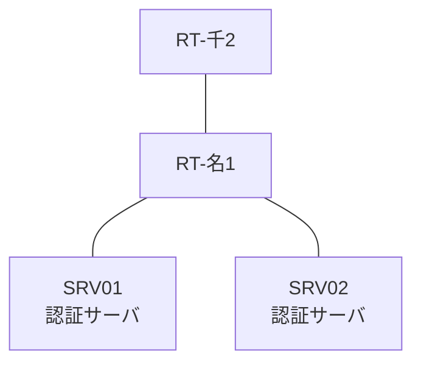

# 問題 20260808-065

> **本問は機器に接続せずに解答すること。追加の show 実行は認めない。**

## シナリオ

あなたの組織は、下記に示されているところのネットワークを運用しています。2 つの拠点のルータが、共通の認証サーバ群を用いて、管理者の認証を行うように構成されています。一方のルータはサーバと直結しており、他方はそのルーターを経由してサーバに到達します。一部の通信が、意図されているとおりに動作していない、という報告があります。示されているところの出力および構成に基づいて、要求されているところの動作が得られていない理由が、判断されなければなりません。名古屋・千葉 の両拠点で、利用者 adm-kato が権限レベル 15 で機器を操作できること。認証サーバ側の設定は変更できない。認証は認証サーバ群 AAA-SRV を用いること。



### 認証サーバの仕様

| 項目 | SRV01 | SRV02 |
|---|---|---|
| アドレス | 10.99.204.2 | 10.99.205.2 |
| 待受ポート | 1812 / 1813 | 11812 / 11813 |
| 共有鍵 | Sh4red-Key | Sh4red-Key |
| 受理する送信元 | 10.1.0.1 ・ 10.4.0.2 | 同左 |
| 台帳 | adm-kato(15) ・ desk-01(1) ・ SUZUKI(15) | 同左 |
| 現在の稼働状態 | 稼働中 | 稼働中 |

### ルータのアドレス

| ルータ | Loopback0 | 認証サーバ方向のインタフェース |
|---|---|---|
| RT-名1(名古屋) | 10.1.0.1 | Ethernet0/0 = 10.99.204.1 |
| RT-千2(千葉) | 10.4.0.2 | Ethernet0/0 = 10.23.12.2 |

## 出力

```
RT-千2# debug radius authentication
RADIUS: Pick NAS IP for u=0x7605 tableid=0 cfg_addr=10.4.0.2
RADIUS(00000000): Send Access-Request to 10.99.204.2:1812 id 1645/119, len 60
RADIUS:  NAS-IP-Address      [4]   6   10.4.0.2
RADIUS:  User-Name           [1]   10  "adm-kato"
RADIUS:  User-Password       [2]   18  *
RADIUS(00000000): Started 2 sec timeout
RADIUS: Received from id 1645/119 10.99.204.2:1812, Access-Reject, len 38
RADIUS: response-authenticator decrypt fail, pak len 38
RADIUS: message-authenticator decrypt fail, pak len 38
RADIUS: Response (119) failed decrypt
RADIUS(00000000): Request timed out!
RADIUS: Retransmit to (10.99.204.2:1812,1813) for id 1645/119
RADIUS(00000000): Started 2 sec timeout
RADIUS: Received from id 1645/119 10.99.204.2:1812, Access-Reject, len 38
RADIUS: Response (119) failed decrypt
RADIUS(00000000): Request timed out!
RADIUS: Retransmit to (10.99.204.2:1812,1813) for id 1645/119
RADIUS(00000000): Started 2 sec timeout
RADIUS: Received from id 1645/119 10.99.204.2:1812, Access-Reject, len 38
RADIUS: Response (119) failed decrypt
RADIUS(00000000): Request timed out!
RADIUS: Fail-over to (10.99.205.2:11812,11813) for id 1645/119
RADIUS(00000000): Started 2 sec timeout
RADIUS: Received from id 1645/119 10.99.205.2:11812, Access-Reject, len 38
RADIUS: response-authenticator decrypt fail, pak len 38
RADIUS: message-authenticator decrypt fail, pak len 38
RADIUS: Response (119) failed decrypt
RADIUS(00000000): Request timed out!
RADIUS: Retransmit to (10.99.205.2:11812,11813) for id 1645/119
RADIUS(00000000): Started 2 sec timeout
RADIUS: Received from id 1645/119 10.99.205.2:11812, Access-Reject, len 38
RADIUS: Response (119) failed decrypt
RADIUS(00000000): Request timed out!
RADIUS: Retransmit to (10.99.205.2:11812,11813) for id 1645/119
RADIUS(00000000): Started 2 sec timeout
RADIUS: Received from id 1645/119 10.99.205.2:11812, Access-Reject, len 38
RADIUS: Response (119) failed decrypt
RADIUS(00000000): Request timed out!
RADIUS: No response from server
```

## 設問

次のうち、正しいものは、どれですか。

## 選択肢
A. 要求の再送は 1 回の送信につき 4 回行われる。

B. 認証要求の送信元となるインタフェースが、明示的に指定されている。

C. 1 台目の認証サーバとして 10.99.204.2 のポート 1645 が設定されている。

D. 認証要求の送信元となるインタフェースは、明示的に指定されていない。
