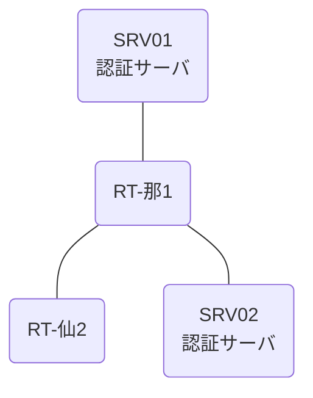

# 問題 20260809-001

> **本問は機器に接続せずに解答すること。追加の show 実行は認めない。**

## シナリオ

あなたの組織は、下記に示されているところのネットワークを運用しています。2 つの拠点のルータが、共通の認証サーバ群を用いて、管理者の認証を行うように構成されています。一方のルータはサーバと直結しており、他方はそのルーターを経由してサーバに到達します。特権レベルへの昇格が試行された際の、デバッグの出力が、採取されました。那覇・仙台 の両拠点で、利用者 adm-kato が権限レベル 15 で機器を操作できること。認証サーバが全て停止した場合でも、コンソールからは操作できること。認証は認証サーバ群 RADGRP を用いること。



### 認証サーバの仕様

| 項目 | SRV01 | SRV02 |
|---|---|---|
| アドレス | 10.99.106.2 | 10.99.107.2 |
| 待受ポート | 1812 / 1813 | 1912 / 1913 |
| 共有鍵 | K-9931 | K-9931 |
| 受理する送信元 | 10.6.0.1 ・ 10.9.0.2 | 同左 |
| 台帳 | adm-kato(15) ・ monitor-op(1) ・ SUZUKI(15) | 同左 |
| 現在の稼働状態 | 稼働中 | 稼働中 |

### ルータのアドレス

| ルータ | Loopback0 | 認証サーバ方向のインタフェース |
|---|---|---|
| RT-那1(那覇) | 10.6.0.1 | Ethernet0/0 = 10.99.106.1 |
| RT-仙2(仙台) | 10.9.0.2 | Ethernet0/0 = 10.67.12.2 |

## 出力

```
RT-仙2# debug aaa authentication
AAA/AUTHEN/START (2269920271): port='tty0' list='' action=LOGIN service=ENABLE
AAA/AUTHEN/START (2269920271): console enable - default to enable password (if any)
AAA/AUTHEN/START (2269920271): Method=ENABLE
AAA/AUTHEN (2269920271): status = GETPASS
AAA/AUTHEN/CONT (2269920271): continue_login (user='(undef)')
AAA/AUTHEN (2269920271): status = GETPASS
AAA/AUTHEN/CONT (2269920271): Method=ENABLE
AAA/AUTHEN (2269920271): status = PASS
```
```
RT-仙2# show running-config | section aaa
aaa new-model
!
aaa group server radius RADGRP
 server name RAD1
 server name RAD2
 deadtime 5
!
aaa authentication login default group RADGRP local
aaa authorization exec default group RADGRP local
```

## 設問

示されているところの出力について、正しい記述は、どれですか。(2つを選択してください)

## 選択肢
A. 特権レベルへの昇格は失敗している。

B. 特権レベルへの昇格の認証について、方式リストが構成されていない。

C. この操作は、コンソール以外の回線から行われている。

D. method2 は試行されていない。
