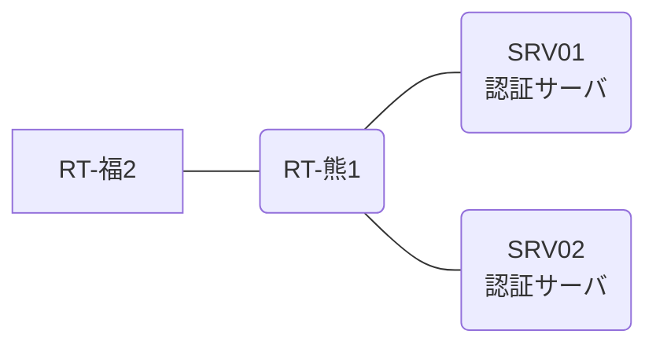

# 問題 20260809-002

> **本問は機器に接続せずに解答すること。追加の show 実行は認めない。**

## シナリオ

あなたの組織は、下記に示されているところのネットワークを運用しています。2 つの拠点のルータが、共通の認証サーバ群を用いて、管理者の認証を行うように構成されています。一方のルータはサーバと直結しており、他方はそのルーターを経由してサーバに到達します。特権レベルへの昇格が試行された際の、デバッグの出力が、採取されました。熊本・福岡 の両拠点で、利用者 noc-hanako が権限レベル 15 で機器を操作できること。既定の方式リストは変更しないこと。認証は認証サーバ群 AAA-SRV を用いること。



### 認証サーバの仕様

| 項目 | SRV01 | SRV02 |
|---|---|---|
| アドレス | 10.99.230.2 | 10.99.231.2 |
| 待受ポート | 1812 / 1813 | 11812 / 11813 |
| 共有鍵 | Rad-8102 | Rad-8102 |
| 受理する送信元 | 10.1.0.1 ・ 10.9.0.2 | 同左 |
| 台帳 | noc-hanako(15) ・ helpdesk(1) ・ SUZUKI(15) | 同左 |
| 現在の稼働状態 | 保守作業のため停止中 | 保守作業のため停止中 |

### ルータのアドレス

| ルータ | Loopback0 | 認証サーバ方向のインタフェース |
|---|---|---|
| RT-熊1(熊本) | 10.1.0.1 | Ethernet0/0 = 10.99.230.1 |
| RT-福2(福岡) | 10.9.0.2 | Ethernet0/0 = 10.73.12.2 |

## 出力

```
RT-福2# debug aaa authentication
AAA/AUTHEN/START (2070617200): port='tty3' list='' action=LOGIN service=ENABLE
AAA/AUTHEN/START (2070617200): using "default" list
AAA/AUTHEN/START (2070617200): Method=AAA-SRV (radius)
AAA/AUTHEN (2070617200): status = GETPASS
AAA/AUTHEN/CONT (2070617200): continue_login (user='helpdesk')
AAA/AUTHEN (2070617200): status = GETPASS
AAA/AUTHEN (2070617200): Method=AAA-SRV (radius)
AAA/AUTHEN (2070617200): status = ERROR
AAA/AUTHEN/START (585061336): port='tty3' list='' action=LOGIN service=ENABLE
AAA/AUTHEN/START (585061336): Restart
AAA/AUTHEN/START (585061336): Method=ENABLE
AAA/AUTHEN (585061336): status = GETPASS
AAA/AUTHEN/CONT (585061336): continue_login (user='(undef)')
AAA/AUTHEN (585061336): status = GETPASS
AAA/AUTHEN/CONT (585061336): Method=ENABLE
AAA/AUTHEN(585061336): password incorrect
AAA/AUTHEN (585061336): status = FAIL
```
```
RT-福2# show running-config | section aaa
aaa new-model
!
aaa group server radius AAA-SRV
 server name RAD1
 server name RAD2
 deadtime 5
!
aaa authentication login default group AAA-SRV local
aaa authorization exec default group AAA-SRV local
aaa authentication enable default group AAA-SRV enable
```

## 設問

示されているところの出力について、正しい記述は、どれですか。(2つを選択してください)

## 選択肢
A. この操作は、コンソール以外の回線から行われている。

B. 特権レベルへの昇格の認証について、方式リストが構成されていない。

C. 特権レベルへの昇格は成功している。

D. method2 として enable パスワードによる認証が試行され、失敗している。
