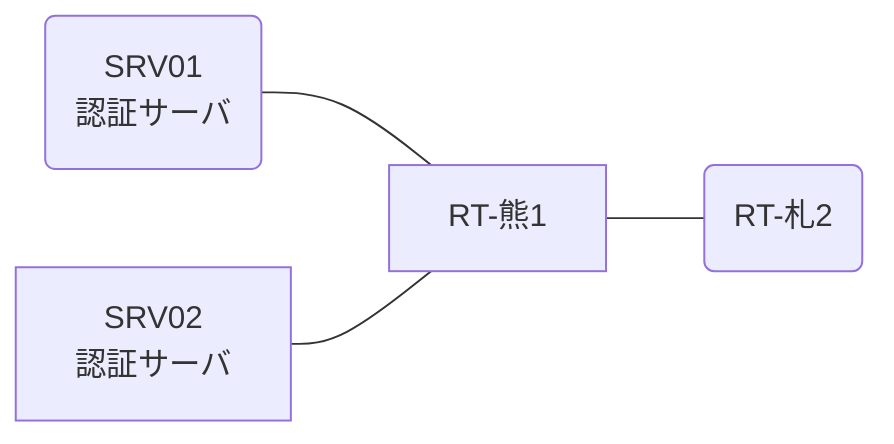

# 問題 20260809-003

> **本問は機器に接続せずに解答すること。追加の show 実行は認めない。**

## トポロジ

あなたは、下記のネットワークの保守を担当する技術者です。2 つの拠点のルータが、共通の認証サーバ群を用いて、管理者の認証を行うように構成されています。一方のルータはサーバと直結しており、他方はそのルーターを経由してサーバに到達します。



### 認証サーバの仕様

| 項目 | SRV01 | SRV02 |
|---|---|---|
| アドレス | 10.99.178.2 | 10.99.179.2 |
| 待受ポート | 1812 / 1813 | 1645 / 1646 |
| 共有鍵 | Sh4red-Key | Sh4red-Key |
| 受理する送信元 | 10.9.0.1 ・ 10.5.0.2 | 同左 |
| 台帳 | noc-taro(15) ・ monitor-op(1) ・ SUZUKI(15) | 同左 |
| 現在の稼働状態 | 保守作業のため停止中 | 稼働中 |

### ルータのアドレス

| ルータ | Loopback0 | 認証サーバ方向のインタフェース |
|---|---|---|
| RT-熊1(熊本) | 10.9.0.1 | Ethernet0/0 = 10.99.178.1 |
| RT-札2(札幌) | 10.5.0.2 | Ethernet0/0 = 10.27.12.2 |

## 要件

1. 熊本・札幌 の両拠点で、利用者 noc-taro が権限レベル 15 で機器を操作できること。
2. 認証は認証サーバ群 RAD-GROUP を用いること。
3. 認証サーバ側の設定は変更できない。

## 現在の状態

特権レベルへの昇格が試行された際の、デバッグの出力が、採取されました。

```
RT-札2# debug aaa authentication
AAA/AUTHEN/START (2316538723): port='tty3' list='' action=LOGIN service=ENABLE
AAA/AUTHEN/START (2316538723): using "default" list
AAA/AUTHEN/START (2316538723): Method=RAD-GROUP (radius)
AAA/AUTHEN (2316538723): status = GETPASS
AAA/AUTHEN/CONT (2316538723): continue_login (user='monitor-op')
AAA/AUTHEN (2316538723): status = GETPASS
AAA/AUTHEN (2316538723): Method=RAD-GROUP (radius)
AAA/AUTHEN (2316538723): status = ERROR
AAA/AUTHEN/START (430982859): port='tty3' list='' action=LOGIN service=ENABLE
AAA/AUTHEN/START (430982859): Restart
AAA/AUTHEN/START (430982859): Method=ENABLE
AAA/AUTHEN (430982859): status = GETPASS
AAA/AUTHEN/CONT (430982859): continue_login (user='(undef)')
AAA/AUTHEN (430982859): status = GETPASS
AAA/AUTHEN/CONT (430982859): Method=ENABLE
AAA/AUTHEN (430982859): status = PASS
```

## 設定抜粋

```
RT-札2# show running-config | section aaa
aaa new-model
!
aaa group server radius RAD-GROUP
 server name RAD1
 server name RAD2
 deadtime 5
!
aaa authentication login default group RAD-GROUP local
aaa authorization exec default group RAD-GROUP local
aaa authentication enable default group RAD-GROUP enable
```

## 設問

示されているところの出力について、正しい記述は、どれですか。(2つを選択してください)

## 選択肢
A. method1 として認証サーバ群 RAD-GROUP への問い合わせが行われ、サーバから拒否されている。

B. 特権レベルへの昇格は成功している。

C. method2 として enable パスワードによる認証が試行され、成功している。

D. 特権レベルへの昇格の認証について、方式リストが構成されていない。
