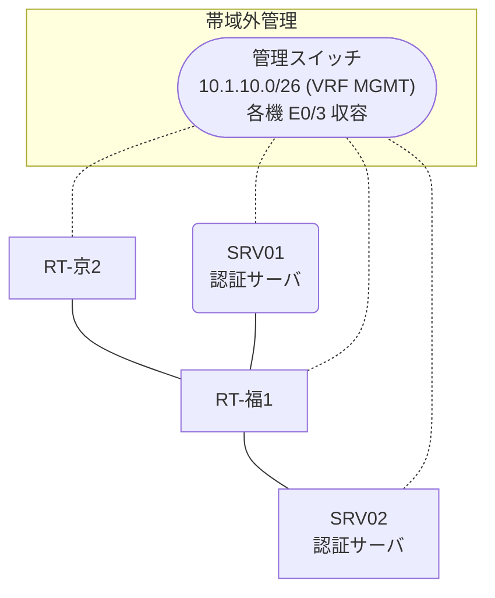

# 問題 20260809-005

> **本問は機器に接続せずに解答すること。追加の show 実行は認めない。**

## シナリオ

あなたは、ネットワークの運用を担当しています。2 つの拠点のルータが、共通の認証サーバ群を用いて、管理者の認証を行うように構成されています。一方のルータはサーバと直結しており、他方はそのルーターを経由してサーバに到達します。特権レベルへの昇格が試行された際の、デバッグの出力が、採取されました。福岡・京都 の両拠点で、利用者 noc-taro が権限レベル 15 で機器を操作できること。認証は認証サーバ群 RADGRP を用いること。認証サーバが全て停止した場合でも、コンソールからは操作できること。



### 認証サーバの仕様

| 項目 | SRV01 | SRV02 |
|---|---|---|
| アドレス | 10.99.13.2 | 10.99.14.2 |
| 待受ポート | 1812 / 1813 | 1912 / 1913 |
| 共有鍵 | K-9931 | K-9931 |
| 受理する送信元 | 10.0.0.1 ・ 10.3.0.2 | 同左 |
| 台帳 | noc-taro(15) ・ watch-op(1) ・ SUZUKI(15) | 同左 |
| 現在の稼働状態 | 保守作業のため停止中 | 稼働中 |

### ルータのアドレス

| ルータ | Loopback0 | 認証サーバ方向のインタフェース |
|---|---|---|
| RT-福1(福岡) | 10.0.0.1 | Ethernet0/0 = 10.99.13.1 |
| RT-京2(京都) | 10.3.0.2 | Ethernet0/0 = 10.78.12.2 |

## 出力

```
RT-京2# debug aaa authentication
AAA/AUTHEN/START (1576935994): port='tty3' list='' action=LOGIN service=ENABLE
AAA/AUTHEN/START (1576935994): using "default" list
AAA/AUTHEN/START (1576935994): Method=RADGRP (radius)
AAA/AUTHEN (1576935994): status = GETPASS
AAA/AUTHEN/CONT (1576935994): continue_login (user='watch-op')
AAA/AUTHEN (1576935994): status = GETPASS
AAA/AUTHEN (1576935994): Method=RADGRP (radius)
AAA/AUTHEN (1576935994): status = FAIL
```
```
RT-京2# show running-config | section aaa
aaa new-model
!
aaa group server radius RADGRP
 server name RAD1
 server name RAD2
 deadtime 5
!
aaa authentication login default group RADGRP local
aaa authorization exec default group RADGRP local
aaa authentication enable default group RADGRP enable
```

## 設問

示されているところの出力について、正しい記述は、どれですか。(2つを選択してください)

## 選択肢
A. method1 として認証サーバ群 RADGRP への問い合わせが行われ、サーバから拒否されている。

B. 特権レベルへの昇格の認証について、方式リストが構成されていない。

C. この操作は、コンソールから行われている。

D. method2 は試行されていない。
