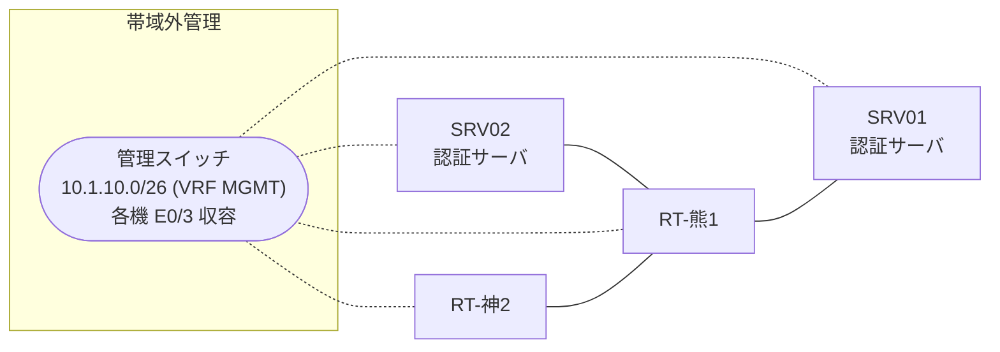

# 問題 20260809-006

> **本問は機器に接続せずに解答すること。追加の show 実行は認めない。**

## トポロジ

あなたは、ネットワークの運用を担当しています。2 つの拠点のルータが、共通の認証サーバ群を用いて、管理者の認証を行うように構成されています。一方のルータはサーバと直結しており、他方はそのルーターを経由してサーバに到達します。



### 認証サーバの仕様

| 項目 | SRV01 | SRV02 |
|---|---|---|
| アドレス | 10.99.38.2 | 10.99.39.2 |
| 待受ポート | 1812 / 1813 | 1912 / 1913 |
| 共有鍵 | K-9931 | K-9931 |
| 受理する送信元 | 10.9.0.1 ・ 10.5.0.2 | 同左 |
| 台帳 | adm-kato(15) ・ desk-01(1) ・ SUZUKI(15) | 同左 |
| 現在の稼働状態 | 保守作業のため停止中 | 保守作業のため停止中 |

### ルータのアドレス

| ルータ | Loopback0 | 認証サーバ方向のインタフェース |
|---|---|---|
| RT-熊1(熊本) | 10.9.0.1 | Ethernet0/0 = 10.99.38.1 |
| RT-神2(神戸) | 10.5.0.2 | Ethernet0/0 = 10.38.12.2 |

## 要件

1. 熊本・神戸 の両拠点で、利用者 adm-kato が権限レベル 15 で機器を操作できること。
2. 認証は認証サーバ群 AAA-SRV を用いること。
3. 緊急時にコンソールから操作できる経路を失わないこと。
4. 運用者の遠隔からの接続が失われないこと。

## 現在の状態

特権レベルへの昇格が試行された際の、デバッグの出力が、採取されました。

```
RT-熊1# debug aaa authentication
AAA/AUTHEN/START (2390570683): port='tty3' list='' action=LOGIN service=ENABLE
AAA/AUTHEN/START (2390570683): using "default" list
AAA/AUTHEN/START (2390570683): Method=AAA-SRV (radius)
AAA/AUTHEN (2390570683): status = GETPASS
AAA/AUTHEN/CONT (2390570683): continue_login (user='desk-01')
AAA/AUTHEN (2390570683): status = GETPASS
AAA/AUTHEN (2390570683): Method=AAA-SRV (radius)
AAA/AUTHEN (2390570683): status = ERROR
AAA/AUTHEN/START (705014819): port='tty3' list='' action=LOGIN service=ENABLE
AAA/AUTHEN/START (705014819): Restart
AAA/AUTHEN/START (705014819): Method=ENABLE
AAA/AUTHEN (705014819): status = GETPASS
AAA/AUTHEN/CONT (705014819): continue_login (user='(undef)')
AAA/AUTHEN (705014819): status = GETPASS
AAA/AUTHEN/CONT (705014819): Method=ENABLE
AAA/AUTHEN (705014819): status = PASS
```

## 設定抜粋

```
RT-熊1# show running-config | section aaa
aaa new-model
!
aaa group server radius AAA-SRV
 server name RAD1
 server name RAD2
 deadtime 5
!
aaa authentication login default group AAA-SRV local
aaa authorization exec default group AAA-SRV local
aaa authentication enable default group AAA-SRV enable
```

## 設問

示されているところの出力について、正しい記述は、どれですか。(2つを選択してください)

## 選択肢
A. method2 は試行されていない。

B. 特権レベルへの昇格の認証について、方式リストが構成されていない。

C. method1 として認証サーバ群 AAA-SRV への問い合わせが行われ、応答が得られていない。

D. この操作は、コンソール以外の回線から行われている。
