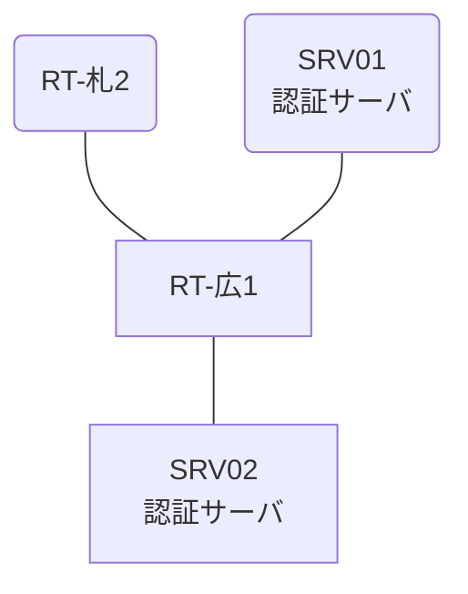

# 問題 20260810-002

> **本問は機器に接続せずに解答すること。追加の show 実行は認めない。**

## シナリオ

あなたは、下記のネットワークの保守を担当する技術者です。2 つの拠点のルータが、共通の認証サーバ群を用いて、管理者の認証を行うように構成されています。一方のルータはサーバと直結しており、他方はそのルーターを経由してサーバに到達します。一部の通信が、意図されているとおりに動作していない、という報告があります。あなたは、示されているところの出力および構成に基づいて、その構成が、下記において記述されているとおりに動作していない理由を、判断する必要があります。広島・札幌 の両拠点で、利用者 netadmin が権限レベル 15 で機器を操作できること。緊急時にコンソールから操作できる経路を失わないこと。運用者の遠隔からの接続が失われないこと。認証は認証サーバ群 AUTH-GRP を用いること。



### 認証サーバの仕様

| 項目 | SRV01 | SRV02 |
|---|---|---|
| アドレス | 10.99.199.2 | 10.99.200.2 |
| 待受ポート | 1812 / 1813 | 1912 / 1913 |
| 共有鍵 | Rad-8102 | Rad-8102 |
| 受理する送信元 | 10.3.0.1 ・ 10.4.0.2 | 同左 |
| 台帳 | netadmin(15) ・ desk-01(1) ・ SUZUKI(15) | 同左 |
| 現在の稼働状態 | 保守作業のため停止中 | 稼働中 |

### ルータのアドレス

| ルータ | Loopback0 | 認証サーバ方向のインタフェース |
|---|---|---|
| RT-広1(広島) | 10.3.0.1 | Ethernet0/0 = 10.99.199.1 |
| RT-札2(札幌) | 10.4.0.2 | Ethernet0/0 = 10.46.12.2 |

## 出力

```
RT-広1# debug radius authentication
RADIUS: Pick NAS IP for u=0x7605 tableid=0 cfg_addr=10.3.0.1
RADIUS(00000000): Send Access-Request to 10.99.199.2:1812 id 1645/119, len 60
RADIUS:  NAS-IP-Address      [4]   6   10.3.0.1
RADIUS:  User-Name           [1]   10  "netadmin"
RADIUS:  User-Password       [2]   18  *
RADIUS(00000000): Started 2 sec timeout
RADIUS(00000000): Request timed out!
RADIUS: Retransmit to (10.99.199.2:1812,1813) for id 1645/119
RADIUS(00000000): Started 2 sec timeout
RADIUS(00000000): Request timed out!
RADIUS: Retransmit to (10.99.199.2:1812,1813) for id 1645/119
RADIUS(00000000): Started 2 sec timeout
RADIUS(00000000): Request timed out!
RADIUS: Fail-over to (10.99.200.2:1912,1913) for id 1645/119
RADIUS(00000000): Started 2 sec timeout
RADIUS: Received from id 1645/119 10.99.200.2:1912, Access-Accept, len 69
RADIUS:  Service-Type        [6]   6   NAS Prompt
RADIUS:   Cisco AVpair       [1]   19  "shell:priv-lvl=15"
```

## 設問

次のうち、正しいものは、どれですか。

## 選択肢
A. 認証要求の送信元となるインタフェースが、明示的に指定されている。

B. 認証要求の送信元となるインタフェースは、明示的に指定されていない。

C. 要求の再送は 1 回の送信につき 4 回行われる。

D. 認証要求の送信元アドレスは 10.3.6.1 である。
