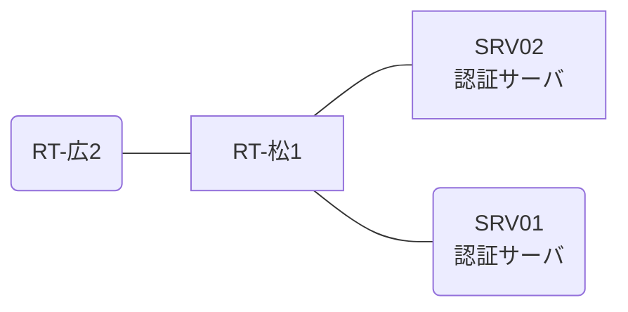

# 問題 20260810-004

> **本問は機器に接続せずに解答すること。追加の show 実行は認めない。**

## シナリオ

あなたは、ネットワークの運用を担当しています。2 つの拠点のルータが、共通の認証サーバ群を用いて、管理者の認証を行うように構成されています。一方のルータはサーバと直結しており、他方はそのルーターを経由してサーバに到達します。認証の動作を確認するために、デバッグの出力が、採取されました。松山・広島 の両拠点で、利用者 netadmin が権限レベル 15 で機器を操作できること。認証は認証サーバ群 NOC-RADIUS を用いること。認証サーバが全て停止した場合でも、コンソールからは操作できること。



### 認証サーバの仕様

| 項目 | SRV01 | SRV02 |
|---|---|---|
| アドレス | 10.99.202.2 | 10.99.203.2 |
| 待受ポート | 1812 / 1813 | 1912 / 1913 |
| 共有鍵 | Rad-8102 | Rad-8102 |
| 受理する送信元 | 10.8.0.1 ・ 10.3.0.2 | 同左 |
| 台帳 | netadmin(15) ・ desk-01(1) ・ SUZUKI(15) | 同左 |
| 現在の稼働状態 | 稼働中 | 稼働中 |

### ルータのアドレス

| ルータ | Loopback0 | 認証サーバ方向のインタフェース |
|---|---|---|
| RT-松1(松山) | 10.8.0.1 | Ethernet0/0 = 10.99.202.1 |
| RT-広2(広島) | 10.3.0.2 | Ethernet0/0 = 10.82.12.2 |

## 出力

```
RT-松1# debug radius authentication
RADIUS: Pick NAS IP for u=0x7605 tableid=0 cfg_addr=10.8.0.1
RADIUS(00000000): Send Access-Request to 10.99.202.2:1812 id 1645/119, len 60
RADIUS:  NAS-IP-Address      [4]   6   10.8.0.1
RADIUS:  User-Name           [1]   10  "netadmin"
RADIUS:  User-Password       [2]   18  *
RADIUS(00000000): Started 5 sec timeout
RADIUS: Received from id 1645/119 10.99.202.2:1812, Access-Reject, len 38
RADIUS: response-authenticator decrypt fail, pak len 38
RADIUS: message-authenticator decrypt fail, pak len 38
RADIUS: Response (119) failed decrypt
RADIUS(00000000): Request timed out!
RADIUS: Retransmit to (10.99.202.2:1812,1813) for id 1645/119
RADIUS(00000000): Started 5 sec timeout
RADIUS: Received from id 1645/119 10.99.202.2:1812, Access-Reject, len 38
RADIUS: Response (119) failed decrypt
RADIUS(00000000): Request timed out!
RADIUS: Retransmit to (10.99.202.2:1812,1813) for id 1645/119
RADIUS(00000000): Started 5 sec timeout
RADIUS: Received from id 1645/119 10.99.202.2:1812, Access-Reject, len 38
RADIUS: Response (119) failed decrypt
RADIUS(00000000): Request timed out!
RADIUS: Fail-over to (10.99.203.2:1912,1913) for id 1645/119
RADIUS(00000000): Started 5 sec timeout
RADIUS: Received from id 1645/119 10.99.203.2:1912, Access-Reject, len 38
RADIUS: response-authenticator decrypt fail, pak len 38
RADIUS: message-authenticator decrypt fail, pak len 38
RADIUS: Response (119) failed decrypt
RADIUS(00000000): Request timed out!
RADIUS: Retransmit to (10.99.203.2:1912,1913) for id 1645/119
RADIUS(00000000): Started 5 sec timeout
RADIUS: Received from id 1645/119 10.99.203.2:1912, Access-Reject, len 38
RADIUS: Response (119) failed decrypt
RADIUS(00000000): Request timed out!
RADIUS: Retransmit to (10.99.203.2:1912,1913) for id 1645/119
RADIUS(00000000): Started 5 sec timeout
RADIUS: Received from id 1645/119 10.99.203.2:1912, Access-Reject, len 38
RADIUS: Response (119) failed decrypt
RADIUS(00000000): Request timed out!
RADIUS: No response from server
```

## 設問

示されているところの出力を生じさせる構成は、どれですか。(1つを選択してください)

## 選択肢
**A.**
```
radius server RAD1
 address ipv4 10.99.202.2 auth-port 1812 acct-port 1813
 key OLD-KEY
!
radius server RAD2
 address ipv4 10.99.203.2 auth-port 1912 acct-port 1913
 key OLD-KEY
!
aaa group server radius NOC-RADIUS
 server name RAD1
 server name RAD2
 deadtime 5
!
radius-server timeout 5
radius-server retransmit 2
```
**B.**
```
radius server RAD1
 address ipv4 10.99.202.2 auth-port 1812 acct-port 1813
 key OLD-KEY
!
radius server RAD2
 address ipv4 10.99.203.2 auth-port 1912 acct-port 1913
 key OLD-KEY
!
aaa group server radius NOC-RADIUS
 server name RAD1
 server name RAD2
 deadtime 5
!
ip radius source-interface Loopback0
radius-server timeout 5
radius-server retransmit 3
```
**C.**
```
radius server RAD1
 address ipv4 10.99.202.2 auth-port 1812 acct-port 1813
 key OLD-KEY
!
radius server RAD2
 address ipv4 10.99.203.2 auth-port 1700 acct-port 1701
 key OLD-KEY
!
aaa group server radius NOC-RADIUS
 server name RAD1
 server name RAD2
 deadtime 5
!
ip radius source-interface Loopback0
radius-server timeout 5
radius-server retransmit 2
```
**D.**
```
radius server RAD1
 address ipv4 10.99.202.2 auth-port 1812 acct-port 1813
 key OLD-KEY
!
radius server RAD2
 address ipv4 10.99.203.2 auth-port 1912 acct-port 1913
 key OLD-KEY
!
aaa group server radius NOC-RADIUS
 server name RAD1
 server name RAD2
 deadtime 5
!
ip radius source-interface Loopback0
radius-server timeout 5
radius-server retransmit 2
```
