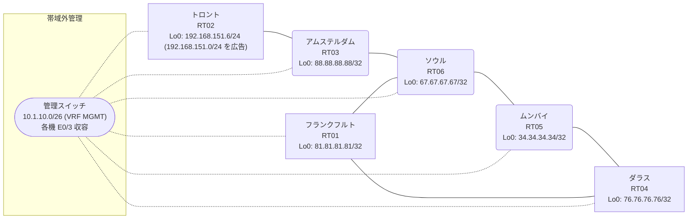

# 問題 20260811-017

> **本問は機器に接続せずに解答すること。追加の show 実行は認めない。**

## シナリオ

あなたは、下記のネットワークの保守を担当する技術者です。あなたの会社のネットワークは、OSPF のドメインと EIGRP のドメインとが、2 つの境界のルーターによって接続され、そして、それらは境界において接続されています。顧客のネットワーク `192.168.151.0/24` は、トロント のサイトにおいて、別のルーティング プロトコルによって学習され、そして、再配送によって、社内へ持ち込まれています。ルーティングの設計の詳細は、示されているところのコンフィギュレーションから、読み取られることが、期待されています。ユーザーから、通信に関する事象が、報告されています。あなたは、提示されているところの情報のみを使用して、要求されている状態が満たされていない理由を、特定しなければなりません。是正は、番号付き標準アクセス リストと、再配送点における distribute-list によって、実装される必要があります。既存の相互再配送の設計が、削除または停止されてはなりません。スタティック・ルートおよび既定のルートによる迂回は、実施されてはなりません。`192.168.151.0/24` 宛のトラフィックが RT02 へ配送され、経路の周回が、発生していないこと。スタティック・ルートおよび既定のルートによる迂回は、実施されてはなりません。すべてのサイトから、`192.168.151.0/24` を含むところのすべての宛先へ、到達することができること。



| 拠点 | ルータ | 拠点網 / 広告網 |
|------|--------|------------------|
| アムステルダム | RT03 | 88.88.88.88/32 |
| ソウル | RT06 | 67.67.67.67/32 |
| ダラス | RT04 | 76.76.76.76/32 |
| トロント | RT02 | 192.168.151.6/24 (`192.168.151.0/24` を広告) |
| フランクフルト | RT01 | 81.81.81.81/32 |
| ムンバイ | RT05 | 34.34.34.34/32 |

リンク一覧:
```
  RT04:E0/0(.1) ── RT01:E0/0(.2)   172.16.99.0/24
  RT04:E0/1(.1) ── RT05:E0/0(.3)   172.16.123.0/24
  RT01:E0/1(.2) ── RT06:E0/0(.4)   172.16.96.0/24
  RT05:E0/1(.3) ── RT06:E0/1(.4)   172.16.191.0/24
  RT06:E0/2(.4) ── RT03:E0/0(.5)   172.16.153.0/24
  RT03:E0/1(.5) ── RT02:E0/0(.6)   172.16.105.0/24
```

## 出力

```
RT06# show ip route
Gateway of last resort is not set
      34.0.0.0/32 is subnetted, 1 subnets
D EX     34.34.34.34 [170/281856] via 172.16.191.3, 00:07:03, Ethernet0/1
                     [170/281856] via 172.16.96.2, 00:07:03, Ethernet0/0
      67.0.0.0/32 is subnetted, 1 subnets
C        67.67.67.67 is directly connected, Loopback0
      76.0.0.0/32 is subnetted, 1 subnets
D EX     76.76.76.76 [170/281856] via 172.16.191.3, 00:07:06, Ethernet0/1
                     [170/281856] via 172.16.96.2, 00:07:06, Ethernet0/0
      81.0.0.0/32 is subnetted, 1 subnets
D EX     81.81.81.81 [170/281856] via 172.16.191.3, 00:07:06, Ethernet0/1
                     [170/281856] via 172.16.96.2, 00:07:06, Ethernet0/0
      88.0.0.0/32 is subnetted, 1 subnets
D        88.88.88.88 [90/409600] via 172.16.153.5, 00:07:51, Ethernet0/2
      172.16.0.0/16 is variably subnetted, 9 subnets, 2 masks
C        172.16.96.0/24 is directly connected, Ethernet0/0
L        172.16.96.4/32 is directly connected, Ethernet0/0
D EX     172.16.99.0/24 [170/281856] via 172.16.191.3, 00:07:06, Ethernet0/1
                        [170/281856] via 172.16.96.2, 00:07:06, Ethernet0/0
D        172.16.105.0/24 [90/307200] via 172.16.153.5, 00:07:51, Ethernet0/2
D EX     172.16.123.0/24 [170/281856] via 172.16.191.3, 00:07:09, Ethernet0/1
                         [170/281856] via 172.16.96.2, 00:07:09, Ethernet0/0
C        172.16.153.0/24 is directly connected, Ethernet0/2
L        172.16.153.4/32 is directly connected, Ethernet0/2
C        172.16.191.0/24 is directly connected, Ethernet0/1
L        172.16.191.4/32 is directly connected, Ethernet0/1
D EX  192.168.151.0/24 [170/281856] via 172.16.191.3, 00:07:06, Ethernet0/1
```
```
RT06# show ip eigrp topology 192.168.151.0 255.255.255.0
EIGRP-IPv4 Topology Entry for AS(26)/ID(67.67.67.67) for 192.168.151.0/24
  State is Passive, Query origin flag is 1, 1 Successor(s), FD is 281856
  Descriptor Blocks:
  172.16.191.3 (Ethernet0/1), from 172.16.191.3, Send flag is 0x0
      Composite metric is (281856/2816), route is External
      Vector metric:
        Minimum bandwidth is 10000 Kbit
        Total delay is 1010 microseconds
        Reliability is 255/255
        Load is 1/255
        Minimum MTU is 1500
        Hop count is 1
        Originating router is 34.34.34.34
      External data:
        AS number of route is 62
        External protocol is OSPF, external metric is 20
        Administrator tag is 0 (0x00000000)
  172.16.153.5 (Ethernet0/2), from 172.16.153.5, Send flag is 0x0
      Composite metric is (307456/281856), route is External
      Vector metric:
        Minimum bandwidth is 10000 Kbit
        Total delay is 2010 microseconds
        Reliability is 255/255
        Load is 1/255
        Minimum MTU is 1500
        Hop count is 2
        Originating router is 192.168.151.6
      External data:
        AS number of route is 0
        External protocol is RIP, external metric is 0
        Administrator tag is 0 (0x00000000)
```
```
RT03# show ip route
Gateway of last resort is not set
      34.0.0.0/32 is subnetted, 1 subnets
D EX     34.34.34.34 [170/307456] via 172.16.153.4, 00:07:22, Ethernet0/0
      67.0.0.0/32 is subnetted, 1 subnets
D        67.67.67.67 [90/409600] via 172.16.153.4, 00:08:15, Ethernet0/0
      76.0.0.0/32 is subnetted, 1 subnets
D EX     76.76.76.76 [170/307456] via 172.16.153.4, 00:07:28, Ethernet0/0
      81.0.0.0/32 is subnetted, 1 subnets
D EX     81.81.81.81 [170/307456] via 172.16.153.4, 00:08:06, Ethernet0/0
      88.0.0.0/32 is subnetted, 1 subnets
C        88.88.88.88 is directly connected, Loopback0
      172.16.0.0/16 is variably subnetted, 8 subnets, 2 masks
D        172.16.96.0/24 [90/307200] via 172.16.153.4, 00:08:15, Ethernet0/0
D EX     172.16.99.0/24 [170/307456] via 172.16.153.4, 00:08:06, Ethernet0/0
C        172.16.105.0/24 is directly connected, Ethernet0/1
L        172.16.105.5/32 is directly connected, Ethernet0/1
D EX     172.16.123.0/24 [170/307456] via 172.16.153.4, 00:07:28, Ethernet0/0
C        172.16.153.0/24 is directly connected, Ethernet0/0
L        172.16.153.5/32 is directly connected, Ethernet0/0
D        172.16.191.0/24 [90/307200] via 172.16.153.4, 00:08:15, Ethernet0/0
D EX  192.168.151.0/24 [170/281856] via 172.16.105.6, 00:07:25, Ethernet0/1
```
```
RT04# show ip route
Gateway of last resort is not set
      34.0.0.0/32 is subnetted, 1 subnets
O        34.34.34.34 [110/11] via 172.16.123.3, 00:07:43, Ethernet0/1
      67.0.0.0/32 is subnetted, 1 subnets
O E2     67.67.67.67 [110/20] via 172.16.123.3, 00:07:43, Ethernet0/1
                     [110/20] via 172.16.99.2, 00:07:46, Ethernet0/0
      76.0.0.0/32 is subnetted, 1 subnets
C        76.76.76.76 is directly connected, Loopback0
      81.0.0.0/32 is subnetted, 1 subnets
O        81.81.81.81 [110/11] via 172.16.99.2, 00:07:46, Ethernet0/0
      88.0.0.0/32 is subnetted, 1 subnets
O E2     88.88.88.88 [110/20] via 172.16.123.3, 00:07:43, Ethernet0/1
                     [110/20] via 172.16.99.2, 00:07:46, Ethernet0/0
      172.16.0.0/16 is variably subnetted, 8 subnets, 2 masks
O E2     172.16.96.0/24 [110/20] via 172.16.123.3, 00:07:43, Ethernet0/1
                        [110/20] via 172.16.99.2, 00:07:46, Ethernet0/0
C        172.16.99.0/24 is directly connected, Ethernet0/0
L        172.16.99.1/32 is directly connected, Ethernet0/0
O E2     172.16.105.0/24 [110/20] via 172.16.123.3, 00:07:43, Ethernet0/1
                         [110/20] via 172.16.99.2, 00:07:46, Ethernet0/0
C        172.16.123.0/24 is directly connected, Ethernet0/1
L        172.16.123.1/32 is directly connected, Ethernet0/1
O E2     172.16.153.0/24 [110/20] via 172.16.123.3, 00:07:43, Ethernet0/1
                         [110/20] via 172.16.99.2, 00:07:46, Ethernet0/0
O E2     172.16.191.0/24 [110/20] via 172.16.123.3, 00:07:43, Ethernet0/1
                         [110/20] via 172.16.99.2, 00:07:46, Ethernet0/0
O E2  192.168.151.0/24 [110/20] via 172.16.99.2, 00:07:46, Ethernet0/0
```
```
RT04# traceroute 192.168.151.6 probe 1 timeout 1 ttl 1 8
Type escape sequence to abort.
Tracing the route to 192.168.151.6
VRF info: (vrf in name/id, vrf out name/id)
  1 172.16.99.2 1 msec
  2 172.16.96.4 2 msec
  3 172.16.191.3 1 msec
  4 172.16.123.1 2 msec
  5 172.16.99.2 10 msec
  6 172.16.96.4 2 msec
  7 172.16.191.3 2 msec
  8 172.16.123.1 2 msec
```
```
RT04# show running-config | section router
router ospf 62
 router-id 76.76.76.76
 network 76.76.76.76 0.0.0.0 area 0
 network 172.16.99.0 0.0.0.255 area 0
 network 172.16.123.0 0.0.0.255 area 0
```
```
RT01# show running-config | section router
router eigrp 26
 network 172.16.96.0 0.0.0.255
 redistribute ospf 62 metric 1000000 1 255 1 1500
router ospf 62
 router-id 81.81.81.81
 redistribute eigrp 26
 network 81.81.81.81 0.0.0.0 area 0
 network 172.16.99.0 0.0.0.255 area 0
```
```
RT05# show running-config | section router
router eigrp 26
 network 172.16.191.0 0.0.0.255
 redistribute ospf 62 metric 1000000 1 255 1 1500
router ospf 62
 router-id 34.34.34.34
 redistribute eigrp 26
 network 34.34.34.34 0.0.0.0 area 0
 network 172.16.123.0 0.0.0.255 area 0
```
```
RT06# show running-config | section router
router eigrp 26
 network 67.67.67.67 0.0.0.0
 network 172.16.96.0 0.0.0.255
 network 172.16.153.0 0.0.0.255
 network 172.16.191.0 0.0.0.255
```
```
RT03# show running-config | section router
router eigrp 26
 network 88.88.88.88 0.0.0.0
 network 172.16.105.0 0.0.0.255
 network 172.16.153.0 0.0.0.255
```
```
RT02# show running-config | section router
router eigrp 26
 network 172.16.105.0 0.0.0.255
 redistribute rip metric 1000000 1 255 1 1500
router rip
 version 2
 network 192.168.151.0
 no auto-summary
```

## 設問

次のうち、正しいものは、どれですか。

## 選択肢
A. RT01 と RT05 の両方で、router ospf 62 配下に `distance ospf external 180` を設定する

B. RT06 の router eigrp 26 配下に `distance eigrp 90 200` を設定する

C. RT06 で `clear ip route *` を実行する

D. RT01 と RT05 の両方で、`access-list 58 deny 192.168.151.0 0.0.0.255` / `permit any` を作成し、router eigrp 26 配下に `distribute-list 58 out ospf 62` を適用する

E. RT02 の router eigrp 26 配下の `redistribute rip` の seed metric をより小さい値へ変更する

F. RT01 でのみ、`access-list 58 deny 192.168.151.0 0.0.0.255` / `permit any` を作成し、router eigrp 26 配下に `distribute-list 58 out ospf 62` を適用する
