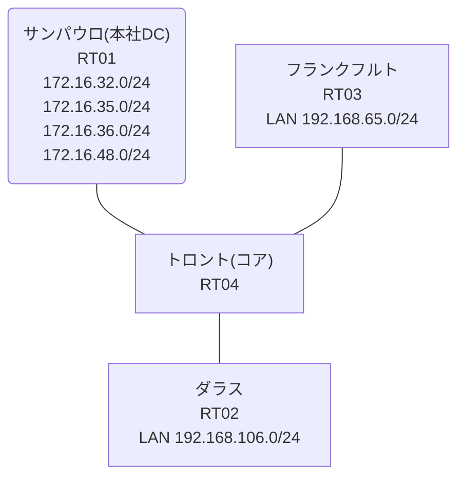

# 問題 20260811-020

> **本問は機器に接続せずに解答すること。追加の show 実行は認めない。**

## トポロジ

あなたの組織は、下記に示されているところのネットワークを運用しています。コアのルータにおいて、それぞれのサイトの LAN から、本社のデータ・センターのサービスのネットワークへの転送が、制御されています。コアは、サービスのネットワークへのルーティングの情報を保持しておらず、そして、ポリシーに一致したトラフィックのみが、ネクスト・ホップへ転送されます。



リンク一覧:
```
  RT04(.1) ── RT01(.2)   192.168.149.0/29
  RT04(.254) ── RT03      192.168.65.0/24
  RT04(.254) ── RT02      192.168.106.0/24
```

## 要件

1. フランクフルト および ダラス のそれぞれのサイトから、業務のサービスのネットワーク `172.16.32.0/24`・`172.16.35.0/24` へ、到達することができること。
2. 検証および隔離のためのネットワーク `172.16.36.0/24`・`172.16.48.0/24` へは、ポリシーによる転送が、実施されてはなりません。
3. ポリシーの対象の指定は、1つのアクセス・リストのエントリによって、まかなわれなければなりません。
4. PBR が適用されるポイントおよびネクスト ホップの設計は、変更されることはできません。
5. 管理のための構成に対して、変更が加えられてはなりません。

## 現在の状態

いくつかの宛先への通信について、報告が上がっています。示されているところの出力および構成に基づいて、要求されているところの動作が得られていない理由が、判断されなければなりません。

```
RT04# show access-lists
Extended IP access list ACL-A
    10 permit ip 192.168.65.0 0.0.0.255 172.16.32.0 0.0.3.255
Extended IP access list ACL-B
    10 permit ip 192.168.106.0 0.0.0.255 172.16.32.0 0.0.3.255 (5 matches)
```
```
RT03# ping 172.16.48.1 repeat 5
Type escape sequence to abort.
Sending 5, 100-byte ICMP Echos to 172.16.48.1, timeout is 2 seconds:
!!!!!
Success rate is 100 percent (5/5), round-trip min/avg/max = 1/4/18 ms
```
```
RT04# show route-map
route-map MAP-A, permit, sequence 10
  Match clauses:
  Set clauses:
    ip next-hop 192.168.149.2
  Policy routing matches: 20 packets, 2280 bytes
route-map MAP-B, permit, sequence 10
  Match clauses:
    ip address (access-lists): ACL-B 
  Set clauses:
    ip next-hop 192.168.149.2
  Policy routing matches: 5 packets, 570 bytes
```
```
RT03# ping 172.16.35.1 repeat 5
Type escape sequence to abort.
Sending 5, 100-byte ICMP Echos to 172.16.35.1, timeout is 2 seconds:
!!!!!
Success rate is 100 percent (5/5), round-trip min/avg/max = 1/1/4 ms
```
```
RT03# ping 172.16.32.1 repeat 5
Type escape sequence to abort.
Sending 5, 100-byte ICMP Echos to 172.16.32.1, timeout is 2 seconds:
!!!!!
Success rate is 100 percent (5/5), round-trip min/avg/max = 1/1/1 ms
```
```
RT02# ping 172.16.36.1 repeat 5
Type escape sequence to abort.
Sending 5, 100-byte ICMP Echos to 172.16.36.1, timeout is 2 seconds:
U.U.U
Success rate is 0 percent (0/5)
```
```
RT03# ping 172.16.36.1 repeat 5
Type escape sequence to abort.
Sending 5, 100-byte ICMP Echos to 172.16.36.1, timeout is 2 seconds:
!!!!!
Success rate is 100 percent (5/5), round-trip min/avg/max = 1/1/1 ms
```
```
RT02# ping 172.16.35.1 repeat 5
Type escape sequence to abort.
Sending 5, 100-byte ICMP Echos to 172.16.35.1, timeout is 2 seconds:
!!!!!
Success rate is 100 percent (5/5), round-trip min/avg/max = 1/1/2 ms
```

## 設定抜粋

```
RT04# show running-config | section interface
interface Ethernet0/0
 ip address 192.168.149.1 255.255.255.248
interface Ethernet0/1
 ip address 192.168.65.254 255.255.255.0
 ip policy route-map MAP-A
interface Ethernet0/2
 ip address 192.168.106.254 255.255.255.0
 ip policy route-map MAP-B
interface Ethernet0/3
 description === MGMT (Ansible) ===
 vrf forwarding MGMT
 ip address 10.1.10.16 255.255.255.192
```
```
RT04# show running-config | section route-map|access-list
ip policy route-map MAP-A
 ip policy route-map MAP-B
ip access-list extended ACL-A
 10 permit ip 192.168.65.0 0.0.0.255 172.16.32.0 0.0.3.255
ip access-list extended ACL-B
 10 permit ip 192.168.106.0 0.0.0.255 172.16.32.0 0.0.3.255
route-map MAP-A permit 10 
 set ip next-hop 192.168.149.2
route-map MAP-B permit 10 
 match ip address ACL-B
 set ip next-hop 192.168.149.2
```
```
RT01# show running-config | section interface|ip route
interface Loopback0
 ip address 172.16.32.1 255.255.255.0
interface Loopback1
 ip address 172.16.35.1 255.255.255.0
interface Loopback2
 ip address 172.16.36.1 255.255.255.0
interface Loopback3
 ip address 172.16.48.1 255.255.255.0
interface Ethernet0/0
 ip address 192.168.149.2 255.255.255.248
interface Ethernet0/1
 no ip address
 shutdown
interface Ethernet0/2
 no ip address
 shutdown
interface Ethernet0/3
 description === MGMT (Ansible) ===
 vrf forwarding MGMT
 ip address 10.1.10.13 255.255.255.192
ip route 192.168.65.0 255.255.255.0 192.168.149.1
ip route 192.168.106.0 255.255.255.0 192.168.149.1
```
```
RT03# show running-config | section interface|ip route
interface Ethernet0/0
 ip address 192.168.65.1 255.255.255.0
interface Ethernet0/1
 no ip address
 shutdown
interface Ethernet0/2
 no ip address
 shutdown
interface Ethernet0/3
 description === MGMT (Ansible) ===
 vrf forwarding MGMT
 ip address 10.1.10.15 255.255.255.192
ip route 0.0.0.0 0.0.0.0 192.168.65.254
```
```
RT02# show running-config | section interface|ip route
interface Ethernet0/0
 ip address 192.168.106.1 255.255.255.0
interface Ethernet0/1
 no ip address
 shutdown
interface Ethernet0/2
 no ip address
 shutdown
interface Ethernet0/3
 description === MGMT (Ansible) ===
 vrf forwarding MGMT
 ip address 10.1.10.14 255.255.255.192
ip route 0.0.0.0 0.0.0.0 192.168.106.254
```

## 設問

次のうち、正しいものは、どれですか。

## 選択肢
A. ACL-A を「deny ip 192.168.65.0 0.0.0.255 172.16.36.0 0.0.0.255」「permit ip 192.168.65.0 0.0.0.255 172.16.32.0 0.0.7.255」の2行(deny 先行)に置き換える

B. MAP-A の match を「match ip address ACL-A」に設定し直す

C. MAP-A の match を「match ip address prefix-list PL-A」に変更する(PL-A: 172.16.32.0/24 と 172.16.35.0/24 を permit)

D. ACL-A を「permit ip 192.168.65.0 0.0.0.255 172.16.32.0 0.0.3.255」の1行に置き換える

E. ACL-A を「permit ip 192.168.65.0 0.0.0.255 172.16.32.0 0.0.1.255」の1行に置き換える

F. ACL-A を「permit ip 192.168.65.0 0.0.0.255 172.16.32.0 0.0.16.255」の1行に置き換える

G. ACL-A を「permit ip 192.168.65.0 0.0.0.255 172.16.32.0 0.0.0.255」「permit ip 192.168.65.0 0.0.0.255 172.16.35.0 0.0.0.255」の2行に置き換える
