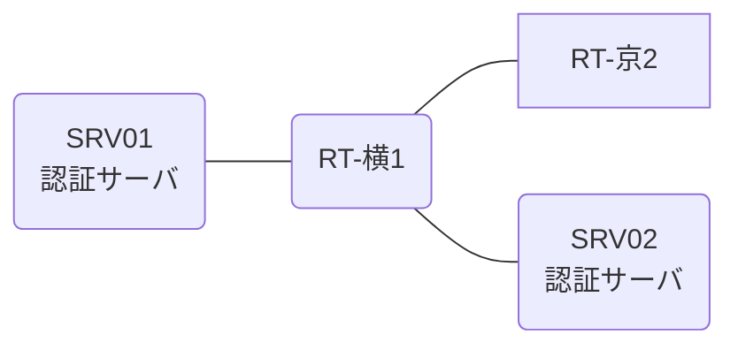

# 問題 20260811-023

> **本問は機器に接続せずに解答すること。追加の show 実行は認めない。**

## シナリオ

あなたの組織は、下記に示されているところのネットワークを運用しています。2 つの拠点のルータが、共通の認証サーバ群を用いて、管理者の認証を行うように構成されています。一方のルータはサーバと直結しており、他方はそのルーターを経由してサーバに到達します。利用者の認証が、意図されたとおりに行われていない、ということが、報告されています。原因として、**アクセスリストが、認証要求の送信を遮断している。** と **アクセスリストが、認証サーバからの応答を遮断している。** と **認証要求の送信元アドレスが、サーバ側で許可された値になっていない。** の 3 つが、想定されています。機器の構成は、まだ取得されていません。横浜・京都 の両拠点で、利用者 ope-suzuki が権限レベル 15 で機器を操作できること。既定の方式リストは変更しないこと。認証は認証サーバ群 NOC-RADIUS を用いること。



### 認証サーバの仕様

| 項目 | SRV01 | SRV02 |
|---|---|---|
| アドレス | 10.99.35.2 | 10.99.36.2 |
| 待受ポート | 1812 / 1813 | 11812 / 11813 |
| 共有鍵 | Ccnp-Aaa-77 | Ccnp-Aaa-77 |
| 受理する送信元 | 10.4.0.1 ・ 10.0.0.2 | 同左 |
| 台帳 | ope-suzuki(15) ・ watch-op(1) ・ SUZUKI(15) | 同左 |
| 現在の稼働状態 | 稼働中 | 稼働中 |

### ルータのアドレス

| ルータ | Loopback0 | 認証サーバ方向のインタフェース |
|---|---|---|
| RT-横1(横浜) | 10.4.0.1 | Ethernet0/0 = 10.99.35.1 |
| RT-京2(京都) | 10.0.0.2 | Ethernet0/0 = 10.91.12.2 |

## 出力

| 拠点 | ユーザ | 結果 |
|---|---|---|
| 横浜 | ope-suzuki | ログイン不可 |
| 横浜 | watch-op | ログイン不可 |
| 横浜 | break-glass | ログイン可(権限レベル 15) |
| 横浜 | ope-suzuki(6 セッション目以降) | ログイン不可 |
| 横浜 | break-glass(コンソールから) | ログイン可(権限レベル 15) |
| 横浜 | ope-suzuki(ログインに要する時間) | 1 回目 約 8 秒 / 2 回目以降 即時 |
| 京都 | ope-suzuki | ログイン可(権限レベル 15) |
| 京都 | watch-op | ログイン可(権限レベル 1) |
| 京都 | break-glass | ログイン不可 |
| 京都 | watch-op からの特権昇格 | 昇格可(15) |
| 京都 | ope-suzuki(6 セッション目以降) | ログイン可(権限レベル 15) |
| 京都 | break-glass(コンソールから) | ログイン可(権限レベル 15) |
| 京都 | ope-suzuki(ログインに要する時間) | 即時 |

認証サーバがすべて停止した場合:

| 拠点 | ユーザ | 結果 |
|---|---|---|
| 横浜 | break-glass | ログイン可(権限レベル 15) |
| 横浜 | SUZUKI | ログイン可(権限レベル 15) |
| 横浜 | break-glass(コンソールから) | ログイン可(権限レベル 15) |
| 京都 | break-glass | ログイン可(権限レベル 15) |
| 京都 | SUZUKI | ログイン可(権限レベル 15) |
| 京都 | break-glass(コンソールから) | ログイン可(権限レベル 15) |

```
横浜: No authoritative response from any server. (1 回目 約 8 秒 / 2 回目以降 即時)
京都: User was successfully authenticated. (即時)
```

## 設問

想定されているところの原因の、いずれであるかを、判断するために、**最も多くの候補を除外できる**出力は、どれですか。(1つを選択してください)

## 選択肢
A. 各ルータでの `debug radius authentication`

B. 各ルータの `show running-config | section line con`

C. 各ルータの `show running-config | include radius source-interface`

D. 各ルータの `show ip access-lists`
