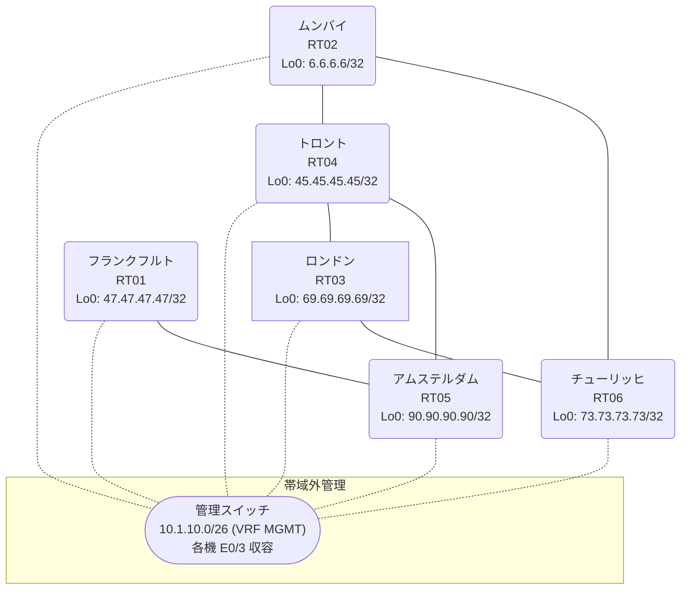

# 問題 20260811-025

> **本問は機器に接続せずに解答すること。追加の show 実行は認めない。**

## トポロジ

あなたの組織は、下記に示されているところのネットワークを運用しています。あなたの会社のネットワークは、複数のルーティング ドメインが、境界のルータによって接続され、そして、すべてのサイトのリーチアビリティが提供されている、というものです。ルーティングの設計の詳細は、示されているところのコンフィギュレーションから、読み取られることが、期待されています。各サイトのルータと、サイトの網との対応は、下記の表に示されているとおりです。



| 拠点 | ルータ | 拠点網 |
|------|--------|----------------------|
| アムステルダム | RT05 | `90.90.90.90/32` |
| チューリッヒ | RT06 | `73.73.73.73/32` |
| トロント | RT04 | `45.45.45.45/32` |
| フランクフルト | RT01 | `47.47.47.47/32` |
| ムンバイ | RT02 | `6.6.6.6/32` |
| ロンドン | RT03 | `69.69.69.69/32` |

リンク一覧:
```
  RT04:E0/0(.1) ── RT03:E0/0(.2)   10.177.149.0/30
  RT02:E0/0(.1) ── RT06:E0/0(.2)   10.93.254.0/30
  RT04:E0/1(.1) ── RT02:E0/1(.2)   10.106.208.0/30
  RT06:E0/1(.1) ── RT03:E0/1(.2)   10.32.229.0/30
  RT04:E0/2(.1) ── RT05:E0/0(.2)   10.144.90.0/30
  RT05:E0/1(.1) ── RT01:E0/0(.2)   10.236.36.0/30
```

## 要件

1. シード メトリック `10000 10 255 1 1500` の付与は、default-metric の方式に統一されなければなりません。
2. ルートの再配送に対して、フィルタが、適用されてはなりません。
3. スタティック・ルートおよび既定のルートによる迂回は、実施されてはなりません。
4. インタフェースの IP アドレッシングは、変更されることはできません。
5. redistribute の参照先は、実在する隣接のプロセス/AS に限定され、無効な参照のステートメントが、コンフィギュレーションに残されることはできません。
6. すべてのルーターのループバック・インターフェイス 0 (/32) が、すべてのドメインの間で、相互に到達可能であること。

## 現在の状態

いくつかの宛先への通信について、報告が上がっています。あなたは、示されているところの出力および構成に基づいて、その構成が、下記において記述されているとおりに動作していない理由を、判断する必要があります。

```
RT04# show route-map
route-map RM-SVC, deny, sequence 10
  Match clauses:
    ip address prefix-lists: PL-SVC 
  Set clauses:
  Policy routing matches: 0 packets, 0 bytes
route-map RM-SVC, permit, sequence 20
  Match clauses:
  Set clauses:
  Policy routing matches: 0 packets, 0 bytes
route-map RM-STG1, deny, sequence 10
  Match clauses:
    ip address prefix-lists: PL-STG1 
  Set clauses:
  Policy routing matches: 0 packets, 0 bytes
route-map RM-STG1, permit, sequence 20
  Match clauses:
  Set clauses:
  Policy routing matches: 0 packets, 0 bytes
route-map RM-OLD2, deny, sequence 10
  Match clauses:
    ip address prefix-lists: PL-OLD2 
  Set clauses:
  Policy routing matches: 0 packets, 0 bytes
route-map RM-OLD2, permit, sequence 20
  Match clauses:
  Set clauses:
  Policy routing matches: 0 packets, 0 bytes
```
```
RT06# show ip route
Gateway of last resort is not set
      6.0.0.0/32 is subnetted, 1 subnets
O        6.6.6.6 [110/11] via 10.93.254.1, 00:04:46, Ethernet0/0
      10.0.0.0/8 is variably subnetted, 8 subnets, 2 masks
C        10.32.229.0/30 is directly connected, Ethernet0/1
L        10.32.229.1/32 is directly connected, Ethernet0/1
C        10.93.254.0/30 is directly connected, Ethernet0/0
L        10.93.254.2/32 is directly connected, Ethernet0/0
O        10.106.208.0/30 [110/20] via 10.93.254.1, 00:04:46, Ethernet0/0
O E2     10.144.90.0/30 [110/20] via 10.93.254.1, 00:04:46, Ethernet0/0
                        [110/20] via 10.32.229.2, 00:04:46, Ethernet0/1
O        10.177.149.0/30 [110/20] via 10.32.229.2, 00:04:46, Ethernet0/1
O E2     10.236.36.0/30 [110/20] via 10.93.254.1, 00:04:46, Ethernet0/0
                        [110/20] via 10.32.229.2, 00:04:46, Ethernet0/1
      45.0.0.0/32 is subnetted, 1 subnets
O        45.45.45.45 [110/21] via 10.93.254.1, 00:04:46, Ethernet0/0
                     [110/21] via 10.32.229.2, 00:04:46, Ethernet0/1
      47.0.0.0/32 is subnetted, 1 subnets
O E2     47.47.47.47 [110/20] via 10.93.254.1, 00:04:46, Ethernet0/0
                     [110/20] via 10.32.229.2, 00:04:46, Ethernet0/1
      69.0.0.0/32 is subnetted, 1 subnets
O        69.69.69.69 [110/11] via 10.32.229.2, 00:04:46, Ethernet0/1
      73.0.0.0/32 is subnetted, 1 subnets
C        73.73.73.73 is directly connected, Loopback0
      90.0.0.0/32 is subnetted, 1 subnets
O E2     90.90.90.90 [110/20] via 10.93.254.1, 00:04:46, Ethernet0/0
                     [110/20] via 10.32.229.2, 00:04:46, Ethernet0/1
```
```
RT03# show ip route
Gateway of last resort is not set
      6.0.0.0/32 is subnetted, 1 subnets
O        6.6.6.6 [110/21] via 10.177.149.1, 00:04:28, Ethernet0/0
                 [110/21] via 10.32.229.1, 00:04:22, Ethernet0/1
      10.0.0.0/8 is variably subnetted, 8 subnets, 2 masks
C        10.32.229.0/30 is directly connected, Ethernet0/1
L        10.32.229.2/32 is directly connected, Ethernet0/1
O        10.93.254.0/30 [110/20] via 10.32.229.1, 00:04:27, Ethernet0/1
O        10.106.208.0/30 [110/20] via 10.177.149.1, 00:04:31, Ethernet0/0
O E2     10.144.90.0/30 [110/20] via 10.177.149.1, 00:04:31, Ethernet0/0
C        10.177.149.0/30 is directly connected, Ethernet0/0
L        10.177.149.2/32 is directly connected, Ethernet0/0
O E2     10.236.36.0/30 [110/20] via 10.177.149.1, 00:04:31, Ethernet0/0
      45.0.0.0/32 is subnetted, 1 subnets
O        45.45.45.45 [110/11] via 10.177.149.1, 00:04:31, Ethernet0/0
      47.0.0.0/32 is subnetted, 1 subnets
O E2     47.47.47.47 [110/20] via 10.177.149.1, 00:04:31, Ethernet0/0
      69.0.0.0/32 is subnetted, 1 subnets
C        69.69.69.69 is directly connected, Loopback0
      73.0.0.0/32 is subnetted, 1 subnets
O        73.73.73.73 [110/11] via 10.32.229.1, 00:04:27, Ethernet0/1
      90.0.0.0/32 is subnetted, 1 subnets
O E2     90.90.90.90 [110/20] via 10.177.149.1, 00:04:31, Ethernet0/0
```
```
RT04# show ip prefix-list
ip prefix-list PL-OLD2: 2 entries
   seq 5 deny 45.45.45.45/32
   seq 10 permit 0.0.0.0/0 le 32
ip prefix-list PL-STG1: 2 entries
   seq 5 deny 47.47.47.47/32
   seq 10 permit 0.0.0.0/0 le 32
ip prefix-list PL-SVC: 1 entries
   seq 5 permit 73.73.73.73/32
```
```
RT01# show ip route
Gateway of last resort is not set
      6.0.0.0/32 is subnetted, 1 subnets
D EX     6.6.6.6 [170/309760] via 10.236.36.1, 00:04:13, Ethernet0/0
      10.0.0.0/8 is variably subnetted, 7 subnets, 2 masks
D EX     10.32.229.0/30 [170/309760] via 10.236.36.1, 00:04:13, Ethernet0/0
D EX     10.93.254.0/30 [170/309760] via 10.236.36.1, 00:04:13, Ethernet0/0
D EX     10.106.208.0/30 [170/309760] via 10.236.36.1, 00:04:45, Ethernet0/0
D        10.144.90.0/30 [90/307200] via 10.236.36.1, 00:04:45, Ethernet0/0
D EX     10.177.149.0/30 [170/309760] via 10.236.36.1, 00:04:45, Ethernet0/0
C        10.236.36.0/30 is directly connected, Ethernet0/0
L        10.236.36.2/32 is directly connected, Ethernet0/0
      45.0.0.0/32 is subnetted, 1 subnets
D        45.45.45.45 [90/435200] via 10.236.36.1, 00:04:45, Ethernet0/0
      47.0.0.0/32 is subnetted, 1 subnets
C        47.47.47.47 is directly connected, Loopback0
      69.0.0.0/32 is subnetted, 1 subnets
D EX     69.69.69.69 [170/309760] via 10.236.36.1, 00:04:13, Ethernet0/0
      90.0.0.0/32 is subnetted, 1 subnets
D        90.90.90.90 [90/409600] via 10.236.36.1, 00:04:45, Ethernet0/0
```
```
RT04# show access-lists
Standard IP access list 36
    10 deny   45.45.45.45
    20 permit any
Standard IP access list 98
    10 deny   47.47.47.47
    20 permit any
```

## 設定抜粋

```
RT01# show running-config | section router
router eigrp 312
 network 10.236.36.0 0.0.0.3
 network 47.47.47.47 0.0.0.0
 passive-interface Loopback0
```
```
RT02# show running-config | section router
router ospf 25
 router-id 6.6.6.6
 network 6.6.6.6 0.0.0.0 area 0
 network 10.93.254.0 0.0.0.3 area 0
 network 10.106.208.0 0.0.0.3 area 0
```
```
RT03# show running-config | section router
router ospf 25
 router-id 69.69.69.69
 timers throttle spf 50 200 5000
 passive-interface Loopback0
 network 10.32.229.0 0.0.0.3 area 0
 network 10.177.149.0 0.0.0.3 area 0
 network 69.69.69.69 0.0.0.0 area 0
```
```
RT04# show running-config | section router
router eigrp 312
 default-metric 10000 10 255 1 1500
 network 10.144.90.0 0.0.0.3
 network 45.45.45.45 0.0.0.0
 redistribute ospf 25 match internal external 1 external 2 route-map RM-SVC
router ospf 25
 router-id 45.45.45.45
 timers throttle spf 50 200 5000
 redistribute eigrp 312
 passive-interface Loopback0
 network 10.106.208.0 0.0.0.3 area 0
 network 10.177.149.0 0.0.0.3 area 0
 network 45.45.45.45 0.0.0.0 area 0
```
```
RT05# show running-config | section router
router eigrp 312
 network 10.144.90.0 0.0.0.3
 network 10.236.36.0 0.0.0.3
 network 90.90.90.90 0.0.0.0
```
```
RT06# show running-config | section router
router ospf 25
 router-id 73.73.73.73
 network 10.32.229.0 0.0.0.3 area 0
 network 10.93.254.0 0.0.0.3 area 0
 network 73.73.73.73 0.0.0.0 area 0
```

## 設問

次のうち、正しいものは、どれですか。

## 選択肢
**A.**
```
router ospf 25
 redistribute eigrp 312 route-map RM-SVC
```

**B.**
```
ip prefix-list PL-SVC seq 10 permit 0.0.0.0/0 le 32
```

**C.**
```
clear ip route *
```

**D.**
```
router eigrp 312
 no redistribute ospf 25
 redistribute ospf 25 match internal external 1 external 2
no route-map RM-SVC
no ip prefix-list PL-SVC
```

**E.**
```
no route-map RM-SVC deny 10
route-map RM-SVC permit 10
 match ip address prefix-list PL-SVC
```

**F.**
```
router eigrp 312
 no passive-interface <上流IF>
```
