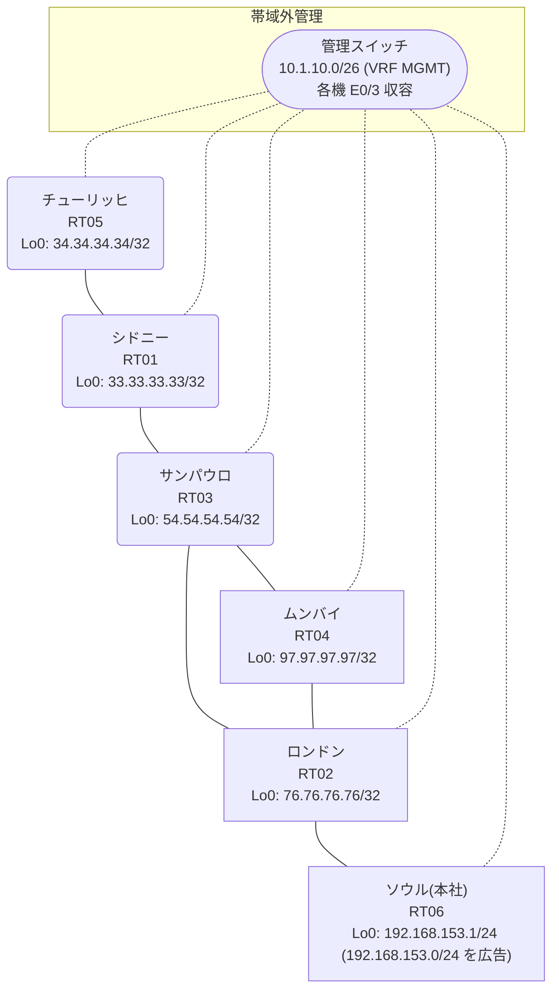

# 問題 20260811-026

> **本問は機器に接続せずに解答すること。追加の show 実行は認めない。**

## トポロジ

あなたは、ネットワークの運用を担当しています。本社の顧客のネットワークは、BGP AS 64993 の RT06 によって、広告されています。あなたの会社の内部は、BGP / EIGRP / OSPF という 3 つのドメインから構成されています。サイトと、ルーターおよびアドレスとの対応は、下記の表に示されているとおりです。



| 拠点 | ルータ | 拠点網 / 広告網 |
|------|--------|------------------|
| サンパウロ | RT03 | 54.54.54.54/32 |
| シドニー | RT01 | 33.33.33.33/32 |
| ソウル(本社) | RT06 | 192.168.153.1/24 (`192.168.153.0/24` を広告) |
| チューリッヒ | RT05 | 34.34.34.34/32 |
| ムンバイ | RT04 | 97.97.97.97/32 |
| ロンドン | RT02 | 76.76.76.76/32 |

リンク一覧:
```
  RT06:E0/0(.1) ── RT02:E0/0(.2)   10.89.112.0/30
  RT02:E0/1(.1) ── RT04:E0/0(.2)   10.117.169.0/30
  RT02:E0/2(.1) ── RT03:E0/0(.2)   10.166.176.0/30
  RT04:E0/1(.1) ── RT03:E0/1(.2)   10.193.174.0/30
  RT03:E0/2(.1) ── RT01:E0/0(.2)   10.67.73.0/30
  RT01:E0/1(.1) ── RT05:E0/0(.2)   10.199.135.0/30
```

## 要件

1. 顧客のネットワーク `192.168.153.0/24` を含むすべての宛先への到達可能性が、すべてのサイトにおいて、確保されていること。
2. インタフェースの IP アドレッシングは、変更されてはなりません。
3. それぞれのドメインの間の再配送の設計は、維持されなければなりません。
4. `192.168.153.0/24` 宛のトラフィックが RT06 へ配送され、経路の周回が、発生していないこと。

## 現在の状態

通信の一部において、想定されていない挙動が、観測されています。示されているところの出力および構成に基づいて、要求されているところの動作が得られていない理由が、判断されなければなりません。

```
RT02# show ip route
Gateway of last resort is not set
      10.0.0.0/8 is variably subnetted, 9 subnets, 2 masks
O        10.67.73.0/30 [110/20] via 10.166.176.2, 00:04:37, Ethernet0/2
C        10.89.112.0/30 is directly connected, Ethernet0/0
L        10.89.112.2/32 is directly connected, Ethernet0/0
C        10.117.169.0/30 is directly connected, Ethernet0/1
L        10.117.169.1/32 is directly connected, Ethernet0/1
C        10.166.176.0/30 is directly connected, Ethernet0/2
L        10.166.176.1/32 is directly connected, Ethernet0/2
O        10.193.174.0/30 [110/20] via 10.166.176.2, 00:04:17, Ethernet0/2
O        10.199.135.0/30 [110/30] via 10.166.176.2, 00:04:14, Ethernet0/2
      33.0.0.0/32 is subnetted, 1 subnets
O        33.33.33.33 [110/21] via 10.166.176.2, 00:04:20, Ethernet0/2
      34.0.0.0/32 is subnetted, 1 subnets
O        34.34.34.34 [110/31] via 10.166.176.2, 00:04:09, Ethernet0/2
      54.0.0.0/32 is subnetted, 1 subnets
O        54.54.54.54 [110/11] via 10.166.176.2, 00:04:37, Ethernet0/2
      76.0.0.0/32 is subnetted, 1 subnets
C        76.76.76.76 is directly connected, Loopback0
      97.0.0.0/32 is subnetted, 1 subnets
O        97.97.97.97 [110/21] via 10.166.176.2, 00:04:13, Ethernet0/2
D EX  192.168.153.0/24 [170/307200] via 10.117.169.2, 00:03:47, Ethernet0/1
```
```
RT02# show route-map
route-map RM-OLD1, deny, sequence 10
  Match clauses:
    ip address prefix-lists: PL-OLD1 
  Set clauses:
  Policy routing matches: 0 packets, 0 bytes
route-map RM-OLD1, permit, sequence 20
  Match clauses:
  Set clauses:
  Policy routing matches: 0 packets, 0 bytes
```
```
RT02# show ip prefix-list
ip prefix-list PL-OLD1: 2 entries
   seq 5 deny 54.54.54.54/32
   seq 10 permit 0.0.0.0/0 le 32
```
```
RT02# show access-lists
Standard IP access list 19
    10 deny   54.54.54.54
    20 permit any
```
```
RT02# show ip bgp
BGP table version is 12, local router ID is 76.76.76.76
Status codes: s suppressed, d damped, h history, * valid, > best, i - internal, 
              r RIB-failure, S Stale, m multipath, b backup-path, f RT-Filter, 
              x best-external, a additional-path, c RIB-compressed, 
              t secondary path, L long-lived-stale,
Origin codes: i - IGP, e - EGP, ? - incomplete
RPKI validation codes: V valid, I invalid, N Not found

     Network          Next Hop            Metric LocPrf Weight Path
 *>   10.67.73.0/30    10.166.176.2            20         32768 ?
 *>   10.166.176.0/30  0.0.0.0                  0         32768 ?
 *>   10.193.174.0/30  10.166.176.2            20         32768 ?
 *>   10.199.135.0/30  10.166.176.2            30         32768 ?
 *>   33.33.33.33/32   10.166.176.2            21         32768 ?
 *>   34.34.34.34/32   10.166.176.2            31         32768 ?
 *>   54.54.54.54/32   10.166.176.2            11         32768 ?
 *>   76.76.76.76/32   0.0.0.0                  0         32768 i
 *>   97.97.97.97/32   10.166.176.2            21         32768 ?
 r>i  192.168.153.0    10.89.112.1              0    100      0 i
```
```
RT05# traceroute 192.168.153.1 probe 1 timeout 1 ttl 1 8
Type escape sequence to abort.
Tracing the route to 192.168.153.1
VRF info: (vrf in name/id, vrf out name/id)
  1 10.199.135.1 1 msec
  2 10.67.73.1 1 msec
  3 10.166.176.1 2 msec
  4 10.117.169.2 2 msec
  5 10.193.174.2 3 msec
  6 10.166.176.1 2 msec
  7 10.117.169.2 3 msec
  8 10.193.174.2 3 msec
```

## 設定抜粋

```
RT02# show running-config | section router
router eigrp 740
 network 10.117.169.0 0.0.0.3
 passive-interface Loopback0
router ospf 29
 router-id 76.76.76.76
 redistribute eigrp 740
 redistribute bgp 64993
 network 10.166.176.0 0.0.0.3 area 0
 network 76.76.76.76 0.0.0.0 area 0
router bgp 64993
 bgp router-id 76.76.76.76
 bgp log-neighbor-changes
 bgp redistribute-internal
 network 76.76.76.76 mask 255.255.255.255
 redistribute ospf 29
 neighbor 10.89.112.1 remote-as 64993
```
```
RT04# show running-config | section router
router eigrp 740
 network 10.117.169.0 0.0.0.3
 redistribute ospf 29 metric 100000 100 255 1 1500
router ospf 29
 router-id 97.97.97.97
 redistribute eigrp 740
 network 10.193.174.0 0.0.0.3 area 0
 network 97.97.97.97 0.0.0.0 area 0
```
```
RT03# show running-config | section router
router ospf 29
 router-id 54.54.54.54
 passive-interface Loopback0
 network 10.67.73.0 0.0.0.3 area 0
 network 10.166.176.0 0.0.0.3 area 0
 network 10.193.174.0 0.0.0.3 area 0
 network 54.54.54.54 0.0.0.0 area 0
```
```
RT06# show running-config | section router
router bgp 64993
 bgp router-id 192.168.153.1
 bgp log-neighbor-changes
 network 192.168.153.0
 neighbor 10.89.112.2 remote-as 64993
```

## 設問

次のうち、正しいものは、どれですか。

## 選択肢
A. RT02 の router bgp 64993 配下から「bgp redistribute-internal」を削除する

B. RT02 で「clear ip bgp *」および「clear ip route *」を実行する

C. RT02 の router ospf 29 配下の「redistribute bgp 64993 ...」に `192.168.153.0/24` を deny する route-map を適用する

D. RT02 の router bgp 64993 配下に「distance bgp 20 165 165」を設定し、clear ip route * を実行する

E. RT04 の相互再配送(redistribute)の両方向に `192.168.153.0/24` を deny する route-map を適用する

F. RT04 の router eigrp 740 配下に「distance eigrp 90 205」を設定する
