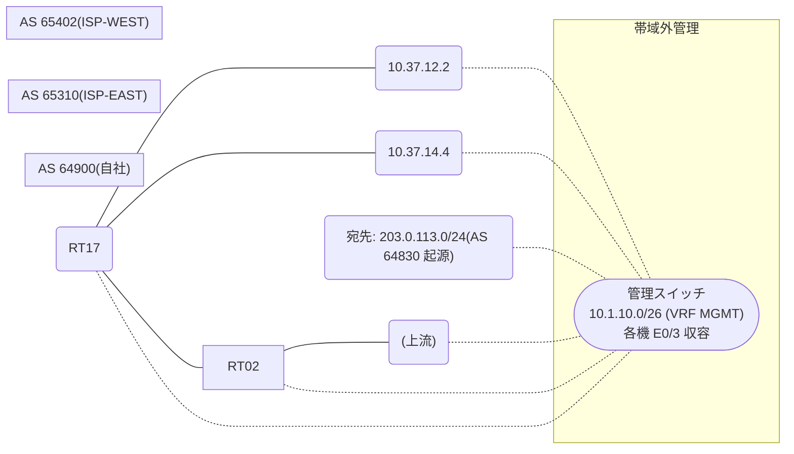

# 問題 20260812-006

> **本問は機器に接続せずに解答すること。追加の show 実行は認めない。**

## トポロジ

あなたの組織は、下記に示されているところのネットワークを運用しています。自社のルータ RT17 は、外部のネットワーク 203.0.113.0/24 への到達性を、複数の経路を通じて、確立しています。 ISP-EAST とは、接続されています。 ISP-WEST とも、接続されています。 一部の経路は、自 AS 内の境界ルータから、iBGP で、学習されています。



## 要件

1. 示されているところの出力、および、構成に基づいて、判断すること。
2. なお、機器の構成は、示されている抜粋のほかは、既定値である。

## 現在の状態

ベストパスの選出の結果について、その根拠が、確認されようとしています。

```
RT17# show ip bgp
BGP table version is 15, local router ID is 133.133.133.133
Status codes: s suppressed, d damped, h history, * valid, > best, i - internal, 
              r RIB-failure, S Stale, m multipath, b backup-path, f RT-Filter, 
              x best-external, a additional-path, c RIB-compressed, 
              t secondary path, L long-lived-stale,
Origin codes: i - IGP, e - EGP, ? - incomplete
RPKI validation codes: V valid, I invalid, N Not found

     Network          Next Hop            Metric LocPrf Weight Path
 *>   203.0.113.0      10.37.12.2                         25000 65310 65310 64830 i
 *                     10.37.14.4                             0 65402 64830 i
 * i                   2.5.5.5                       100      0 65310 64830 i
```

## 設定抜粋

```
RT17# show running-config | section router bgp
router bgp 64900
 bgp router-id 133.133.133.133
 bgp log-neighbor-changes
 neighbor 2.5.5.5 remote-as 64900
 neighbor 2.5.5.5 update-source Loopback0
 neighbor 10.37.12.2 remote-as 65310
 neighbor 10.37.14.4 remote-as 65402
 !
 address-family ipv4
  neighbor 2.5.5.5 activate
  neighbor 10.37.12.2 activate
  neighbor 10.37.12.2 weight 25000
  neighbor 10.37.14.4 activate
 exit-address-family
```

## 設問

示されているところの出力において、ベストパスの選出を決定づけた要素は、どれですか。(1つを選択してください)

## 選択肢
A. LOCAL_PREF(大きいほうが優先)

B. next-hop への IGP メトリック(小さいほうが優先)

C. AS-PATH 長(短いほうが優先)

D. MED(小さいほうが優先)

E. weight(大きいほうが優先)
