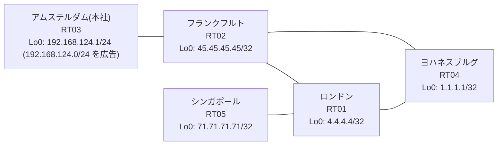

# 問題 20260812-011

> **本問は機器に接続せずに解答すること。追加の show 実行は認めない。**

## シナリオ

あなたは、ネットワークの運用を担当しています。本社の顧客のネットワークは、BGP AS 64840 の RT03 によって、広告されています。あなたの会社の内部は、BGP / EIGRP / OSPF という 3 つのドメインから構成されています。サイトと、ルーターおよびアドレスとの対応は、下記の表に示されているとおりです。いくつかの宛先への通信について、報告が上がっています。あなたは、示されているところの出力および構成に基づいて、その構成が、下記において記述されているとおりに動作していない理由を、判断する必要があります。既存の再配送の設計が、変更または撤去されてはなりません。スタティック・ルートによる回避も、許可されていません。`192.168.124.0/24` 宛のパケットが、広告元である RT03 の方向へ転送され、そして、転送のループが存在していないこと。顧客のネットワーク `192.168.124.0/24` を含むすべての宛先への到達可能性が、すべてのサイトにおいて、確保されていること。本作業は、日中の時間帯において実施されるという理由により、対象外であるところのデバイスに対する構成の変更は、許可されていません。



| 拠点 | ルータ | 拠点網 / 広告網 |
|------|--------|------------------|
| アムステルダム(本社) | RT03 | 192.168.124.1/24 (`192.168.124.0/24` を広告) |
| シンガポール | RT05 | 71.71.71.71/32 |
| フランクフルト | RT02 | 45.45.45.45/32 |
| ヨハネスブルグ | RT04 | 1.1.1.1/32 |
| ロンドン | RT01 | 4.4.4.4/32 |

リンク一覧:
```
  RT03:E0/0(.1) ── RT02:E0/0(.2)   10.165.144.0/30
  RT02:E0/1(.1) ── RT04:E0/0(.2)   10.40.245.0/30
  RT02:E0/2(.1) ── RT01:E0/0(.2)   10.28.211.0/30
  RT04:E0/1(.1) ── RT01:E0/1(.2)   10.63.113.0/30
  RT01:E0/2(.1) ── RT05:E0/0(.2)   10.107.135.0/30
```

## 出力

```
RT02# show ip bgp
BGP table version is 10, local router ID is 45.45.45.45
Status codes: s suppressed, d damped, h history, * valid, > best, i - internal, 
              r RIB-failure, S Stale, m multipath, b backup-path, f RT-Filter, 
              x best-external, a additional-path, c RIB-compressed, 
              t secondary path, L long-lived-stale,
Origin codes: i - IGP, e - EGP, ? - incomplete
RPKI validation codes: V valid, I invalid, N Not found

     Network          Next Hop            Metric LocPrf Weight Path
 *>   1.1.1.1/32       10.28.211.2             21         32768 ?
 *>   4.4.4.4/32       10.28.211.2             11         32768 ?
 *>   10.28.211.0/30   0.0.0.0                  0         32768 ?
 *>   10.63.113.0/30   10.28.211.2             20         32768 ?
 *>   10.107.135.0/30  10.28.211.2             20         32768 ?
 *>   45.45.45.45/32   0.0.0.0                  0         32768 i
 *>   71.71.71.71/32   10.28.211.2             21         32768 ?
 r>i  192.168.124.0    10.165.144.1             0    100      0 i
```
```
RT02# show running-config | section router
router eigrp 750
 network 10.40.245.0 0.0.0.3
 passive-interface Loopback0
router ospf 84
 router-id 45.45.45.45
 redistribute eigrp 750
 redistribute bgp 64840
 network 10.28.211.0 0.0.0.3 area 0
 network 45.45.45.45 0.0.0.0 area 0
router bgp 64840
 bgp router-id 45.45.45.45
 bgp log-neighbor-changes
 bgp redistribute-internal
 network 45.45.45.45 mask 255.255.255.255
 redistribute ospf 84
 neighbor 10.165.144.1 remote-as 64840
```
```
RT01# show running-config | section router
router ospf 84
 router-id 4.4.4.4
 passive-interface Loopback0
 network 4.4.4.4 0.0.0.0 area 0
 network 10.28.211.0 0.0.0.3 area 0
 network 10.63.113.0 0.0.0.3 area 0
 network 10.107.135.0 0.0.0.3 area 0
```
```
RT04# show running-config | section router
router eigrp 750
 network 10.40.245.0 0.0.0.3
 redistribute ospf 84 metric 100000 100 255 1 1500
router ospf 84
 router-id 1.1.1.1
 redistribute eigrp 750
 network 1.1.1.1 0.0.0.0 area 0
 network 10.63.113.0 0.0.0.3 area 0
```
```
RT02# show ip route
Gateway of last resort is not set
      1.0.0.0/32 is subnetted, 1 subnets
O        1.1.1.1 [110/21] via 10.28.211.2, 00:03:41, Ethernet0/2
      4.0.0.0/32 is subnetted, 1 subnets
O        4.4.4.4 [110/11] via 10.28.211.2, 00:04:16, Ethernet0/2
      10.0.0.0/8 is variably subnetted, 8 subnets, 2 masks
C        10.28.211.0/30 is directly connected, Ethernet0/2
L        10.28.211.1/32 is directly connected, Ethernet0/2
C        10.40.245.0/30 is directly connected, Ethernet0/1
L        10.40.245.1/32 is directly connected, Ethernet0/1
O        10.63.113.0/30 [110/20] via 10.28.211.2, 00:04:16, Ethernet0/2
O        10.107.135.0/30 [110/20] via 10.28.211.2, 00:03:47, Ethernet0/2
C        10.165.144.0/30 is directly connected, Ethernet0/0
L        10.165.144.2/32 is directly connected, Ethernet0/0
      45.0.0.0/32 is subnetted, 1 subnets
C        45.45.45.45 is directly connected, Loopback0
      71.0.0.0/32 is subnetted, 1 subnets
O        71.71.71.71 [110/21] via 10.28.211.2, 00:03:42, Ethernet0/2
D EX  192.168.124.0/24 [170/307200] via 10.40.245.2, 00:03:33, Ethernet0/1
```
```
RT02# show ip prefix-list
ip prefix-list PL-MIGR1: 2 entries
   seq 5 deny 71.71.71.71/32
   seq 10 permit 0.0.0.0/0 le 32
ip prefix-list PL-OLD2: 2 entries
   seq 5 deny 45.45.45.45/32
   seq 10 permit 0.0.0.0/0 le 32
```
```
RT05# traceroute 192.168.124.1 probe 1 timeout 1 ttl 1 8
Type escape sequence to abort.
Tracing the route to 192.168.124.1
VRF info: (vrf in name/id, vrf out name/id)
  1 10.107.135.1 1 msec
  2 10.28.211.1 6 msec
  3 10.40.245.2 2 msec
  4 10.63.113.2 2 msec
  5 10.28.211.1 4 msec
  6 10.40.245.2 2 msec
  7 10.63.113.2 17 msec
  8 10.28.211.1 15 msec
```
```
RT03# show running-config | section router
router bgp 64840
 bgp router-id 192.168.124.1
 bgp log-neighbor-changes
 network 192.168.124.0
 neighbor 10.165.144.2 remote-as 64840
```
```
RT02# show access-lists
Standard IP access list 12
    10 deny   45.45.45.45
    20 permit any
Standard IP access list 60
    10 deny   71.71.71.71
    20 permit any
```
```
RT02# show route-map
route-map RM-MIGR1, deny, sequence 10
  Match clauses:
    ip address prefix-lists: PL-MIGR1 
  Set clauses:
  Policy routing matches: 0 packets, 0 bytes
route-map RM-MIGR1, permit, sequence 20
  Match clauses:
  Set clauses:
  Policy routing matches: 0 packets, 0 bytes
route-map RM-OLD2, deny, sequence 10
  Match clauses:
    ip address prefix-lists: PL-OLD2 
  Set clauses:
  Policy routing matches: 0 packets, 0 bytes
route-map RM-OLD2, permit, sequence 20
  Match clauses:
  Set clauses:
  Policy routing matches: 0 packets, 0 bytes
```

## 設問

次のうち、正しいものは、どれですか。

## 選択肢
A. RT03 からの広告が RT02 に到達していない

B. RT02 が、一周して戻ってきた外部経路を iBGP の経路より優先して採用している

C. RT02 において当該プレフィックスの外部経路タイプが E2 であり、内部コストが加算されていない

D. RT04 の相互再配送において経路が収束せず、振動している

E. RT02 の BGP テーブルにおいて当該経路が RIB-failure となり、ベストパスが選出できていない

F. RT04 と RT01 の間で等コストの複数経路が成立し、パケットが分散されている
