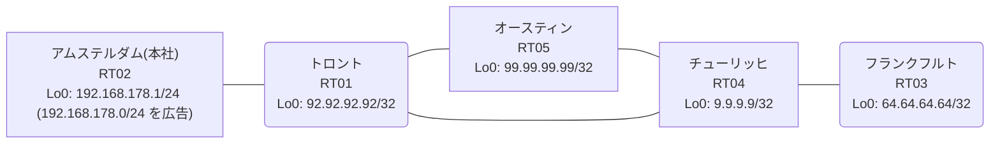

# 問題 20260812-013

> **本問は機器に接続せずに解答すること。追加の show 実行は認めない。**

## トポロジ

あなたは、ネットワークの運用を担当しています。本社の顧客のネットワークは、BGP AS 65447 の RT02 によって、広告されています。あなたの会社の内部は、BGP / EIGRP / OSPF という 3 つのドメインから構成されています。サイトと、ルータおよびアドレスとの対応は、下記の表に示されているとおりです。



| 拠点 | ルータ | 拠点網 / 広告網 |
|------|--------|------------------|
| アムステルダム(本社) | RT02 | 192.168.178.1/24 (`192.168.178.0/24` を広告) |
| オースティン | RT05 | 99.99.99.99/32 |
| チューリッヒ | RT04 | 9.9.9.9/32 |
| トロント | RT01 | 92.92.92.92/32 |
| フランクフルト | RT03 | 64.64.64.64/32 |

リンク一覧:
```
  RT02:E0/0(.1) ── RT01:E0/0(.2)   10.253.76.0/30
  RT01:E0/1(.1) ── RT04:E0/0(.2)   10.75.173.0/30
  RT01:E0/2(.1) ── RT05:E0/0(.2)   10.142.8.0/30
  RT04:E0/1(.1) ── RT05:E0/1(.2)   10.59.146.0/30
  RT04:E0/2(.1) ── RT03:E0/0(.2)   10.129.123.0/30
```

## 要件

1. 顧客のネットワーク `192.168.178.0/24` を含むすべての宛先への到達可能性が、すべてのサイトにおいて、確保されていること。
2. スタティック ルートおよび既定のルートによる迂回は、実施されてはなりません。
3. `192.168.178.0/24` 宛のトラフィックが RT02 へ配送され、経路の周回が、発生していないこと。
4. インタフェースの IP アドレッシングは、変更されてはなりません。
5. 既存の再配送の設計が、変更または撤去されることはできません。スタティック ルートによる回避も、許可されていません。

## 現在の状態

通信の一部において、想定されていない挙動が、観測されています。あなたは、示されているところの出力および構成に基づいて、その構成が、下記において記述されているとおりに動作していない理由を、判断する必要があります。

```
RT01# show ip route
Gateway of last resort is not set
      9.0.0.0/32 is subnetted, 1 subnets
O        9.9.9.9 [110/21] via 10.142.8.2, 00:03:51, Ethernet0/2
      10.0.0.0/8 is variably subnetted, 8 subnets, 2 masks
O        10.59.146.0/30 [110/20] via 10.142.8.2, 00:03:51, Ethernet0/2
C        10.75.173.0/30 is directly connected, Ethernet0/1
L        10.75.173.1/32 is directly connected, Ethernet0/1
O        10.129.123.0/30 [110/30] via 10.142.8.2, 00:03:51, Ethernet0/2
C        10.142.8.0/30 is directly connected, Ethernet0/2
L        10.142.8.1/32 is directly connected, Ethernet0/2
C        10.253.76.0/30 is directly connected, Ethernet0/0
L        10.253.76.2/32 is directly connected, Ethernet0/0
      64.0.0.0/32 is subnetted, 1 subnets
O        64.64.64.64 [110/31] via 10.142.8.2, 00:03:51, Ethernet0/2
      92.0.0.0/32 is subnetted, 1 subnets
C        92.92.92.92 is directly connected, Loopback0
      99.0.0.0/32 is subnetted, 1 subnets
O        99.99.99.99 [110/11] via 10.142.8.2, 00:03:51, Ethernet0/2
D EX  192.168.178.0/24 [170/307200] via 10.75.173.2, 00:03:38, Ethernet0/1
```
```
RT01# show route-map
route-map RM-OLD1, deny, sequence 10
  Match clauses:
    ip address prefix-lists: PL-OLD1 
  Set clauses:
  Policy routing matches: 0 packets, 0 bytes
route-map RM-OLD1, permit, sequence 20
  Match clauses:
  Set clauses:
  Policy routing matches: 0 packets, 0 bytes
route-map RM-LEGACY2, deny, sequence 10
  Match clauses:
    ip address prefix-lists: PL-LEGACY2 
  Set clauses:
  Policy routing matches: 0 packets, 0 bytes
route-map RM-LEGACY2, permit, sequence 20
  Match clauses:
  Set clauses:
  Policy routing matches: 0 packets, 0 bytes
```
```
RT01# show ip prefix-list
ip prefix-list PL-LEGACY2: 2 entries
   seq 5 deny 99.99.99.99/32
   seq 10 permit 0.0.0.0/0 le 32
ip prefix-list PL-OLD1: 2 entries
   seq 5 deny 192.168.178.0/24
   seq 10 permit 0.0.0.0/0 le 32
```
```
RT01# show access-lists
Standard IP access list 57
    10 deny   99.99.99.99
    20 permit any
Standard IP access list 75
    10 deny   192.168.178.0
    20 permit any
```
```
RT01# show ip bgp
BGP table version is 10, local router ID is 92.92.92.92
Status codes: s suppressed, d damped, h history, * valid, > best, i - internal, 
              r RIB-failure, S Stale, m multipath, b backup-path, f RT-Filter, 
              x best-external, a additional-path, c RIB-compressed, 
              t secondary path, L long-lived-stale,
Origin codes: i - IGP, e - EGP, ? - incomplete
RPKI validation codes: V valid, I invalid, N Not found

     Network          Next Hop            Metric LocPrf Weight Path
 *>   9.9.9.9/32       10.142.8.2              21         32768 ?
 *>   10.59.146.0/30   10.142.8.2              20         32768 ?
 *>   10.129.123.0/30  10.142.8.2              30         32768 ?
 *>   10.142.8.0/30    0.0.0.0                  0         32768 ?
 *>   64.64.64.64/32   10.142.8.2              31         32768 ?
 *>   92.92.92.92/32   0.0.0.0                  0         32768 i
 *>   99.99.99.99/32   10.142.8.2              11         32768 ?
 r>i  192.168.178.0    10.253.76.1              0    100      0 i
```
```
RT03# traceroute 192.168.178.1 probe 1 timeout 1 ttl 1 8
Type escape sequence to abort.
Tracing the route to 192.168.178.1
VRF info: (vrf in name/id, vrf out name/id)
  1 10.129.123.1 1 msec
  2 10.59.146.2 1 msec
  3 10.142.8.1 2 msec
  4 10.75.173.2 1 msec
  5 10.59.146.2 2 msec
  6 10.142.8.1 2 msec
  7 10.75.173.2 2 msec
  8 10.59.146.2 23 msec
```

## 設定抜粋

```
RT01# show running-config | section router
router eigrp 760
 timers active-time 5
 network 10.75.173.0 0.0.0.3
 passive-interface Loopback0
router ospf 65
 router-id 92.92.92.92
 redistribute eigrp 760
 redistribute bgp 65447
 network 10.142.8.0 0.0.0.3 area 0
 network 92.92.92.92 0.0.0.0 area 0
router bgp 65447
 bgp router-id 92.92.92.92
 bgp log-neighbor-changes
 bgp redistribute-internal
 network 92.92.92.92 mask 255.255.255.255
 redistribute ospf 65
 neighbor 10.253.76.1 remote-as 65447
```
```
RT04# show running-config | section router
router eigrp 760
 network 10.75.173.0 0.0.0.3
 redistribute ospf 65 metric 100000 100 255 1 1500
router ospf 65
 router-id 9.9.9.9
 redistribute eigrp 760
 network 9.9.9.9 0.0.0.0 area 0
 network 10.59.146.0 0.0.0.3 area 0
 network 10.129.123.0 0.0.0.3 area 0
```
```
RT05# show running-config | section router
router ospf 65
 router-id 99.99.99.99
 passive-interface Loopback0
 network 10.59.146.0 0.0.0.3 area 0
 network 10.142.8.0 0.0.0.3 area 0
 network 99.99.99.99 0.0.0.0 area 0
```
```
RT02# show running-config | section router
router bgp 65447
 bgp router-id 192.168.178.1
 bgp log-neighbor-changes
 network 192.168.178.0
 neighbor 10.253.76.2 remote-as 65447
```

## 設問

次のうち、正しいものは、どれですか。

## 選択肢
A. BGP から OSPF への再配送に seed metric が指定されておらず、経路が広告されていない

B. RT01 が、一周して戻ってきた外部経路を iBGP の経路より優先して採用している

C. RT04 と RT05 の間で等コストの複数経路が成立し、パケットが分散されている

D. RT01 の BGP テーブルにおいて当該経路が RIB-failure となり、ベストパスが選出できていない

E. RT02 からの広告が RT01 に到達していない

F. RT01 において当該プレフィックスの外部経路タイプが E2 であり、内部コストが加算されていない
