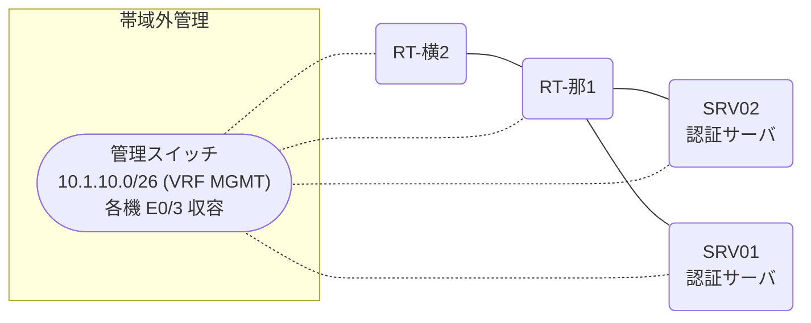

# 問題 20260812-016

> **本問は機器に接続せずに解答すること。追加の show 実行は認めない。**

## シナリオ

あなたの組織は、下記に示されているところのネットワークを運用しています。2 つの拠点のルータが、共通の認証サーバ群を用いて、管理者の認証を行うように構成されています。一方のルータはサーバと直結しており、他方はそのルーターを経由してサーバに到達します。ユーザーから、通信に関する事象が、報告されています。示されているところの出力および構成に基づいて、要求されているところの動作が得られていない理由が、判断されなければなりません。那覇・横浜 の両拠点で、利用者 ope-suzuki が権限レベル 15 で機器を操作できること。既定の方式リストは変更しないこと。認証は認証サーバ群 RAD-GROUP を用いること。



### 認証サーバの仕様

| 項目 | SRV01 | SRV02 |
|---|---|---|
| アドレス | 10.99.49.2 | 10.99.50.2 |
| 待受ポート | 1812 / 1813 | 1645 / 1646 |
| 共有鍵 | Rad-8102 | Rad-8102 |
| 受理する送信元 | 10.0.0.1 ・ 10.9.0.2 | 同左 |
| 台帳 | ope-suzuki(15) ・ watch-op(1) ・ SUZUKI(15) | 同左 |
| 現在の稼働状態 | 保守作業のため停止中 | 稼働中 |

### ルータのアドレス

| ルータ | Loopback0 | 認証サーバ方向のインタフェース |
|---|---|---|
| RT-那1(那覇) | 10.0.0.1 | Ethernet0/0 = 10.99.49.1 |
| RT-横2(横浜) | 10.9.0.2 | Ethernet0/0 = 10.73.12.2 |

## 出力

| 拠点 | ユーザ | 結果 |
|---|---|---|
| 那覇 | ope-suzuki | ログイン可(権限レベル 15) |
| 那覇 | watch-op | ログイン可(権限レベル 1) |
| 那覇 | backup-adm | ログイン不可 |
| 那覇 | watch-op からの特権昇格 | 昇格可(15) |
| 那覇 | ope-suzuki(6 セッション目以降) | ログイン可(権限レベル 15) |
| 那覇 | backup-adm(コンソールから) | ログイン可(権限レベル 15) |
| 那覇 | ope-suzuki(ログインに要する時間) | 1 回目 約 15 秒 / 2 回目以降 即時 |
| 横浜 | ope-suzuki | ログイン可(権限レベル 15) |
| 横浜 | watch-op | ログイン可(権限レベル 1) |
| 横浜 | backup-adm | ログイン不可 |
| 横浜 | watch-op からの特権昇格 | 昇格可(15) |
| 横浜 | ope-suzuki(6 セッション目以降) | ログイン可(権限レベル 15) |
| 横浜 | backup-adm(コンソールから) | ログイン可(権限レベル 15) |
| 横浜 | ope-suzuki(ログインに要する時間) | 1 回目 約 15 秒 / 2 回目以降 即時 |

認証サーバがすべて停止した場合:

| 拠点 | ユーザ | 結果 |
|---|---|---|
| 那覇 | backup-adm | ログイン可(権限レベル 15) |
| 那覇 | SUZUKI | ログイン可(権限レベル 15) |
| 那覇 | backup-adm(コンソールから) | ログイン可(権限レベル 15) |
| 横浜 | backup-adm | ログインは通るが exec 拒否 |
| 横浜 | SUZUKI | ログインは通るが exec 拒否 |
| 横浜 | backup-adm(コンソールから) | ログイン可(権限レベル 15) |

```
RT-那1# show running-config | section aaa
aaa new-model
!
radius server RAD1
 address ipv4 10.99.49.2 auth-port 1812 acct-port 1813
 key Rad-8102
!
radius server RAD2
 address ipv4 10.99.50.2 auth-port 1645 acct-port 1646
 key Rad-8102
!
aaa group server radius RAD-GROUP
 server name RAD1
 server name RAD2
 deadtime 5
!
aaa authentication login default group RAD-GROUP local
aaa authentication login CONSOLE local
aaa authorization exec default group RAD-GROUP local
aaa authorization exec CONSOLE local
aaa authorization console
!
ip radius source-interface Loopback0
radius-server timeout 5
radius-server retransmit 2
radius-server dead-criteria time 5 tries 1
!
username backup-adm privilege 15 secret 5 $1$xxxx
username SUZUKI privilege 15 secret 5 $1$yyyy
!
line con 0
 exec-timeout 0 0
 logging synchronous
 login authentication CONSOLE
 authorization exec CONSOLE
line vty 0 4
 exec-timeout 0 0
 transport input ssh
line vty 5 15
 exec-timeout 0 0
 transport input ssh
```
```
RT-横2# show running-config | section aaa
aaa new-model
!
radius server RAD1
 address ipv4 10.99.49.2 auth-port 1812 acct-port 1813
 key Rad-8102
!
radius server RAD2
 address ipv4 10.99.50.2 auth-port 1645 acct-port 1646
 key Rad-8102
!
aaa group server radius RAD-GROUP
 server name RAD1
 server name RAD2
 deadtime 5
!
aaa authentication login default group RAD-GROUP local
aaa authentication login CONSOLE local
aaa authorization exec default group RAD-GROUP
aaa authorization exec CONSOLE local
aaa authorization console
!
ip radius source-interface Loopback0
radius-server timeout 5
radius-server retransmit 2
radius-server dead-criteria time 5 tries 1
!
username backup-adm privilege 15 secret 5 $1$xxxx
username SUZUKI privilege 15 secret 5 $1$yyyy
!
line con 0
 exec-timeout 0 0
 logging synchronous
 login authentication CONSOLE
 authorization exec CONSOLE
line vty 0 4
 exec-timeout 0 0
 transport input ssh
line vty 5 15
 exec-timeout 0 0
 transport input ssh
```
```
那覇: User was successfully authenticated. (1 回目 約 15 秒 / 2 回目以降 即時)
横浜: User was successfully authenticated. (1 回目 約 15 秒 / 2 回目以降 即時)
```

## 設問

次のうち、正しいものは、どれですか。

## 選択肢
**A.**
```
aaa authorization exec ADMIN-LOGIN group RAD-GROUP local
line vty 0 4
 authorization exec ADMIN-LOGIN
 exit
```

B. 認証サーバに、昇格用の利用者を登録する。

**C.**
```
aaa authentication login CONSOLE local
aaa authorization exec CONSOLE local
line con 0
 login authentication CONSOLE
 authorization exec CONSOLE
 exit
```

D. aaa authorization exec default group RAD-GROUP local
