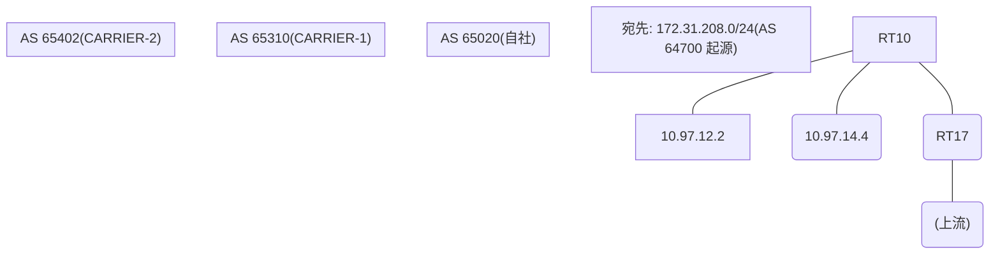

# 問題 20260812-021

> **本問は機器に接続せずに解答すること。追加の show 実行は認めない。**

## トポロジ

あなたの組織は、下記に示されているところのネットワークを運用しています。自社のルータ RT10 は、外部のネットワーク 172.31.208.0/24 への到達性を、複数の経路を通じて、確立しています。 CARRIER-1 とは、接続されています。 CARRIER-2 とも、接続されています。 一部の経路は、自 AS 内の境界ルータから、iBGP で、学習されています。



## 要件

1. 示されているところの出力、および、構成に基づいて、判断すること。
2. なお、機器の構成は、示されている抜粋のほかは、既定値である。

## 現在の状態

外部との 1 つのセッションが失われ、それまで使用されていたところの経路は、取り下げられました。ルーターは、残るところの経路からの、ベストパスの選出を、行おうとしています。示されているところの出力は、その時点で、採取されたものです。なお、各経路の受信の後、セッションのクリア、および、ソフト・リフレッシュは、実施されていません。

```
RT10# show ip bgp
BGP table version is 48, local router ID is 6.6.6.6
Status codes: s suppressed, d damped, h history, * valid, > best, i - internal, 
              r RIB-failure, S Stale, m multipath, b backup-path, f RT-Filter, 
              x best-external, a additional-path, c RIB-compressed, 
              t secondary path, L long-lived-stale,
Origin codes: i - IGP, e - EGP, ? - incomplete
RPKI validation codes: V valid, I invalid, N Not found

     Network          Next Hop            Metric LocPrf Weight Path
 * i  172.31.208.0/24  7.6.6.6                       100      0 65310 65310 64700 64700 i
 *                     10.97.14.4              20             0 65402 64700 i
 *                     10.97.12.2             300             0 65310 64700 i
```
```
RT10# show ip bgp 172.31.208.0
BGP routing table entry for 172.31.208.0/24, version 48
Paths: (3 available, no best path)
  Not advertised to any peer
  Refresh Epoch 1
  65310 65310 64700 64700
    7.6.6.6 (metric 101) from 7.6.6.6 (7.6.6.6)
      Origin IGP, localpref 100, valid, internal
      rx pathid: 0, tx pathid: 0
      Updated on Jul 21 2026 18:53:56 UTC
  Refresh Epoch 3
  65402 64700
    10.97.14.4 from 10.97.14.4 (43.43.43.43)
      Origin IGP, metric 20, localpref 100, valid, external
      rx pathid: 0, tx pathid: 0
      Updated on Jul 21 2026 16:20:14 UTC
  Refresh Epoch 2
  65310 64700
    10.97.12.2 from 10.97.12.2 (180.180.180.180)
      Origin IGP, metric 300, localpref 100, valid, external
      rx pathid: 0, tx pathid: 0
      Updated on Jul 21 2026 15:55:07 UTC
```

## 設定抜粋

```
RT10# show running-config | section router bgp
router bgp 65020
 bgp router-id 6.6.6.6
 bgp log-neighbor-changes
 neighbor 7.6.6.6 remote-as 65020
 neighbor 7.6.6.6 update-source Loopback0
 neighbor 10.97.12.2 remote-as 65310
 neighbor 10.97.14.4 remote-as 65402
 !
 address-family ipv4
  neighbor 7.6.6.6 activate
  neighbor 10.97.12.2 activate
  neighbor 10.97.14.4 activate
 exit-address-family
```

## 設問

示されているところの出力に基づいて、この後、172.31.208.0/24 のベストパスとして選出され、転送に使用されるところの経路は、どれですか。(1つを選択してください)

## 選択肢
A. next hop 10.97.12.2 の経路

B. next hop 10.97.14.4 の経路

C. next hop 7.6.6.6 の経路
