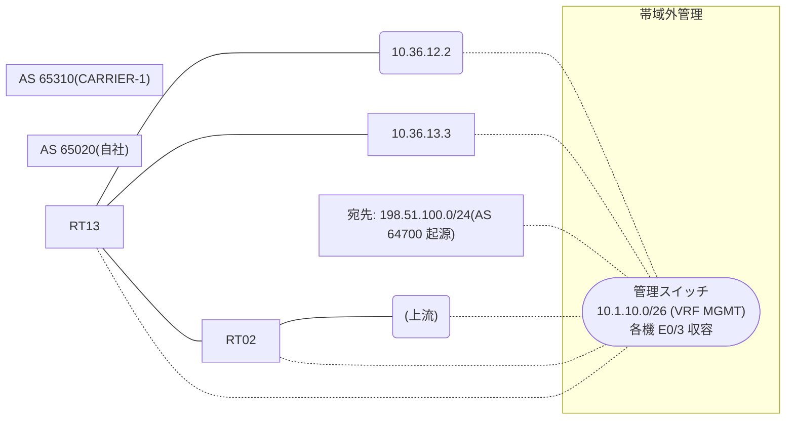

# 問題 20260812-022

> **本問は機器に接続せずに解答すること。追加の show 実行は認めない。**

## トポロジ

あなたは、下記のネットワークの保守を担当する技術者です。自社のルーター RT13 は、外部のネットワーク 198.51.100.0/24 への到達性を、複数の経路を通じて、確立しています。 CARRIER-1 とは、2 本のリンクで、接続されています。 一部の経路は、自 AS 内の境界ルータから、iBGP で、学習されています。



## 要件

1. 示されているところの出力、および、構成に基づいて、判断すること。
2. なお、機器の構成は、示されている抜粋のほかは、既定値である。

## 現在の状態

外部との 1 つのセッションが失われ、それまで使用されていたところの経路は、取り下げられました。ルータは、残るところの経路からの、ベストパスの選出を、行おうとしています。示されているところの出力は、その時点で、採取されたものです。

```
RT13# show ip bgp
BGP table version is 19, local router ID is 235.235.235.235
Status codes: s suppressed, d damped, h history, * valid, > best, i - internal, 
              r RIB-failure, S Stale, m multipath, b backup-path, f RT-Filter, 
              x best-external, a additional-path, c RIB-compressed, 
              t secondary path, L long-lived-stale,
Origin codes: i - IGP, e - EGP, ? - incomplete
RPKI validation codes: V valid, I invalid, N Not found

     Network          Next Hop            Metric LocPrf Weight Path
 * i  198.51.100.0     5.6.6.6                       100      0 65310 65310 64700 64700 i
 *                     10.36.12.2                             0 65310 64700 i
 *                     10.36.13.3                             0 65310 64700 i
```
```
RT13# show ip bgp 198.51.100.0
BGP routing table entry for 198.51.100.0/24, version 19
BGP Bestpath: compare-routerid
Paths: (3 available, no best path)
  Not advertised to any peer
  Refresh Epoch 4
  65310 65310 64700 64700
    5.6.6.6 (metric 101) from 5.6.6.6 (5.6.6.6)
      Origin IGP, localpref 100, valid, internal
      rx pathid: 0, tx pathid: 0
      Updated on May 7 2026 08:50:56 UTC
  Refresh Epoch 2
  65310 64700
    10.36.12.2 from 10.36.12.2 (131.131.131.131)
      Origin IGP, localpref 100, valid, external
      rx pathid: 0, tx pathid: 0
      Updated on May 7 2026 07:44:14 UTC
  Refresh Epoch 1
  65310 64700
    10.36.13.3 from 10.36.13.3 (156.156.156.156)
      Origin IGP, localpref 100, valid, external
      rx pathid: 0, tx pathid: 0
      Updated on May 7 2026 06:11:07 UTC
```

## 設定抜粋

```
RT13# show running-config | section router bgp
router bgp 65020
 bgp router-id 235.235.235.235
 bgp log-neighbor-changes
 bgp bestpath compare-routerid
 neighbor 5.6.6.6 remote-as 65020
 neighbor 5.6.6.6 update-source Loopback0
 neighbor 10.36.12.2 remote-as 65310
 neighbor 10.36.13.3 remote-as 65310
 !
 address-family ipv4
  neighbor 5.6.6.6 activate
  neighbor 10.36.12.2 activate
  neighbor 10.36.13.3 activate
 exit-address-family
```

## 設問

示されているところの出力に基づいて、この後、198.51.100.0/24 のベストパスとして選出され、転送に使用されるところの経路は、どれですか。(1つを選択してください)

## 選択肢
A. next hop 5.6.6.6 の経路

B. next hop 10.36.13.3 の経路

C. next hop 10.36.12.2 の経路
