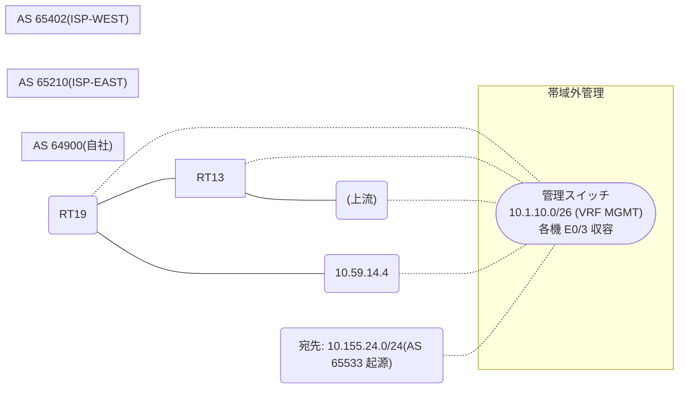

# 問題 20260812-023

> **本問は機器に接続せずに解答すること。追加の show 実行は認めない。**

## シナリオ

あなたは、下記のネットワークの保守を担当する技術者です。自社のルーター RT19 は、外部のネットワーク 10.155.24.0/24 への到達性を、複数の経路を通じて、確立しています。 ISP-WEST とも、接続されています。 一部の経路は、自 AS 内の境界ルータから、iBGP で、学習されています。現在、10.155.24.0/24 への転送は、要件に適合しないところの経路を、使用しています。next hop 10.59.25.2 の経路が、ベストパスとして、選出されること。BGP の設定は、変更が、承認されていない。なお、設定の投入後、変更は、適切に、反映されているものとする。



## 出力

```
RT19# show running-config | section router bgp
router bgp 64900
 bgp router-id 146.146.146.146
 bgp log-neighbor-changes
 neighbor 3.5.5.5 remote-as 64900
 neighbor 3.5.5.5 update-source Loopback0
 neighbor 10.59.14.4 remote-as 65402
 !
 address-family ipv4
  neighbor 3.5.5.5 activate
  neighbor 10.59.14.4 activate
 exit-address-family
```
```
RT13# show running-config | section router bgp
router bgp 64900
 bgp router-id 3.5.5.5
 neighbor 146.146.146.146 remote-as 64900
 neighbor 146.146.146.146 update-source Loopback0
 neighbor 10.59.25.2 remote-as 65210
 !
 address-family ipv4
  neighbor 146.146.146.146 activate
  neighbor 10.59.25.2 activate
 exit-address-family
```
```
RT19# show ip bgp 10.155.24.0
BGP routing table entry for 10.155.24.0/24, version 55
Paths: (2 available, best #2, table default)
  Advertised to update-groups:
     1         
  Refresh Epoch 1
  65210 65533
    10.59.25.2 (inaccessible) from 3.5.5.5 (3.5.5.5)
      Origin IGP, localpref 200, valid, internal
      rx pathid: 0, tx pathid: 0
      Updated on Jun 21 2026 12:58:03 UTC
  Refresh Epoch 1
  65402 65402 65533
    10.59.14.4 from 10.59.14.4 (116.116.116.116)
      Origin IGP, localpref 100, valid, external, best
      rx pathid: 0, tx pathid: 0x0
      Updated on Jun 21 2026 13:48:03 UTC
```
```
RT19# show ip bgp
BGP table version is 55, local router ID is 146.146.146.146
Status codes: s suppressed, d damped, h history, * valid, > best, i - internal, 
              r RIB-failure, S Stale, m multipath, b backup-path, f RT-Filter, 
              x best-external, a additional-path, c RIB-compressed, 
              t secondary path, L long-lived-stale,
Origin codes: i - IGP, e - EGP, ? - incomplete
RPKI validation codes: V valid, I invalid, N Not found

     Network          Next Hop            Metric LocPrf Weight Path
 * i  10.155.24.0/24   10.59.25.2                    200      0 65210 65533 i
 *>                    10.59.14.4                             0 65402 65402 65533 i
```

## 設問

示されているところのすべての要件が満たされることを確実にするために、適用されなければならない構成は、どれですか。(1つを選択してください)

## 選択肢
**A.**
```
! RT13(境界)にて
router ospf 1
 network 10.59.25.0 0.0.0.255 area 0
```

**B.**
```
clear ip bgp * soft
```

**C.**
```
router bgp 64900
 address-family ipv4
  neighbor 3.5.5.5 weight 30000
```

**D.**
```
route-map RM-PRIMARY-IN permit 10
 set local-preference 200
router bgp 64900
 address-family ipv4
  neighbor 3.5.5.5 route-map RM-PRIMARY-IN in
```

**E.**
```
! RT13(境界)にて
router bgp 64900
 address-family ipv4
  neighbor 146.146.146.146 next-hop-self
```
