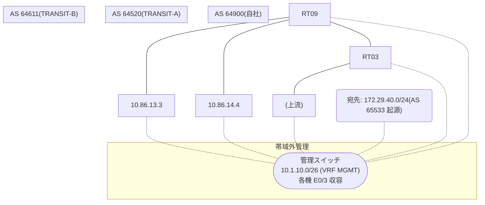

# 問題 20260812-024

> **本問は機器に接続せずに解答すること。追加の show 実行は認めない。**

## シナリオ

あなたは、下記のネットワークの保守を担当する技術者です。自社のルーター RT09 は、外部のネットワーク 172.29.40.0/24 への到達性を、複数の経路を通じて、確立しています。 TRANSIT-A とは、接続されています。 TRANSIT-B とも、接続されています。 一部の経路は、自 AS 内の境界ルータから、iBGP で、学習されています。外部との 1 つのセッションが失われ、それまで使用されていたところの経路は、取り下げられました。ルータは、残るところの経路からの、ベストパスの選出を、行おうとしています。示されているところの出力は、その時点で、採取されたものです。示されているところの出力、および、構成に基づいて、判断すること。なお、機器の構成は、示されている抜粋のほかは、既定値である。



## 出力

```
RT09# show ip bgp
BGP table version is 26, local router ID is 68.68.68.68
Status codes: s suppressed, d damped, h history, * valid, > best, i - internal, 
              r RIB-failure, S Stale, m multipath, b backup-path, f RT-Filter, 
              x best-external, a additional-path, c RIB-compressed, 
              t secondary path, L long-lived-stale,
Origin codes: i - IGP, e - EGP, ? - incomplete
RPKI validation codes: V valid, I invalid, N Not found

     Network          Next Hop            Metric LocPrf Weight Path
 *    172.29.40.0/24   10.86.14.4             500             0 64611 65533 i
 *                     10.86.13.3                             0 64520 64520 65533 65533 i
 * i                   5.5.5.5                 10    100      0 64520 65533 i
```
```
RT09# show ip bgp 172.29.40.0
BGP routing table entry for 172.29.40.0/24, version 26
Paths: (3 available, no best path)
  Not advertised to any peer
  Refresh Epoch 4
  64611 65533
    10.86.14.4 from 10.86.14.4 (246.246.246.246)
      Origin IGP, metric 500, localpref 100, valid, external
      rx pathid: 0, tx pathid: 0
      Updated on Jun 20 2026 08:25:03 UTC
  Refresh Epoch 3
  64520 64520 65533 65533
    10.86.13.3 from 10.86.13.3 (60.60.60.60)
      Origin IGP, localpref 100, valid, external
      rx pathid: 0, tx pathid: 0
      Updated on Jun 20 2026 07:06:56 UTC
  Refresh Epoch 4
  64520 65533
    5.5.5.5 (metric 11) from 5.5.5.5 (5.5.5.5)
      Origin IGP, metric 10, localpref 100, valid, internal
      rx pathid: 0, tx pathid: 0
      Updated on Jun 20 2026 06:51:07 UTC
```
```
RT09# show running-config | section router bgp
router bgp 64900
 bgp router-id 68.68.68.68
 bgp log-neighbor-changes
 neighbor 5.5.5.5 remote-as 64900
 neighbor 5.5.5.5 update-source Loopback0
 neighbor 10.86.13.3 remote-as 64520
 neighbor 10.86.14.4 remote-as 64611
 !
 address-family ipv4
  neighbor 5.5.5.5 activate
  neighbor 10.86.13.3 activate
  neighbor 10.86.14.4 activate
 exit-address-family
```

## 設問

示されているところの出力に基づいて、この後、172.29.40.0/24 のベストパスとして選出され、転送に使用されるところの経路は、どれですか。(1つを選択してください)

## 選択肢
A. next hop 10.86.14.4 の経路

B. next hop 5.5.5.5 の経路

C. next hop 10.86.13.3 の経路
