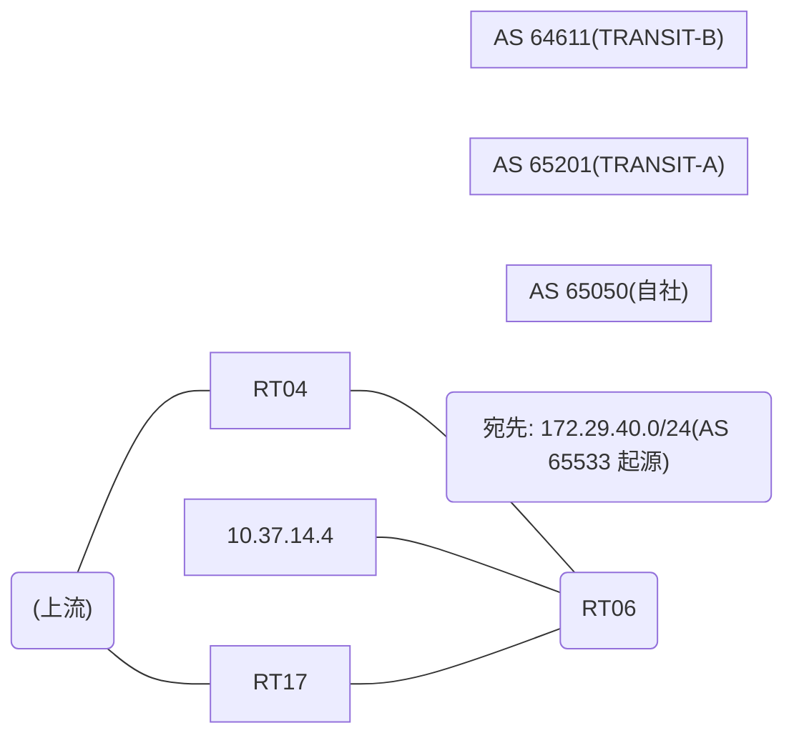

# 問題 20260812-025

> **本問は機器に接続せずに解答すること。追加の show 実行は認めない。**

## シナリオ

あなたの組織は、下記に示されているところのネットワークを運用しています。自社のルータ RT06 は、外部のネットワーク 172.29.40.0/24 への到達性を、複数の経路を通じて、確立しています。 TRANSIT-B とも、接続されています。 一部の経路は、自 AS 内の境界ルータから、iBGP で、学習されています。外部との 1 つのセッションが失われ、それまで使用されていたところの経路は、取り下げられました。ルータは、残るところの経路からの、ベストパスの選出を、行おうとしています。示されているところの出力は、その時点で、採取されたものです。示されているところの出力、および、構成に基づいて、判断すること。なお、機器の構成は、示されている抜粋のほかは、既定値である。



## 出力

```
RT06# show ip bgp
BGP table version is 5, local router ID is 90.90.90.90
Status codes: s suppressed, d damped, h history, * valid, > best, i - internal, 
              r RIB-failure, S Stale, m multipath, b backup-path, f RT-Filter, 
              x best-external, a additional-path, c RIB-compressed, 
              t secondary path, L long-lived-stale,
Origin codes: i - IGP, e - EGP, ? - incomplete
RPKI validation codes: V valid, I invalid, N Not found

     Network          Next Hop            Metric LocPrf Weight Path
 *    172.29.40.0/24   10.37.14.4                             0 64611 64611 65533 65533 i
 * i                   5.5.5.5                       100      0 65201 65533 i
 * i                   8.6.6.6                       100      0 65201 65533 i
```
```
RT06# show ip bgp 172.29.40.0
BGP routing table entry for 172.29.40.0/24, version 5
Paths: (3 available, no best path)
  Not advertised to any peer
  Refresh Epoch 2
  64611 64611 65533 65533
    10.37.14.4 from 10.37.14.4 (81.81.81.81)
      Origin IGP, localpref 100, valid, external
      rx pathid: 0, tx pathid: 0
      Updated on Jul 15 2026 12:24:56 UTC
  Refresh Epoch 4
  65201 65533
    5.5.5.5 (metric 11) from 5.5.5.5 (176.176.176.176)
      Origin IGP, localpref 100, valid, internal
      rx pathid: 0, tx pathid: 0
      Updated on Jul 15 2026 10:16:14 UTC
  Refresh Epoch 3
  65201 65533
    8.6.6.6 (metric 101) from 8.6.6.6 (78.78.78.78)
      Origin IGP, localpref 100, valid, internal
      rx pathid: 0, tx pathid: 0
      Updated on Jul 15 2026 09:59:07 UTC
```
```
RT06# show running-config | section router bgp
router bgp 65050
 bgp router-id 90.90.90.90
 bgp log-neighbor-changes
 neighbor 5.5.5.5 remote-as 65050
 neighbor 5.5.5.5 update-source Loopback0
 neighbor 8.6.6.6 remote-as 65050
 neighbor 8.6.6.6 update-source Loopback0
 neighbor 10.37.14.4 remote-as 64611
 !
 address-family ipv4
  neighbor 5.5.5.5 activate
  neighbor 8.6.6.6 activate
  neighbor 10.37.14.4 activate
 exit-address-family
```

## 設問

示されているところの出力に基づいて、この後、172.29.40.0/24 のベストパスとして選出され、転送に使用されるところの経路は、どれですか。(1つを選択してください)

## 選択肢
A. next hop 8.6.6.6 の経路

B. next hop 10.37.14.4 の経路

C. next hop 5.5.5.5 の経路
