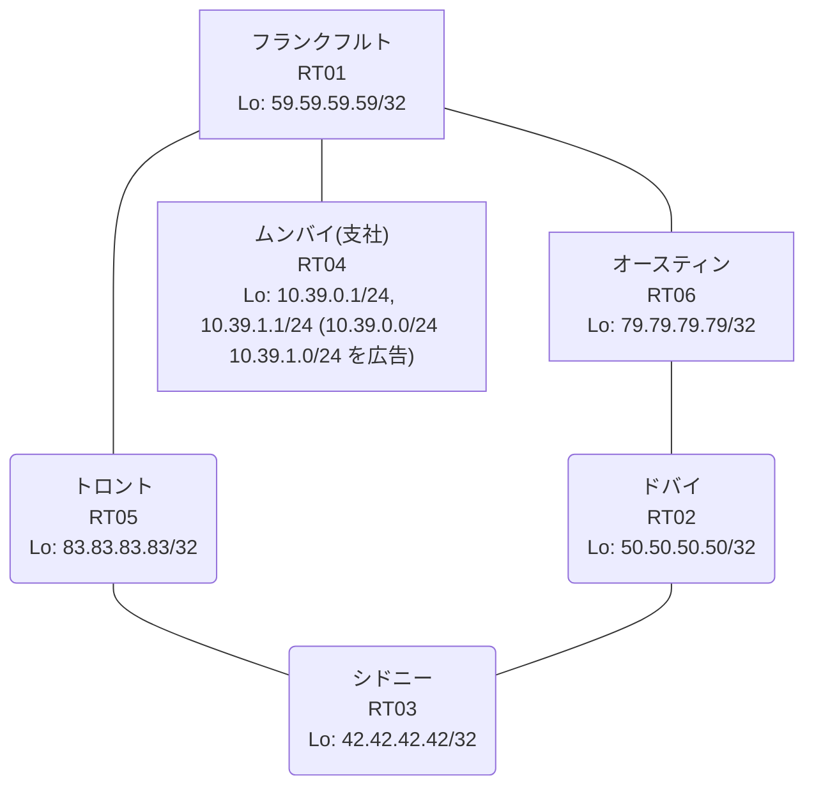

# 問題 20260813-001

> **本問は機器に接続せずに解答すること。追加の show 実行は認めない。**

## シナリオ

あなたの組織は、下記に示されているところのネットワークを運用しています。あなたの会社のネットワークは、支社のドメインと、本社のコアのドメイン(OSPF)とが、2 台の境界のルータによって接続され、そして、それらは境界において接続されています。支社のネットワーク `10.39.0.0/24` および `10.39.1.0/24` は、RT04 によって、広告されています。どちらの境界が失われた場合においても、通信が継続されることができるように、設計されています。ルーティングの設計の詳細は、示されているところの出力から、読み取られることが、期待されています。ユーザーから、通信に関する事象が、報告されています。あなたは、示されているところの出力および構成に基づいて、その構成が、下記において記述されているとおりに動作していない理由を、判断する必要があります。管理のための構成に対して、変更が加えられてはなりません。二点相互再配送による、冗長の設計が、維持されなければなりません。支社のネットワーク宛のパケットが、広告元である RT04 の方向へ転送され、そして、転送のループが存在していないこと。スタティック・ルートおよび既定のルートによる迂回は、実施されることはできません。ルーティング プロトコルの種別およびプロセスの配置は、変更されてはなりません。すべてのサイトから、支社のネットワーク `10.39.0.0/24` および `10.39.1.0/24` を含むところの、すべての宛先へ、到達することができること。



| 拠点 | ルータ | Loopback / 広告網 |
|------|--------|--------------------|
| オースティン | RT06 | 79.79.79.79/32 |
| シドニー | RT03 | 42.42.42.42/32 |
| トロント | RT05 | 83.83.83.83/32 |
| ドバイ | RT02 | 50.50.50.50/32 |
| フランクフルト | RT01 | 59.59.59.59/32 |
| ムンバイ(支社) | RT04 | 10.39.0.1/24, 10.39.1.1/24 (`10.39.0.0/24` `10.39.1.0/24` を広告) |

リンク一覧:
```
  RT04:E0/0(.2) ── RT01:E0/0(.1)   10.138.132.0/30
  RT01:E0/1(.1) ── RT06:E0/0(.2)   10.209.77.0/30
  RT01:E0/2(.1) ── RT05:E0/0(.2)   10.12.214.0/30
  RT06:E0/1(.1) ── RT02:E0/0(.2)   172.16.33.0/30
  RT02:E0/1(.1) ── RT03:E0/0(.2)   172.16.181.0/30
  RT05:E0/1(.1) ── RT03:E0/1(.2)   172.16.81.0/30
```

## 出力

```
RT01# show ip route
Gateway of last resort is not set
      10.0.0.0/8 is variably subnetted, 8 subnets, 3 masks
C        10.12.214.0/30 is directly connected, Ethernet0/2
L        10.12.214.1/32 is directly connected, Ethernet0/2
R        10.39.0.0/24 [120/1] via 10.209.77.2, 00:00:15, Ethernet0/1
                      [120/1] via 10.138.132.2, 00:00:08, Ethernet0/0
R        10.39.1.0/24 [120/1] via 10.209.77.2, 00:00:15, Ethernet0/1
                      [120/1] via 10.138.132.2, 00:00:08, Ethernet0/0
C        10.138.132.0/30 is directly connected, Ethernet0/0
L        10.138.132.1/32 is directly connected, Ethernet0/0
C        10.209.77.0/30 is directly connected, Ethernet0/1
L        10.209.77.1/32 is directly connected, Ethernet0/1
      42.0.0.0/32 is subnetted, 1 subnets
R        42.42.42.42 [120/1] via 10.209.77.2, 00:00:15, Ethernet0/1
                     [120/1] via 10.12.214.2, 00:00:15, Ethernet0/2
      50.0.0.0/32 is subnetted, 1 subnets
R        50.50.50.50 [120/1] via 10.209.77.2, 00:00:15, Ethernet0/1
                     [120/1] via 10.12.214.2, 00:00:15, Ethernet0/2
      59.0.0.0/32 is subnetted, 1 subnets
C        59.59.59.59 is directly connected, Loopback0
      79.0.0.0/32 is subnetted, 1 subnets
R        79.79.79.79 [120/1] via 10.209.77.2, 00:00:15, Ethernet0/1
                     [120/1] via 10.12.214.2, 00:00:15, Ethernet0/2
      83.0.0.0/32 is subnetted, 1 subnets
R        83.83.83.83 [120/1] via 10.209.77.2, 00:00:15, Ethernet0/1
                     [120/1] via 10.12.214.2, 00:00:15, Ethernet0/2
      172.16.0.0/30 is subnetted, 3 subnets
R        172.16.33.0 [120/1] via 10.209.77.2, 00:00:15, Ethernet0/1
                     [120/1] via 10.12.214.2, 00:00:15, Ethernet0/2
R        172.16.81.0 [120/1] via 10.209.77.2, 00:00:15, Ethernet0/1
                     [120/1] via 10.12.214.2, 00:00:15, Ethernet0/2
R        172.16.181.0 [120/1] via 10.209.77.2, 00:00:15, Ethernet0/1
                      [120/1] via 10.12.214.2, 00:00:15, Ethernet0/2
```
```
RT02# traceroute 10.39.0.1 probe 1 timeout 1 ttl 1 8
Type escape sequence to abort.
Tracing the route to 10.39.0.1
VRF info: (vrf in name/id, vrf out name/id)
  1 172.16.181.2 1 msec
  2 172.16.81.1 1 msec
  3 10.12.214.1 5 msec
  4 10.209.77.2 3 msec
  5 172.16.33.2 2 msec
  6 172.16.181.2 2 msec
  7 172.16.81.1 2 msec
  8 10.12.214.1 3 msec
```
```
RT05# show running-config | section router
router ospf 1
 router-id 83.83.83.83
 redistribute rip
 network 83.83.83.83 0.0.0.0 area 0
 network 172.16.81.0 0.0.0.3 area 0
router rip
 version 2
 redistribute ospf 1 metric 1
 network 10.0.0.0
 network 83.0.0.0
 no auto-summary
```
```
RT06# show ip route 10.39.0.0
Routing entry for 10.39.0.0/24
  Known via "ospf 1", distance 110, metric 20, type extern 2, forward metric 30
  Redistributing via rip
  Advertised by rip metric 1
  Last update from 172.16.33.2 on Ethernet0/1, 00:04:27 ago
  Routing Descriptor Blocks:
  * 172.16.33.2, from 83.83.83.83, 00:04:27 ago, via Ethernet0/1
      Route metric is 20, traffic share count is 1
```
```
RT06# show running-config | section router
router ospf 1
 router-id 79.79.79.79
 redistribute rip
 network 79.79.79.79 0.0.0.0 area 0
 network 172.16.33.0 0.0.0.3 area 0
router rip
 version 2
 redistribute ospf 1 metric 1
 network 10.0.0.0
 network 79.0.0.0
 no auto-summary
```

## 設問

次のうち、正しいものは、どれですか。

## 選択肢
A. RT04 が支社網を広告しておらず、正規の経路が存在しない

B. 等コストの複数経路による正常な負荷分散であり、事象は仕様どおりである

C. RT01 において、再注入された経路の管理距離が、正規の経路のそれより小さい

D. 支社網の経路が収束せず、境界の間で振動している

E. RT06 と RT05 の間で OSPF の隣接が確立しておらず、経路情報が同期していない

F. RT01 が、境界で再注入された経路を、RT04 からの正規の経路と等価に扱っている
