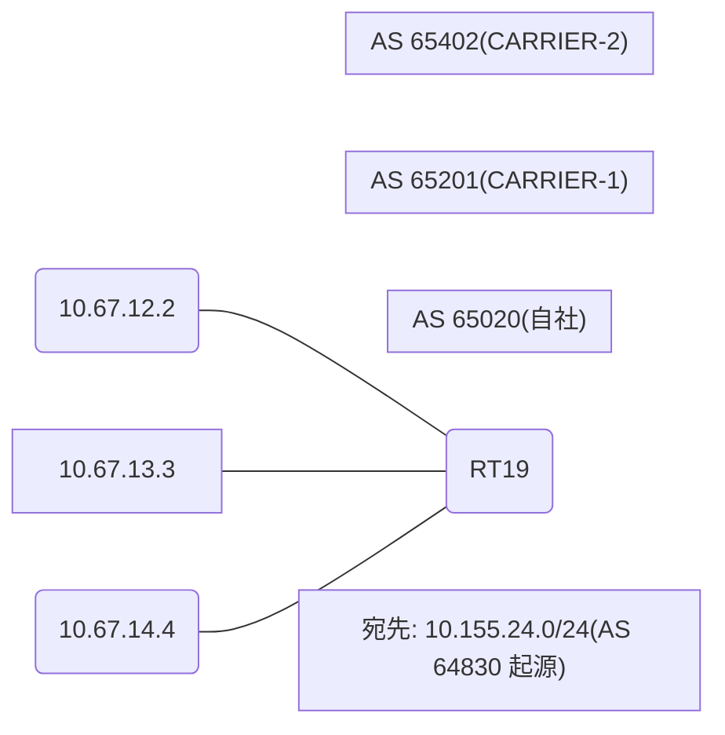

# 問題 20260813-004

> **本問は機器に接続せずに解答すること。追加の show 実行は認めない。**

## シナリオ

あなたは、下記のネットワークの保守を担当する技術者です。自社のルータ RT19 は、外部のネットワーク 10.155.24.0/24 への到達性を、複数の経路を通じて、確立しています。 CARRIER-1 とは、2 本のリンクで、接続されています。 CARRIER-2 とも、接続されています。運用チームは、対向 AS の経路選択に影響を与えることを意図して、示されているところの route-map を、外部の近隣に対して、適用しました。しかしながら、対向 AS から受信するところのトラフィックの経路は、変更されていません。示されているところの出力、および、構成に基づいて、判断すること。なお、機器の構成は、示されている抜粋のほかは、既定値である。



## 出力

```
RT19# show ip bgp
BGP table version is 42, local router ID is 148.148.148.148
Status codes: s suppressed, d damped, h history, * valid, > best, i - internal, 
              r RIB-failure, S Stale, m multipath, b backup-path, f RT-Filter, 
              x best-external, a additional-path, c RIB-compressed, 
              t secondary path, L long-lived-stale,
Origin codes: i - IGP, e - EGP, ? - incomplete
RPKI validation codes: V valid, I invalid, N Not found

     Network          Next Hop            Metric LocPrf Weight Path
 *    10.155.24.0/24   10.67.13.3                             0 65201 65201 64830 64830 i
 *                     10.67.14.4                             0 65402 64830 i
 *>                    10.67.12.2                             0 65201 64830 i
```
```
RT19# show running-config | section router bgp
router bgp 65020
 bgp router-id 148.148.148.148
 bgp log-neighbor-changes
 neighbor 10.67.12.2 remote-as 65201
 neighbor 10.67.13.3 remote-as 65201
 neighbor 10.67.14.4 remote-as 65402
 !
 address-family ipv4
  neighbor 10.67.12.2 activate
  neighbor 10.67.12.2 route-map RM-PREF-OUT out
  neighbor 10.67.13.3 activate
  neighbor 10.67.14.4 activate
 exit-address-family
```
```
RT19# show ip bgp 10.155.24.0
BGP routing table entry for 10.155.24.0/24, version 42
Paths: (3 available, best #3, table default)
  Advertised to update-groups:
     3         
  Refresh Epoch 3
  65201 65201 64830 64830
    10.67.13.3 from 10.67.13.3 (181.181.181.181)
      Origin IGP, localpref 100, valid, external
      rx pathid: 0, tx pathid: 0
      Updated on Jul 26 2026 15:03:56 UTC
  Refresh Epoch 1
  65402 64830
    10.67.14.4 from 10.67.14.4 (77.77.77.77)
      Origin IGP, localpref 100, valid, external
      rx pathid: 0, tx pathid: 0
      Updated on Jul 26 2026 13:50:14 UTC
  Refresh Epoch 4
  65201 64830
    10.67.12.2 from 10.67.12.2 (97.97.97.97)
      Origin IGP, localpref 100, valid, external, best
      rx pathid: 0, tx pathid: 0x0
      Updated on Jul 26 2026 12:48:07 UTC
```
```
RT19# show running-config | section route-map
route-map RM-PREF-OUT permit 10
 set local-preference 300
```

## 設問

この事象の原因である可能性が、最も高いものは、どれですか。(1つを選択してください)

## 選択肢
A. 設定変更後に BGP セッションの再評価(clear)が行われていない

B. LOCAL_PREF は iBGP でのみ交換される属性であり、eBGP の近隣には送信されない

C. MED は、異なる隣接 AS から受信した経路の間では、既定では比較されない

D. weight は、それを設定したルータのローカルでのみ有効であり、iBGP の近隣には伝播しない
