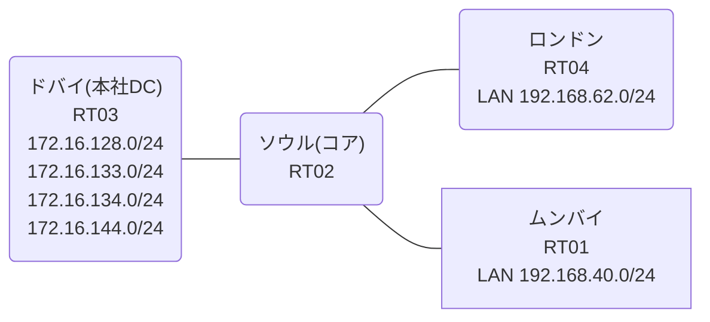

# 問題 20260813-005

> **本問は機器に接続せずに解答すること。追加の show 実行は認めない。**

## シナリオ

あなたの組織は、下記に示されているところのネットワークを運用しています。コアのルータにおいて、それぞれのサイトの LAN から、本社のデータ・センターのサービスのネットワークへの転送が、制御されています。コアは、サービスのネットワークへのルーティングの情報を保持しておらず、そして、ポリシーに一致したトラフィックのみが、ネクスト・ホップへ転送されます。通信の一部において、想定されていない挙動が、観測されています。あなたは、提示されているところの情報のみを使用して、要求されている状態が満たされていない理由を、特定しなければなりません。PBR が適用されるポイントおよびネクスト ホップの設計は、変更されてはなりません。検証および隔離のためのネットワーク `172.16.134.0/24`・`172.16.144.0/24` へは、ポリシーによる転送が、実施されることはできません。ムンバイ および ロンドン のそれぞれのサイトから、業務のサービスのネットワーク `172.16.128.0/24`・`172.16.133.0/24` へ、到達することができること。ポリシーの対象の指定は、1つのアクセス リストのエントリによって、まかなわれなければなりません。スタティック ルートおよび既定のルートによる迂回は、実施されてはなりません。



リンク一覧:
```
  RT02(.1) ── RT03(.2)   192.168.179.0/29
  RT02(.254) ── RT01      192.168.40.0/24
  RT02(.254) ── RT04      192.168.62.0/24
```

## 出力

```
RT01# ping 172.16.133.1 repeat 5
Type escape sequence to abort.
Sending 5, 100-byte ICMP Echos to 172.16.133.1, timeout is 2 seconds:
!!!!!
Success rate is 100 percent (5/5), round-trip min/avg/max = 1/1/1 ms
```
```
RT04# show running-config | section interface|ip route
interface Ethernet0/0
 ip address 192.168.62.1 255.255.255.0
interface Ethernet0/1
 no ip address
 shutdown
interface Ethernet0/2
 no ip address
 shutdown
interface Ethernet0/3
 description === MGMT (Ansible) ===
 vrf forwarding MGMT
 ip address 10.1.10.16 255.255.255.192
ip route 0.0.0.0 0.0.0.0 192.168.62.254
```
```
RT02# show running-config | section interface
interface Ethernet0/0
 ip address 192.168.179.1 255.255.255.248
interface Ethernet0/1
 ip address 192.168.40.254 255.255.255.0
 ip policy route-map MAP-A
interface Ethernet0/2
 ip address 192.168.62.254 255.255.255.0
 ip policy route-map MAP-B
interface Ethernet0/3
 description === MGMT (Ansible) ===
 vrf forwarding MGMT
 ip address 10.1.10.14 255.255.255.192
```
```
RT02# show ip prefix-list
ip prefix-list PL-A: 2 entries
   seq 5 permit 172.16.128.0/24
   seq 10 permit 172.16.133.0/24
```
```
RT03# show running-config | section interface|ip route
interface Loopback0
 ip address 172.16.128.1 255.255.255.0
interface Loopback1
 ip address 172.16.133.1 255.255.255.0
interface Loopback2
 ip address 172.16.134.1 255.255.255.0
interface Loopback3
 ip address 172.16.144.1 255.255.255.0
interface Ethernet0/0
 ip address 192.168.179.2 255.255.255.248
interface Ethernet0/1
 no ip address
 shutdown
interface Ethernet0/2
 no ip address
 shutdown
interface Ethernet0/3
 description === MGMT (Ansible) ===
 vrf forwarding MGMT
 ip address 10.1.10.15 255.255.255.192
ip route 192.168.40.0 255.255.255.0 192.168.179.1
ip route 192.168.62.0 255.255.255.0 192.168.179.1
```
```
RT01# show running-config | section interface|ip route
interface Ethernet0/0
 ip address 192.168.40.1 255.255.255.0
interface Ethernet0/1
 no ip address
 shutdown
interface Ethernet0/2
 no ip address
 shutdown
interface Ethernet0/3
 description === MGMT (Ansible) ===
 vrf forwarding MGMT
 ip address 10.1.10.13 255.255.255.192
ip route 0.0.0.0 0.0.0.0 192.168.40.254
```
```
RT04# ping 172.16.134.1 repeat 5
Type escape sequence to abort.
Sending 5, 100-byte ICMP Echos to 172.16.134.1, timeout is 2 seconds:
U.U.U
Success rate is 0 percent (0/5)
```
```
RT01# ping 172.16.134.1 repeat 5
Type escape sequence to abort.
Sending 5, 100-byte ICMP Echos to 172.16.134.1, timeout is 2 seconds:
!!!!!
Success rate is 100 percent (5/5), round-trip min/avg/max = 1/1/3 ms
```
```
RT02# show running-config | section route-map|access-list
ip policy route-map MAP-A
 ip policy route-map MAP-B
ip access-list extended ACL-A
 10 permit ip 192.168.40.0 0.0.0.255 172.16.128.0 0.0.5.255
ip access-list extended ACL-B
 10 permit ip 192.168.62.0 0.0.0.255 172.16.128.0 0.0.5.255
route-map MAP-A permit 10 
 match ip address prefix-list PL-A
 set ip next-hop 192.168.179.2
route-map MAP-B permit 10 
 match ip address ACL-B
 set ip next-hop 192.168.179.2
```
```
RT02# show access-lists
Extended IP access list ACL-A
    10 permit ip 192.168.40.0 0.0.0.255 172.16.128.0 0.0.5.255
Extended IP access list ACL-B
    10 permit ip 192.168.62.0 0.0.0.255 172.16.128.0 0.0.5.255 (5 matches)
```
```
RT01# ping 172.16.144.1 repeat 5
Type escape sequence to abort.
Sending 5, 100-byte ICMP Echos to 172.16.144.1, timeout is 2 seconds:
!!!!!
Success rate is 100 percent (5/5), round-trip min/avg/max = 1/1/2 ms
```
```
RT04# ping 172.16.133.1 repeat 5
Type escape sequence to abort.
Sending 5, 100-byte ICMP Echos to 172.16.133.1, timeout is 2 seconds:
!!!!!
Success rate is 100 percent (5/5), round-trip min/avg/max = 1/1/2 ms
```
```
RT02# show route-map
route-map MAP-A, permit, sequence 10
  Match clauses:
    ip address prefix-lists: PL-A 
  Set clauses:
    ip next-hop 192.168.179.2
  Policy routing matches: 20 packets, 2280 bytes
route-map MAP-B, permit, sequence 10
  Match clauses:
    ip address (access-lists): ACL-B 
  Set clauses:
    ip next-hop 192.168.179.2
  Policy routing matches: 5 packets, 570 bytes
```
```
RT01# ping 172.16.128.1 repeat 5
Type escape sequence to abort.
Sending 5, 100-byte ICMP Echos to 172.16.128.1, timeout is 2 seconds:
!!!!!
Success rate is 100 percent (5/5), round-trip min/avg/max = 1/1/2 ms
```

## 設問

次のうち、正しいものは、どれですか。

## 選択肢
A. MAP-A の match が prefix-list を参照している

B. 宛先ルータに戻り経路が無く、応答が返れない

C. ACL-A の送信元と宛先の指定が逆になっている

D. ACL-A の宛先ワイルドカードが、対象外のネットワークに一致し、対象の一部に一致していない

E. MAP-A のシーケンスに match 条件が設定されていない

F. set ip next-hop の指定が誤っている
