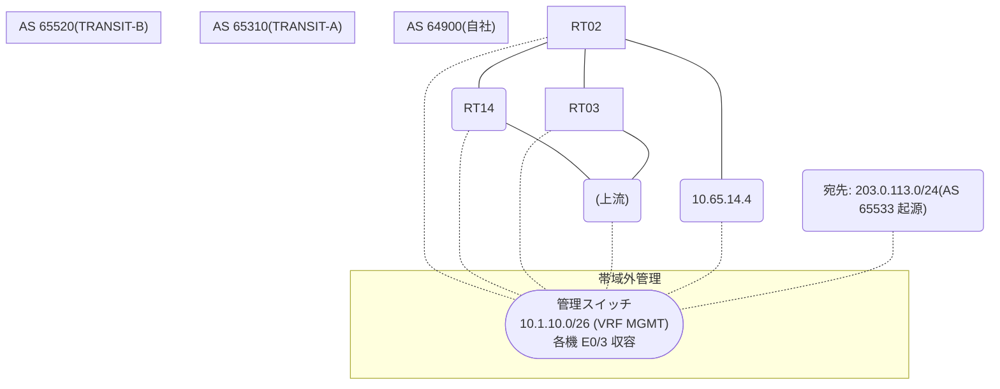

# 問題 20260813-006

> **本問は機器に接続せずに解答すること。追加の show 実行は認めない。**

## シナリオ

あなたは、ネットワークの運用を担当しています。自社のルータ RT02 は、外部のネットワーク 203.0.113.0/24 への到達性を、複数の経路を通じて、確立しています。 TRANSIT-B とも、接続されています。 一部の経路は、自 AS 内の境界ルータから、iBGP で、学習されています。現在、203.0.113.0/24 への転送は、要件に適合しないところの経路を、使用しています。AS 64900 内の、すべてのルータにおいて、203.0.113.0/24 への転送が、next hop 5.6.6.6 の経路を、使用すること。個々のルータに対する、個別の設定の繰り返しは、行わないこと。なお、設定の投入後、変更は、適切に、反映されているものとする。



## 出力

```
RT02# show running-config | section router bgp
router bgp 64900
 bgp router-id 109.109.109.109
 bgp log-neighbor-changes
 neighbor 3.5.5.5 remote-as 64900
 neighbor 3.5.5.5 update-source Loopback0
 neighbor 5.6.6.6 remote-as 64900
 neighbor 5.6.6.6 update-source Loopback0
 neighbor 10.65.14.4 remote-as 65520
 !
 address-family ipv4
  neighbor 3.5.5.5 activate
  neighbor 5.6.6.6 activate
  neighbor 10.65.14.4 activate
 exit-address-family
```
```
RT02# show ip bgp 203.0.113.0
BGP routing table entry for 203.0.113.0/24, version 57
Paths: (3 available, best #2, table default)
  Advertised to update-groups:
     3         
  Refresh Epoch 2
  65520 65520 65533 65533
    10.65.14.4 from 10.65.14.4 (159.159.159.159)
      Origin IGP, localpref 100, valid, external
      rx pathid: 0, tx pathid: 0
      Updated on Jul 19 2026 02:52:56 UTC
  Refresh Epoch 4
  65310 65533
    3.5.5.5 (metric 11) from 3.5.5.5 (205.205.205.205)
      Origin IGP, localpref 100, valid, internal, best
      rx pathid: 0, tx pathid: 0x0
      Updated on Jul 19 2026 02:19:14 UTC
  Refresh Epoch 3
  65310 65533
    5.6.6.6 (metric 101) from 5.6.6.6 (35.35.35.35)
      Origin IGP, localpref 100, valid, internal
      rx pathid: 0, tx pathid: 0
      Updated on Jul 19 2026 02:14:07 UTC
```
```
RT02# show ip bgp
BGP table version is 57, local router ID is 109.109.109.109
Status codes: s suppressed, d damped, h history, * valid, > best, i - internal, 
              r RIB-failure, S Stale, m multipath, b backup-path, f RT-Filter, 
              x best-external, a additional-path, c RIB-compressed, 
              t secondary path, L long-lived-stale,
Origin codes: i - IGP, e - EGP, ? - incomplete
RPKI validation codes: V valid, I invalid, N Not found

     Network          Next Hop            Metric LocPrf Weight Path
 *    203.0.113.0      10.65.14.4                             0 65520 65520 65533 65533 i
 *>i                   3.5.5.5                       100      0 65310 65533 i
 * i                   5.6.6.6                       100      0 65310 65533 i
```

## 設問

示されているところのすべての要件が満たされることを確実にするために、適用されなければならない構成は、どれですか。(1つを選択してください)

## 選択肢
**A.**
```
router bgp 64900
 bgp always-compare-med
```

**B.**
```
router bgp 64900
 address-family ipv4
  neighbor 5.6.6.6 weight 30000
```

**C.**
```
clear ip bgp * soft
```

**D.**
```
route-map RM-PRIMARY-IN permit 10
 set local-preference 200
router bgp 64900
 address-family ipv4
  neighbor 5.6.6.6 route-map RM-PRIMARY-IN in
```

**E.**
```
route-map RM-MED-A permit 10
 set metric 200
route-map RM-MED-B permit 10
 set metric 10
router bgp 64900
 address-family ipv4
  neighbor 10.65.12.2 route-map RM-MED-A out
  neighbor 10.65.13.3 route-map RM-MED-B out
```

**F.**
```
route-map RM-BACKUP-OUT permit 10
 set as-path prepend 64900 64900
router bgp 64900
 address-family ipv4
  neighbor 10.65.12.2 route-map RM-BACKUP-OUT out
```
