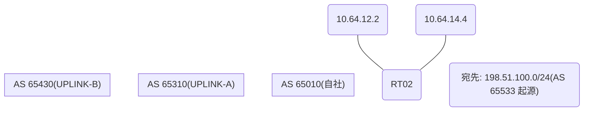

# 問題 20260813-007

> **本問は機器に接続せずに解答すること。追加の show 実行は認めない。**

## シナリオ

あなたは、ネットワークの運用を担当しています。自社のルーター RT02 は、外部のネットワーク 198.51.100.0/24 への到達性を、複数の経路を通じて、確立しています。 UPLINK-A とは、接続されています。 UPLINK-B とも、接続されています。ベストパスの選出の結果について、その根拠が、確認されようとしています。示されているところの出力、および、構成に基づいて、判断すること。なお、機器の構成は、示されている抜粋のほかは、既定値である。



## 出力

```
RT02# show ip bgp
BGP table version is 7, local router ID is 135.135.135.135
Status codes: s suppressed, d damped, h history, * valid, > best, i - internal, 
              r RIB-failure, S Stale, m multipath, b backup-path, f RT-Filter, 
              x best-external, a additional-path, c RIB-compressed, 
              t secondary path, L long-lived-stale,
Origin codes: i - IGP, e - EGP, ? - incomplete
RPKI validation codes: V valid, I invalid, N Not found

     Network          Next Hop            Metric LocPrf Weight Path
 *>   198.51.100.0     0.0.0.0                  0         32768 i
 *                     10.64.14.4                             0 65430 65533 i
 *                     10.64.12.2                             0 65310 65533 i
```
```
RT02# show running-config | section router bgp
router bgp 65010
 bgp router-id 135.135.135.135
 bgp log-neighbor-changes
 neighbor 10.64.12.2 remote-as 65310
 neighbor 10.64.14.4 remote-as 65430
 !
 address-family ipv4
  network 198.51.100.0 mask 255.255.255.0
  neighbor 10.64.12.2 activate
  neighbor 10.64.14.4 activate
 exit-address-family
```
```
RT02# show running-config | include ip route
ip route 198.51.100.0 255.255.255.0 Null0 name AGGREGATE
```

## 設問

示されているところの出力において、ベストパスの選出を決定づけた要素は、どれですか。(1つを選択してください)

## 選択肢
A. 最も古い経路(eBGP 同士のタイ)

B. LOCAL_PREF(大きいほうが優先)

C. AS-PATH 長(短いほうが優先)

D. weight(大きいほうが優先)

E. origin コード(i < e < ?)
