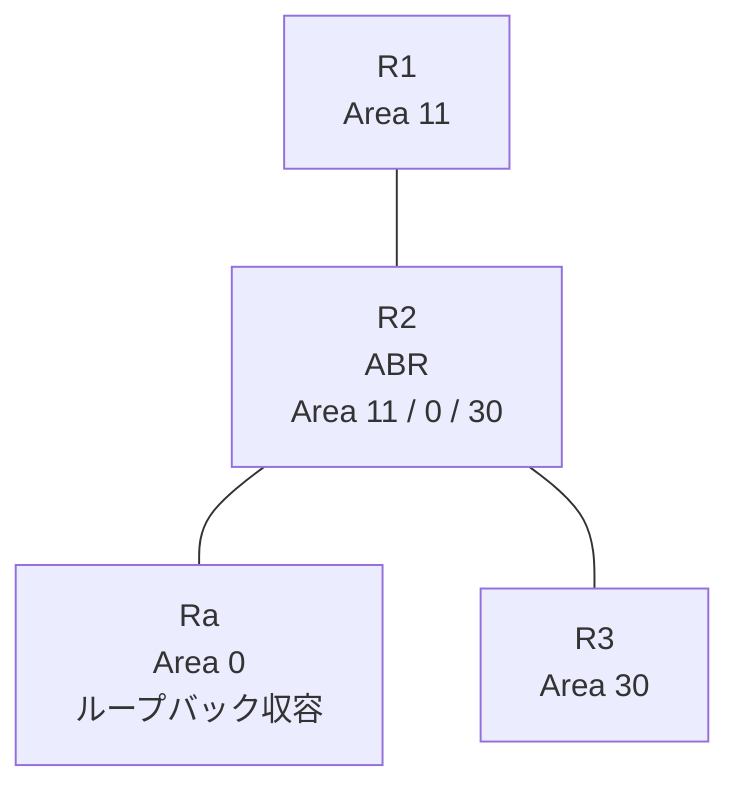

# 問題 20260813-008

> **本問は機器に接続せずに解答すること。追加の show 実行は認めない。**

## シナリオ

あなたは、下記のネットワークの保守を担当する技術者です。拠点の集約ルーター Ra は、サービスのためのプレフィックスを、4つのループバック・インターフェイスによって収容しています。R2 は、エリア 11・エリア 0・エリア 30 を接続するところの ABR であり、そして、すべてのルータにおいて、OSPFv3 のプロセス 1 が構成されています。一部の通信が、意図されているとおりに動作していない、という報告があります。あなたは、提示されているところの情報のみを使用して、要求されている状態が満たされていない理由を、特定しなければなりません。適用は、単一のステートメントの追加によって、実現される必要があります。R2 自身の経路テーブルは、影響を受けてはなりません。スタティック ルートおよび既定のルートによる迂回は、実施されてはなりません。2001:DB8:9:9::/64 のルートは、バックボーン以外のすべてのエリアから、隠されなければなりません。その他のルートの広告は、いかなる影響も受けてはなりません。



| 区間 | インターフェイス | ネットワーク | エリア |
|------|------------------|--------------|--------|
| R1 ⇔ R2 | E0/0 | 2001:DB8:6:9::/64 | 11 |
| R2 ⇔ Ra | E0/1 | 2001:DB8:2:2::/64 | 0 |
| R2 ⇔ R3 | E0/2 | 2001:DB8:1:7::/64 | 30 |

- R1 の E0/0 セカンダリ: 2001:DB8:7:B::/64（Area 11）
- Ra のループバック: 2001:DB8:8:8::/64, 2001:DB8:9:9::/64, 2001:DB8:A:A::/64, 2001:DB8:B:B::/64（Area 0）

## 出力

```
R3# show ipv6 route ospf | include ^O|via
OI  2001:DB8:2:2::/64 [110/20]
     via FE80::A8BB:CCFF:FE01:9620, Ethernet0/0
OI  2001:DB8:6:9::/64 [110/20]
     via FE80::A8BB:CCFF:FE01:9620, Ethernet0/0
OI  2001:DB8:7:B::/64 [110/20]
     via FE80::A8BB:CCFF:FE01:9620, Ethernet0/0
OI  2001:DB8:8:8::/64 [110/21]
     via FE80::A8BB:CCFF:FE01:9620, Ethernet0/0
OI  2001:DB8:9:9::/64 [110/21]
     via FE80::A8BB:CCFF:FE01:9620, Ethernet0/0
OI  2001:DB8:A:A::/64 [110/21]
     via FE80::A8BB:CCFF:FE01:9620, Ethernet0/0
OI  2001:DB8:B:B::/64 [110/21]
     via FE80::A8BB:CCFF:FE01:9620, Ethernet0/0
```
```
R1# show ipv6 route ospf | include ^O|via
OI  2001:DB8:1:7::/64 [110/20]
     via FE80::A8BB:CCFF:FE01:9600, Ethernet0/0
OI  2001:DB8:2:2::/64 [110/20]
     via FE80::A8BB:CCFF:FE01:9600, Ethernet0/0
OI  2001:DB8:8:8::/64 [110/21]
     via FE80::A8BB:CCFF:FE01:9600, Ethernet0/0
OI  2001:DB8:A:A::/64 [110/21]
     via FE80::A8BB:CCFF:FE01:9600, Ethernet0/0
OI  2001:DB8:B:B::/64 [110/21]
     via FE80::A8BB:CCFF:FE01:9600, Ethernet0/0
```
```
R2# show running-config
Building configuration...
!
interface Ethernet0/0
 no ip address
 ipv6 address 2001:DB8:6:9::2/64
 ipv6 enable
 ipv6 ospf 1 area 11
!
interface Ethernet0/1
 no ip address
 ipv6 address 2001:DB8:2:2::2/64
 ipv6 enable
 ipv6 ospf 1 area 0
!
interface Ethernet0/2
 no ip address
 ipv6 address 2001:DB8:1:7::2/64
 ipv6 enable
 ipv6 ospf 1 area 30
!
router ospfv3 1
 router-id 2.2.2.2
 !
 address-family ipv6 unicast
  area 11 filter-list prefix PL01 in
 exit-address-family
!
ipv6 prefix-list PL-AREA10 seq 5 permit 2001:DB8:8::/46 le 64
!
ipv6 prefix-list PL-TYPE3 seq 5 permit 2001:DB8:9:9::/64
!
ipv6 prefix-list PL01 seq 5 deny 2001:DB8:9:9::/64
ipv6 prefix-list PL01 seq 10 permit ::/0 le 128
!
ipv6 prefix-list PL10 seq 5 permit ::/0 ge 1
!
```

## 設問

次のうち、正しいものは、どれですか。

## 選択肢
**A.**
```
R2(config)# ipv6 prefix-list PL-NEW seq 5 deny 2001:DB8:9:9::/64
R2(config)# ipv6 prefix-list PL-NEW seq 10 permit ::/0 le 128
R2(config)# router ospfv3 1
R2(config-router)# address-family ipv6 unicast
R2(config-router-af)# no area 11 filter-list prefix PL01 in
R2(config-router-af)# area 0 filter-list prefix PL-NEW out
R2(config)# no ipv6 prefix-list PL01
```

**B.**
```
R2(config)# ipv6 prefix-list PL-NEW seq 5 deny 2001:DB8:8::/47 le 64
R2(config)# ipv6 prefix-list PL-NEW seq 10 permit ::/0 le 128
R2(config)# router ospfv3 1
R2(config-router)# address-family ipv6 unicast
R2(config-router-af)# no area 11 filter-list prefix PL01 in
R2(config-router-af)# area 0 filter-list prefix PL-NEW out
R2(config)# no ipv6 prefix-list PL01
```

**C.**
```
R2(config)# ipv6 prefix-list PL-NEW seq 5 deny 2001:DB8:9:9::/64
R2(config)# ipv6 prefix-list PL-NEW seq 10 permit ::/0 le 128
R2(config)# router ospfv3 1
R2(config-router)# address-family ipv6 unicast
R2(config-router-af)# no area 11 filter-list prefix PL01 in
R2(config-router-af)# area 11 filter-list prefix PL-NEW in
R2(config)# no ipv6 prefix-list PL01
```

**D.**
```
R2(config)# ipv6 prefix-list PL-NEW seq 5 deny 2001:DB8:9:9::/64
R2(config)# ipv6 prefix-list PL-NEW seq 10 permit ::/0
R2(config)# router ospfv3 1
R2(config-router)# address-family ipv6 unicast
R2(config-router-af)# no area 11 filter-list prefix PL01 in
R2(config-router-af)# area 0 filter-list prefix PL-NEW out
R2(config)# no ipv6 prefix-list PL01
```
