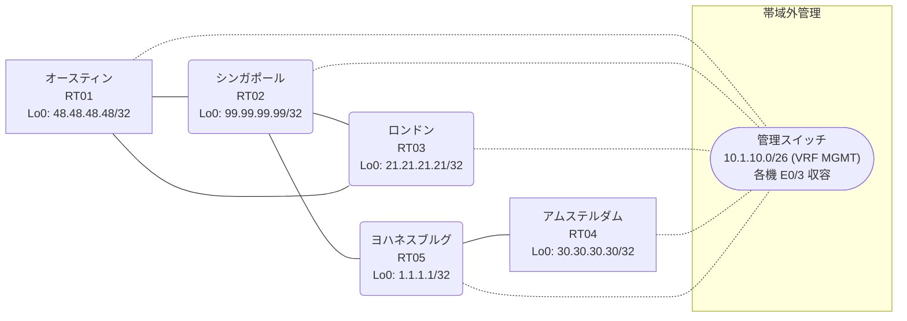

# 問題 20260813-009

> **本問は機器に接続せずに解答すること。追加の show 実行は認めない。**

## トポロジ

あなたは、下記のネットワークの保守を担当する技術者です。あなたの会社のネットワークは、複数のルーティング・ドメインが、境界のルータによって接続され、そして、すべての拠点のリーチアビリティが提供されている、というものです。ルーティングの設計の詳細は、示されているところの構成から、読み取られることが、期待されています。各拠点のルータと、拠点の網との対応は、下記の表に示されているとおりです。



| 拠点 | ルータ | 拠点網 |
|------|--------|----------------------|
| アムステルダム | RT04 | `30.30.30.30/32` |
| オースティン | RT01 | `48.48.48.48/32` |
| シンガポール | RT02 | `99.99.99.99/32` |
| ヨハネスブルグ | RT05 | `1.1.1.1/32` |
| ロンドン | RT03 | `21.21.21.21/32` |

リンク一覧:
```
  RT03:E0/0(.1) ── RT01:E0/0(.2)   10.158.80.0/30
  RT02:E0/0(.1) ── RT05:E0/0(.2)   10.56.128.0/30
  RT02:E0/1(.1) ── RT01:E0/1(.2)   10.225.120.0/30
  RT02:E0/2(.1) ── RT03:E0/1(.2)   10.79.235.0/30
  RT05:E0/1(.1) ── RT04:E0/0(.2)   10.219.71.0/30
```

## 要件

1. 各サイトのネットワークは、ドメインをまたいで、すべてのサイトから、到達されることができること。
2. スタティック ルートおよび既定のルートによる迂回は、実施されてはなりません。
3. 再配送される経路の、選択的な制限は、実施されてはなりません。
4. redistribute によって参照されるところのプロセス ID / AS 番号は、その境界に実在する隣接のドメインのものと一致させられ、そして、実在しないプロセスへの参照が、残置されてはなりません。
5. ルーティング プロトコルの種別およびプロセスの配置は、変更されることはできません。
6. シード メトリック `1000000 100 255 1 1500` は、redistribute のステートメントごとに、個別に指定される必要があります。

## 現在の状態

通信の一部において、想定されていない挙動が、観測されています。あなたは、示されているところの出力および構成に基づいて、その構成が、下記において記述されているとおりに動作していない理由を、判断する必要があります。

```
RT05# show ip route
Gateway of last resort is not set
      1.0.0.0/32 is subnetted, 1 subnets
C        1.1.1.1 is directly connected, Loopback0
      10.0.0.0/8 is variably subnetted, 4 subnets, 2 masks
C        10.56.128.0/30 is directly connected, Ethernet0/0
L        10.56.128.2/32 is directly connected, Ethernet0/0
C        10.219.71.0/30 is directly connected, Ethernet0/1
L        10.219.71.1/32 is directly connected, Ethernet0/1
      30.0.0.0/32 is subnetted, 1 subnets
D        30.30.30.30 [90/409600] via 10.219.71.2, 00:04:23, Ethernet0/1
      99.0.0.0/32 is subnetted, 1 subnets
D        99.99.99.99 [90/409600] via 10.56.128.1, 00:04:39, Ethernet0/0
```
```
RT01# show ip route
Gateway of last resort is not set
      1.0.0.0/32 is subnetted, 1 subnets
D EX     1.1.1.1 [170/307200] via 10.225.120.1, 00:04:45, Ethernet0/1
      10.0.0.0/8 is variably subnetted, 7 subnets, 2 masks
D EX     10.56.128.0/30 [170/307200] via 10.225.120.1, 00:04:45, Ethernet0/1
D        10.79.235.0/30 [90/307200] via 10.225.120.1, 00:04:45, Ethernet0/1
                        [90/307200] via 10.158.80.1, 00:04:45, Ethernet0/0
C        10.158.80.0/30 is directly connected, Ethernet0/0
L        10.158.80.2/32 is directly connected, Ethernet0/0
D EX     10.219.71.0/30 [170/307200] via 10.225.120.1, 00:04:45, Ethernet0/1
C        10.225.120.0/30 is directly connected, Ethernet0/1
L        10.225.120.2/32 is directly connected, Ethernet0/1
      21.0.0.0/32 is subnetted, 1 subnets
D        21.21.21.21 [90/409600] via 10.158.80.1, 00:04:45, Ethernet0/0
      30.0.0.0/32 is subnetted, 1 subnets
D EX     30.30.30.30 [170/307200] via 10.225.120.1, 00:04:42, Ethernet0/1
      48.0.0.0/32 is subnetted, 1 subnets
C        48.48.48.48 is directly connected, Loopback0
      99.0.0.0/32 is subnetted, 1 subnets
D        99.99.99.99 [90/409600] via 10.225.120.1, 00:04:45, Ethernet0/1
```
```
RT04# show ip route
Gateway of last resort is not set
      1.0.0.0/32 is subnetted, 1 subnets
D        1.1.1.1 [90/409600] via 10.219.71.1, 00:05:05, Ethernet0/0
      10.0.0.0/8 is variably subnetted, 3 subnets, 2 masks
D        10.56.128.0/30 [90/307200] via 10.219.71.1, 00:05:05, Ethernet0/0
C        10.219.71.0/30 is directly connected, Ethernet0/0
L        10.219.71.2/32 is directly connected, Ethernet0/0
      30.0.0.0/32 is subnetted, 1 subnets
C        30.30.30.30 is directly connected, Loopback0
      99.0.0.0/32 is subnetted, 1 subnets
D        99.99.99.99 [90/435200] via 10.219.71.1, 00:05:05, Ethernet0/0
```
```
RT02# show route-map
route-map RM-BACKUP1, deny, sequence 10
  Match clauses:
    ip address prefix-lists: PL-BACKUP1 
  Set clauses:
  Policy routing matches: 0 packets, 0 bytes
route-map RM-BACKUP1, permit, sequence 20
  Match clauses:
  Set clauses:
  Policy routing matches: 0 packets, 0 bytes
```
```
RT02# show ip prefix-list
ip prefix-list PL-BACKUP1: 2 entries
   seq 5 deny 21.21.21.21/32
   seq 10 permit 0.0.0.0/0 le 32
```
```
RT02# show access-lists
Standard IP access list 70
    10 deny   21.21.21.21
    20 permit any
```

## 設定抜粋

```
RT01# show running-config | section router
router eigrp 677
 network 10.158.80.0 0.0.0.3
 network 10.225.120.0 0.0.0.3
 network 48.48.48.48 0.0.0.0
```
```
RT02# show running-config | section router
router eigrp 677
 network 10.79.235.0 0.0.0.3
 network 10.225.120.0 0.0.0.3
 network 99.99.99.99 0.0.0.0
 redistribute eigrp 450 metric 1000000 100 255 1 1500
router eigrp 450
 network 10.56.128.0 0.0.0.3
 network 99.99.99.99 0.0.0.0
 passive-interface Loopback0
```
```
RT03# show running-config | section router
router eigrp 677
 timers active-time 5
 network 10.79.235.0 0.0.0.3
 network 10.158.80.0 0.0.0.3
 network 21.21.21.21 0.0.0.0
 passive-interface Loopback0
```
```
RT04# show running-config | section router
router eigrp 450
 network 10.219.71.0 0.0.0.3
 network 30.30.30.30 0.0.0.0
```
```
RT05# show running-config | section router
router eigrp 450
 timers active-time 5
 network 1.1.1.1 0.0.0.0
 network 10.56.128.0 0.0.0.3
 network 10.219.71.0 0.0.0.3
 passive-interface Loopback0
```

## 設問

次のうち、正しいものは、どれですか。

## 選択肢
A. RT02 の route-map RM-BACKUP1 が対象の経路を拒否している

B. RT05 と隣接ルータの間で EIGRP のネイバー(隣接関係)が確立していない

C. RT02 の redistribute に適用された route-map が特定の拠点網を deny している

D. RT02 の router eigrp 450 配下の redistribute が、実在しないプロセス/AS を参照している

E. RT05 の router eigrp 450 に Loopback0 の network 文が設定されていない

F. RT02 の router eigrp 450 配下に redistribute が設定されていない
