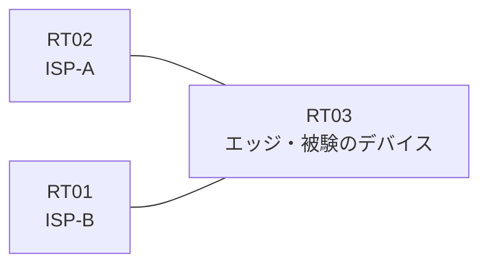

# 問題 20260813-010

> **本問は機器に接続せずに解答すること。追加の show 実行は認めない。**

## トポロジ

あなたの組織は、下記に示されているところのネットワークを運用しています。あなたの会社のエッジのルーターは、2つのアップリンクによって、2つのサービス プロバイダへ接続されている、というものです。顧客のネットワーク 192.168.98.0/24 および 192.168.110.0/24 は、それぞれのプロバイダを経由して、広告されています。



| 区間 | エッジ側インターフェイス | ネットワーク |
|------|--------------------------|--------------|
| RT03 ⇔ RT02（ISP-A） | Ethernet0/0 | 10.146.12.0/30 |
| RT03 ⇔ RT01（ISP-B） | Ethernet0/1 | 10.146.13.0/30 |

- 監視のためのホスト `192.168.110.99` および `192.168.110.127` は、ISP-B を経由して着信します。

## 要件

1. エッジのルータの両方のアップリンクのインターフェイスにおいて、送信元アドレスの検証が、有効にされていなければなりません。
2. 例外のリストの運用は、実施されることはできません。検証のモードの選択によって対処すること。
3. ルーティング プロトコルの種別およびプロセスの配置は、変更されてはなりません。
4. 監視のためのホストである 192.168.110.99 および 192.168.110.127 からの、正規のトラフィックが、破棄されてはなりません。
5. 着信のインターフェイスと一致しない送信元を持つところのトラフィックは、破棄されなければなりません。

## 現在の状態

ユーザーから、通信に関する事象が、報告されています。あなたは、示されているところの出力および構成に基づいて、その構成が、下記において記述されているとおりに動作していない理由を、判断する必要があります。

```
RT03# show ip interface Ethernet0/0
Ethernet0/0 is up, line protocol is up
  Internet address is 10.146.12.1/30
  IP verify source reachable-via RX
   10 verification drops
   0 suppressed verification drops
```
```
RT03# show ip interface Ethernet0/1
Ethernet0/1 is up, line protocol is up
  Internet address is 10.146.13.1/30
  IP verify source reachable-via RX 1
   20 verification drops
   0 suppressed verification drops
```
```
RT03# show ip route | begin Gateway
Gateway of last resort is not set
      192.168.98.0/24 is subnetted, 1 subnets
O E2     192.168.98.0 [110/20] via 10.146.13.2, Ethernet0/1
      192.168.110.0/24 is subnetted, 1 subnets
O E2     192.168.110.0 [110/20] via 10.146.12.2, Ethernet0/0
```
```
RT03# show access-lists
Standard IP access list 1
    10 permit 192.168.110.127
```

## 設定抜粋

```
RT03# show running-config | section interface
interface Ethernet0/0
 ip address 10.146.12.1 255.255.255.252
 ip verify unicast source reachable-via rx
interface Ethernet0/1
 ip address 10.146.13.1 255.255.255.252
 ip verify unicast source reachable-via rx 1
```

## 設問

次のうち、正しいものは、どれですか。

## 選択肢
A. 検証の構成が参照しているアクセス・リストの番号と、定義されているアクセス・リストの番号とが一致していない

B. ISP-B 向けインターフェイスに検証の構成が適用されていない

C. アクセス・リストが、インターフェイスの in 方向に適用されている

D. アクセス・リストにおいて許可されているホストが、対象のホストと異なっている

E. エッジのルータに、既定のルートが構成されていない

F. アクセス・リストが拡張の番号帯で定義され、送信元ではなく宛先に一致している
