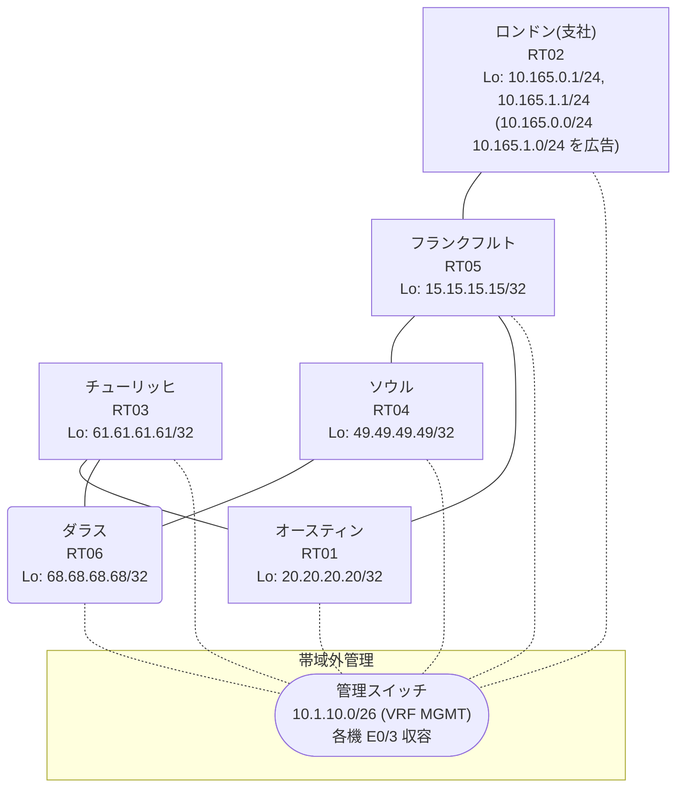

# 問題 20260813-011

> **本問は機器に接続せずに解答すること。追加の show 実行は認めない。**

## シナリオ

あなたは、ネットワークの運用を担当しています。あなたの会社のネットワークは、支社のドメインと、本社のコアのドメイン(OSPF)とが、2 台の境界のルータによって接続され、そして、それらは境界において接続されています。支社のネットワーク `10.165.0.0/24` および `10.165.1.0/24` は、RT02 によって、広告されています。どちらの境界が失われた場合においても、通信が継続されることができるように、設計されています。ルーティングの設計の詳細は、示されているところの出力から、読み取られることが、期待されています。通信の一部において、想定されていない挙動が、観測されています。あなたは、示されているところの出力および構成に基づいて、その構成が、下記において記述されているとおりに動作していない理由を、判断する必要があります。すべてのサイトから、支社のネットワーク `10.165.0.0/24` および `10.165.1.0/24` を含むところの、すべての宛先へ、到達することができること。二点相互再配送による、冗長の設計が、維持されなければなりません。ルーティング・プロトコルの種別およびプロセスの配置は、変更されることはできません。管理のための構成に対して、変更が加えられてはなりません。スタティック・ルートおよび既定のルートによる迂回は、実施されてはなりません。支社のネットワーク宛のトラフィックが RT02 へ配送され、経路の周回が、発生していないこと。



| 拠点 | ルータ | Loopback / 広告網 |
|------|--------|--------------------|
| オースティン | RT01 | 20.20.20.20/32 |
| ソウル | RT04 | 49.49.49.49/32 |
| ダラス | RT06 | 68.68.68.68/32 |
| チューリッヒ | RT03 | 61.61.61.61/32 |
| フランクフルト | RT05 | 15.15.15.15/32 |
| ロンドン(支社) | RT02 | 10.165.0.1/24, 10.165.1.1/24 (`10.165.0.0/24` `10.165.1.0/24` を広告) |

リンク一覧:
```
  RT02:E0/0(.2) ── RT05:E0/0(.1)   10.168.42.0/30
  RT05:E0/1(.1) ── RT04:E0/0(.2)   10.82.76.0/30
  RT05:E0/2(.1) ── RT01:E0/0(.2)   10.198.180.0/30
  RT04:E0/1(.1) ── RT06:E0/0(.2)   172.16.194.0/30
  RT06:E0/1(.1) ── RT03:E0/0(.2)   172.16.136.0/30
  RT01:E0/1(.1) ── RT03:E0/1(.2)   172.16.9.0/30
```

## 出力

```
RT01# show ip route
Gateway of last resort is not set
      10.0.0.0/8 is variably subnetted, 6 subnets, 3 masks
O E2     10.82.76.0/30 [110/20] via 172.16.9.2, 00:04:11, Ethernet0/1
O E2     10.165.0.0/24 [110/20] via 172.16.9.2, 00:04:11, Ethernet0/1
O E2     10.165.1.0/24 [110/20] via 172.16.9.2, 00:04:11, Ethernet0/1
O E2     10.168.42.0/30 [110/20] via 172.16.9.2, 00:04:11, Ethernet0/1
C        10.198.180.0/30 is directly connected, Ethernet0/0
L        10.198.180.2/32 is directly connected, Ethernet0/0
      15.0.0.0/32 is subnetted, 1 subnets
O E2     15.15.15.15 [110/20] via 172.16.9.2, 00:04:11, Ethernet0/1
      20.0.0.0/32 is subnetted, 1 subnets
C        20.20.20.20 is directly connected, Loopback0
      49.0.0.0/32 is subnetted, 1 subnets
O        49.49.49.49 [110/31] via 172.16.9.2, 00:04:11, Ethernet0/1
      61.0.0.0/32 is subnetted, 1 subnets
O        61.61.61.61 [110/11] via 172.16.9.2, 00:04:23, Ethernet0/1
      68.0.0.0/32 is subnetted, 1 subnets
O        68.68.68.68 [110/21] via 172.16.9.2, 00:04:15, Ethernet0/1
      172.16.0.0/16 is variably subnetted, 4 subnets, 2 masks
C        172.16.9.0/30 is directly connected, Ethernet0/1
L        172.16.9.1/32 is directly connected, Ethernet0/1
O        172.16.136.0/30 [110/20] via 172.16.9.2, 00:04:16, Ethernet0/1
O        172.16.194.0/30 [110/30] via 172.16.9.2, 00:04:15, Ethernet0/1
```
```
RT04# show ip route 10.165.0.0
Routing entry for 10.165.0.0/24
  Known via "rip", distance 120, metric 2
  Redistributing via ospf 1, rip
  Advertised by ospf 1 subnets route-map RIP2OSPF
  Last update from 10.82.76.1 on Ethernet0/0, 00:00:06 ago
  Routing Descriptor Blocks:
  * 10.82.76.1, from 10.82.76.1, 00:00:06 ago, via Ethernet0/0
      Route metric is 2, traffic share count is 1
```
```
RT05# show ip route 68.68.68.68
Routing entry for 68.68.68.68/32
  Known via "rip", distance 120, metric 5
  Tag 110
  Redistributing via rip
  Last update from 10.82.76.2 on Ethernet0/1, 00:00:22 ago
  Routing Descriptor Blocks:
    10.198.180.2, from 10.198.180.2, 00:00:22 ago, via Ethernet0/2
      Route metric is 5, traffic share count is 1
      Route tag 110
  * 10.82.76.2, from 10.82.76.2, 00:00:22 ago, via Ethernet0/1
      Route metric is 5, traffic share count is 1
      Route tag 110
```
```
RT01# traceroute 10.165.0.1 probe 1 timeout 1 ttl 1 8
Type escape sequence to abort.
Tracing the route to 10.165.0.1
VRF info: (vrf in name/id, vrf out name/id)
  1 172.16.9.2 1 msec
  2 172.16.136.1 2 msec
  3 172.16.194.1 2 msec
  4 10.82.76.1 1 msec
  5 10.168.42.2 2 msec
```
```
RT04# show running-config | section router
router ospf 1
 router-id 49.49.49.49
 redistribute rip route-map RIP2OSPF
 network 49.49.49.49 0.0.0.0 area 0
 network 172.16.194.0 0.0.0.3 area 0
 distance ospf external 180
router rip
 version 2
 redistribute ospf 1 metric 5 route-map OSPF2RIP
 network 10.0.0.0
 network 49.0.0.0
 no auto-summary
```

## 設問

次のうち、正しいものは、どれですか。

## 選択肢
A. RT01 の OSPF の隣接が不安定であり、経路の学習が断続している

B. 支社網の経路が収束せず、境界の間で振動している

C. RT05 において、両方の境界からの経路の管理距離が異なっている

D. RT01 が、フィードバックの外部経路を、支社からの正規の経路より優先している

E. 残置されたフィルタが、一方の境界からの広告を抑止している

F. 出自のタグによる遮断が機能しておらず、経路が周回している
