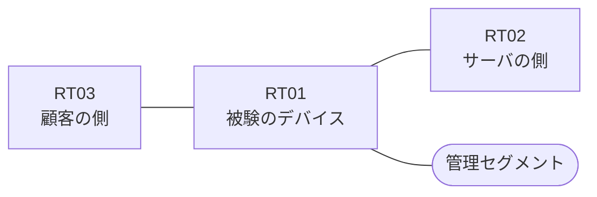

# 問題 20260813-013

> **本問は機器に接続せずに解答すること。追加の show 実行は認めない。**

## シナリオ

あなたの組織は、下記に示されているところのネットワークを運用しています。ある企業のネットワークにおいて、RT01 は、顧客の側のネットワークと、サーバの側のネットワークとの間に、配置されています。ユーザーから、通信に関する事象が、報告されています。あなたは、提示されているところの情報のみを使用して、要求されている状態が満たされていない理由を、特定しなければなりません。ルーティング・プロトコルの種別およびプロセスの配置は、変更されてはなりません。`10.109.52.0/24` からの通信は、許可されてはなりません。アクセス リストは、顧客の側のインターフェイスである `Ethernet2/0` において、着信の方向に適用されなければなりません。アクセス・リストのエントリは、1行で構成されなければなりません。`10.109.53.0/24` からの通信は、許可されることはできません。RT01 において、`10.109.48.0/24`、`10.109.49.0/24`、`10.109.50.0/24`、`10.109.51.0/24` のネットワークからの通信のみが、許可されなければなりません。



| 区間 | 被験デバイス側のインターフェイス | ネットワーク |
|------|----------------------------------|--------------|
| RT03（顧客の側） ⇔ RT01 | `Ethernet2/0` | 10.109.253.0/24 |
| RT01 ⇔ RT02（サーバの側） | `Ethernet2/1` | 10.109.254.0/24 |
| RT01 ⇔ 管理セグメント | `Ethernet2/2` | 10.109.255.0/24 |

## 出力

観測 | サーバへの到達
--- | ---
送信元が 10.109.48.0/24 のネットワークにあるホストから、172.25.25.31 の TCP ポート 22 宛ての通信 | 到達不可
送信元が 10.109.49.0/24 のネットワークにあるホストから、172.25.25.31 の TCP ポート 22 宛ての通信 | 到達不可
送信元が 10.109.50.0/24 のネットワークにあるホストから、172.25.25.31 の TCP ポート 22 宛ての通信 | 到達不可
送信元が 10.109.51.0/24 のネットワークにあるホストから、172.25.25.31 の TCP ポート 22 宛ての通信 | 到達不可
送信元が 10.109.52.0/24 のネットワークにあるホストから、172.25.25.31 の TCP ポート 22 宛ての通信 | 到達不可
送信元が 10.109.53.0/24 のネットワークにあるホストから、172.25.25.31 の TCP ポート 22 宛ての通信 | 到達不可
送信元が 10.109.250.0/24 のネットワークにあるホストから、172.25.25.31 の TCP ポート 22 宛ての通信 | 到達不可

```
RT01# show running-config | section ^interface
interface Ethernet2/0
 description === to RT03 ===
 ip address 10.109.253.1 255.255.255.0
interface Ethernet2/1
 description === to RT02 ===
 ip address 10.109.254.1 255.255.255.0
 ip access-group 70 in
interface Ethernet2/2
 description === management ===
 ip address 10.109.255.1 255.255.255.0
```
```
RT01# show ip access-lists
Standard IP access list 70
    10 permit 10.109.48.0, wildcard bits 0.0.0.255
    20 permit 10.109.49.0, wildcard bits 0.0.0.255
    30 permit 10.109.50.0, wildcard bits 0.0.0.255
    40 permit 10.109.51.0, wildcard bits 0.0.0.255
```

## 設問

次のうち、正しいものは、どれですか。

## 選択肢
A. インターフェイスに対して、アクセス・リストが in ではなく out の方向に適用されている

B. インターフェイスに適用されているアクセス・リストに、エントリが1つも存在しない

C. 戻りの通信を許可するアクセス・リストに、established のキーワードを伴うエントリが存在しない

D. アクセス・リストが、顧客の側ではなくサーバの側のインターフェイスに、着信の方向で適用されている

E. プレフィックス・リストがルート・マップから参照されていない

F. インターフェイスが管理上シャットダウンされている
