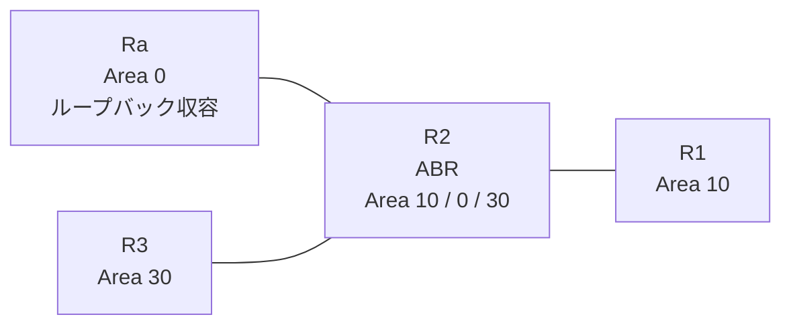

# 問題 20260813-014

> **本問は機器に接続せずに解答すること。追加の show 実行は認めない。**

## トポロジ

あなたは、下記のネットワークの保守を担当する技術者です。拠点の集約ルーター Ra は、サービスのためのプレフィックスを、4つのループバック・インターフェイスによって収容しています。R2 は、エリア 10・エリア 0・エリア 30 を接続するところの ABR であり、そして、すべてのルーターにおいて、OSPFv3 のプロセス 10 が構成されています。



| 区間 | インターフェイス | ネットワーク | エリア |
|------|------------------|--------------|--------|
| R1 ⇔ R2 | E0/0 | 2001:DB8:2:E::/64 | 10 |
| R2 ⇔ Ra | E0/1 | 2001:DB8:3:3::/64 | 0 |
| R2 ⇔ R3 | E0/2 | 2001:DB8:5:8::/64 | 30 |

- R1 の E0/0 セカンダリ: 2001:DB8:0:6::/64（Area 10）
- Ra のループバック: 2001:DB8:8:8::/64, 2001:DB8:9:9::/64, 2001:DB8:A:A::/64, 2001:DB8:B:B::/64（Area 0）

## 要件

1. ルーティング プロトコルの種別およびプロセスの配置は、変更されることはできません。
2. エリア 10 へ配布されるループバック由来のエリア間のルートは、2001:DB8:8:8::/64 および 2001:DB8:9:9::/64 に限定されなければなりません。リンクのネットワークのルートは、引き続き受信される必要があります。
3. ただし、2001:DB8:8:8::/64 のルートは、障害の対応という理由により、**すべてのエリアにおいて**、一時的に停止される必要があります。
4. エリア 30 においては、2001:DB8:8:8::/64 を除くいかなるルートの受信にも、影響が及んではなりません。
5. この制御は、エリア 10 に今後追加されるところの、いかなるルーターに対しても、等しく適用される必要があります。

## 現在の状態

ユーザーから、通信に関する事象が、報告されています。あなたは、提示されているところの情報のみを使用して、要求されている状態が満たされていない理由を、特定しなければなりません。


## 設定抜粋

```
R2# show running-config
Building configuration...
!
interface Ethernet0/0
 no ip address
 ipv6 address 2001:DB8:2:E::2/64
 ipv6 enable
 ipv6 ospf 10 area 10
!
interface Ethernet0/1
 no ip address
 ipv6 address 2001:DB8:3:3::2/64
 ipv6 enable
 ipv6 ospf 10 area 0
!
interface Ethernet0/2
 no ip address
 ipv6 address 2001:DB8:5:8::2/64
 ipv6 enable
 ipv6 ospf 10 area 30
!
router ospfv3 10
 router-id 2.2.2.2
 !
 address-family ipv6 unicast
  area 0 filter-list prefix PL-TYPE3 out
  area 10 filter-list prefix PL-STOP in
 exit-address-family
!
ipv6 prefix-list PL-AREA10 seq 5 permit 2001:DB8:8::/46 le 64
!
ipv6 prefix-list PL-CORE seq 5 permit ::/0 ge 1
!
ipv6 prefix-list PL-STOP seq 5 deny 2001:DB8:8:8::/64
ipv6 prefix-list PL-STOP seq 10 permit ::/0 le 128
!
ipv6 prefix-list PL-TYPE3 seq 5 permit 2001:DB8:8::/47 ge 64 le 64
ipv6 prefix-list PL-TYPE3 seq 10 permit 2001:DB8:3:3::/64
ipv6 prefix-list PL-TYPE3 seq 15 permit 2001:DB8:5:8::/64
!
ipv6 prefix-list PL10 seq 5 permit 2001:DB8:8:8::/64
!
```

## 設問

次のうち、正しいものは、どれですか。

## 選択肢
**A.**
```
R1# show ipv6 route ospf | include ^O|via
OI  2001:DB8:3:3::/64 [110/20]
     via FE80::A8BB:CCFF:FE01:9800, Ethernet0/0
OI  2001:DB8:5:8::/64 [110/20]
     via FE80::A8BB:CCFF:FE01:9800, Ethernet0/0
OI  2001:DB8:8:8::/64 [110/21]
     via FE80::A8BB:CCFF:FE01:9800, Ethernet0/0
OI  2001:DB8:9:9::/64 [110/21]
     via FE80::A8BB:CCFF:FE01:9800, Ethernet0/0
OI  2001:DB8:A:A::/64 [110/21]
     via FE80::A8BB:CCFF:FE01:9800, Ethernet0/0
OI  2001:DB8:B:B::/64 [110/21]
     via FE80::A8BB:CCFF:FE01:9800, Ethernet0/0
```
**B.**
```
R1# show ipv6 route ospf | include ^O|via
OI  2001:DB8:3:3::/64 [110/20]
     via FE80::A8BB:CCFF:FE01:9800, Ethernet0/0
OI  2001:DB8:5:8::/64 [110/20]
     via FE80::A8BB:CCFF:FE01:9800, Ethernet0/0
OI  2001:DB8:9:9::/64 [110/21]
     via FE80::A8BB:CCFF:FE01:9800, Ethernet0/0
```
**C.**
```
R1# show ipv6 route ospf | include ^O|via
OI  2001:DB8:3:3::/64 [110/20]
     via FE80::A8BB:CCFF:FE01:9800, Ethernet0/0
OI  2001:DB8:5:8::/64 [110/20]
     via FE80::A8BB:CCFF:FE01:9800, Ethernet0/0
OI  2001:DB8:9:9::/64 [110/21]
     via FE80::A8BB:CCFF:FE01:9800, Ethernet0/0
OI  2001:DB8:A:A::/64 [110/21]
     via FE80::A8BB:CCFF:FE01:9800, Ethernet0/0
OI  2001:DB8:B:B::/64 [110/21]
     via FE80::A8BB:CCFF:FE01:9800, Ethernet0/0
```
**D.**
```
R1# show ipv6 route ospf | include ^O|via
OI  2001:DB8:3:3::/64 [110/20]
     via FE80::A8BB:CCFF:FE01:9800, Ethernet0/0
OI  2001:DB8:5:8::/64 [110/20]
     via FE80::A8BB:CCFF:FE01:9800, Ethernet0/0
OI  2001:DB8:8:8::/64 [110/21]
     via FE80::A8BB:CCFF:FE01:9800, Ethernet0/0
OI  2001:DB8:9:9::/64 [110/21]
     via FE80::A8BB:CCFF:FE01:9800, Ethernet0/0
```
