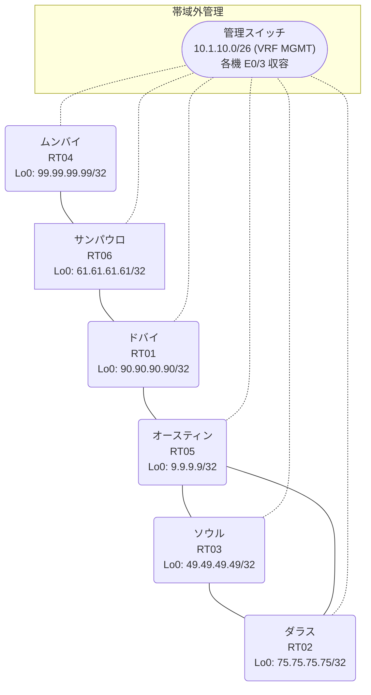

# 問題 20260813-015

> **本問は機器に接続せずに解答すること。追加の show 実行は認めない。**

## トポロジ

あなたは、下記のネットワークの保守を担当する技術者です。あなたの会社のネットワークは、複数のルーティング ドメインが、境界のルーターによって接続され、そして、すべてのサイトの到達可能性が提供されている、というものです。ルーティングの設計の詳細は、示されているところのコンフィギュレーションから、読み取られることが、期待されています。各サイトのルータと、サイトのネットワークとの対応は、下記の表に示されているとおりです。



| 拠点 | ルータ | 拠点網 |
|------|--------|----------------------|
| オースティン | RT05 | `9.9.9.9/32` |
| サンパウロ | RT06 | `61.61.61.61/32` |
| ソウル | RT03 | `49.49.49.49/32` |
| ダラス | RT02 | `75.75.75.75/32` |
| ドバイ | RT01 | `90.90.90.90/32` |
| ムンバイ | RT04 | `99.99.99.99/32` |

リンク一覧:
```
  RT05:E0/0(.1) ── RT02:E0/0(.2)   10.152.4.0/30
  RT01:E0/0(.1) ── RT06:E0/0(.2)   10.90.6.0/30
  RT03:E0/0(.1) ── RT02:E0/1(.2)   10.187.131.0/30
  RT06:E0/1(.1) ── RT04:E0/0(.2)   10.43.207.0/30
  RT01:E0/1(.1) ── RT05:E0/1(.2)   10.0.173.0/30
  RT05:E0/2(.1) ── RT03:E0/1(.2)   10.82.11.0/30
```

## 要件

1. 存在しないプロセス/AS を参照するところの構成のステートメントが、残置されることはできません。
2. ルートの再配送に対して、フィルターが、適用されることはできません。
3. 各サイトのネットワークは、ドメインをまたいで、すべてのサイトから、到達されることができること。
4. EIGRP へのルートの注入におけるシード メトリックは、プロセスの配下の default-metric `100000 100 255 1 1500` によって、与えられなければなりません。
5. 本作業は、日中の時間帯において実施されるという理由により、対象外であるところのデバイスに対する構成の変更は、許可されていません。

## 現在の状態

通信の一部において、想定されていない挙動が、観測されています。あなたは、示されているところの出力および構成に基づいて、その構成が、下記において記述されているとおりに動作していない理由を、判断する必要があります。

```
RT02# show ip route
Gateway of last resort is not set
      9.0.0.0/32 is subnetted, 1 subnets
O E2     9.9.9.9 [110/1] via 10.152.4.1, 00:07:48, Ethernet0/0
      10.0.0.0/8 is variably subnetted, 8 subnets, 2 masks
O E2     10.0.173.0/30 [110/10] via 10.152.4.1, 00:07:48, Ethernet0/0
O E2     10.43.207.0/30 [110/20] via 10.152.4.1, 00:07:48, Ethernet0/0
O        10.82.11.0/30 [110/20] via 10.187.131.1, 00:07:42, Ethernet0/1
                       [110/20] via 10.152.4.1, 00:07:44, Ethernet0/0
O E2     10.90.6.0/30 [110/10] via 10.152.4.1, 00:07:48, Ethernet0/0
C        10.152.4.0/30 is directly connected, Ethernet0/0
L        10.152.4.2/32 is directly connected, Ethernet0/0
C        10.187.131.0/30 is directly connected, Ethernet0/1
L        10.187.131.2/32 is directly connected, Ethernet0/1
      49.0.0.0/32 is subnetted, 1 subnets
O        49.49.49.49 [110/11] via 10.187.131.1, 00:07:42, Ethernet0/1
      61.0.0.0/32 is subnetted, 1 subnets
O E2     61.61.61.61 [110/11] via 10.152.4.1, 00:07:48, Ethernet0/0
      75.0.0.0/32 is subnetted, 1 subnets
C        75.75.75.75 is directly connected, Loopback0
      90.0.0.0/32 is subnetted, 1 subnets
O E2     90.90.90.90 [110/1] via 10.152.4.1, 00:07:48, Ethernet0/0
      99.0.0.0/32 is subnetted, 1 subnets
O E2     99.99.99.99 [110/21] via 10.152.4.1, 00:07:36, Ethernet0/0
```
```
RT05# show access-lists
Standard IP access list 18
    10 deny   99.99.99.99
    20 permit any
Standard IP access list 59
    10 deny   49.49.49.49
    20 permit any
```
```
RT05# show route-map
route-map RM-BACKUP1, deny, sequence 10
  Match clauses:
    ip address prefix-lists: PL-BACKUP1 
  Set clauses:
  Policy routing matches: 0 packets, 0 bytes
route-map RM-BACKUP1, permit, sequence 20
  Match clauses:
  Set clauses:
  Policy routing matches: 0 packets, 0 bytes
route-map RM-BACKUP2, deny, sequence 10
  Match clauses:
    ip address prefix-lists: PL-BACKUP2 
  Set clauses:
  Policy routing matches: 0 packets, 0 bytes
route-map RM-BACKUP2, permit, sequence 20
  Match clauses:
  Set clauses:
  Policy routing matches: 0 packets, 0 bytes
```
```
RT01# show ip route
Gateway of last resort is not set
      9.0.0.0/32 is subnetted, 1 subnets
O        9.9.9.9 [110/11] via 10.0.173.2, 00:07:18, Ethernet0/1
      10.0.0.0/8 is variably subnetted, 5 subnets, 2 masks
C        10.0.173.0/30 is directly connected, Ethernet0/1
L        10.0.173.1/32 is directly connected, Ethernet0/1
O        10.43.207.0/30 [110/20] via 10.90.6.2, 00:07:05, Ethernet0/0
C        10.90.6.0/30 is directly connected, Ethernet0/0
L        10.90.6.1/32 is directly connected, Ethernet0/0
      61.0.0.0/32 is subnetted, 1 subnets
O        61.61.61.61 [110/11] via 10.90.6.2, 00:07:14, Ethernet0/0
      90.0.0.0/32 is subnetted, 1 subnets
C        90.90.90.90 is directly connected, Loopback0
      99.0.0.0/32 is subnetted, 1 subnets
O        99.99.99.99 [110/21] via 10.90.6.2, 00:07:00, Ethernet0/0
```
```
RT05# show ip prefix-list
ip prefix-list PL-BACKUP1: 2 entries
   seq 5 deny 99.99.99.99/32
   seq 10 permit 0.0.0.0/0 le 32
ip prefix-list PL-BACKUP2: 2 entries
   seq 5 deny 49.49.49.49/32
   seq 10 permit 0.0.0.0/0 le 32
```
```
RT03# show ip route
Gateway of last resort is not set
      9.0.0.0/32 is subnetted, 1 subnets
O E2     9.9.9.9 [110/1] via 10.82.11.1, 00:07:26, Ethernet0/1
      10.0.0.0/8 is variably subnetted, 8 subnets, 2 masks
O E2     10.0.173.0/30 [110/10] via 10.82.11.1, 00:07:26, Ethernet0/1
O E2     10.43.207.0/30 [110/20] via 10.82.11.1, 00:07:26, Ethernet0/1
C        10.82.11.0/30 is directly connected, Ethernet0/1
L        10.82.11.2/32 is directly connected, Ethernet0/1
O E2     10.90.6.0/30 [110/10] via 10.82.11.1, 00:07:26, Ethernet0/1
O        10.152.4.0/30 [110/20] via 10.187.131.2, 00:07:25, Ethernet0/0
                       [110/20] via 10.82.11.1, 00:07:26, Ethernet0/1
C        10.187.131.0/30 is directly connected, Ethernet0/0
L        10.187.131.1/32 is directly connected, Ethernet0/0
      49.0.0.0/32 is subnetted, 1 subnets
C        49.49.49.49 is directly connected, Loopback0
      61.0.0.0/32 is subnetted, 1 subnets
O E2     61.61.61.61 [110/11] via 10.82.11.1, 00:07:26, Ethernet0/1
      75.0.0.0/32 is subnetted, 1 subnets
O        75.75.75.75 [110/11] via 10.187.131.2, 00:07:25, Ethernet0/0
      90.0.0.0/32 is subnetted, 1 subnets
O E2     90.90.90.90 [110/1] via 10.82.11.1, 00:07:26, Ethernet0/1
      99.0.0.0/32 is subnetted, 1 subnets
O E2     99.99.99.99 [110/21] via 10.82.11.1, 00:07:18, Ethernet0/1
```

## 設定抜粋

```
RT01# show running-config | section router
router ospf 3
 router-id 90.90.90.90
 redistribute ospf 26 match internal external 1 external 2
 passive-interface Loopback0
 network 10.90.6.0 0.0.0.3 area 0
 network 90.90.90.90 0.0.0.0 area 0
router ospf 26
 redistribute ospf 3 match internal external 1 external 2
 network 10.0.173.0 0.0.0.3 area 0
```
```
RT02# show running-config | section router
router ospf 47
 router-id 75.75.75.75
 network 10.152.4.0 0.0.0.3 area 0
 network 10.187.131.0 0.0.0.3 area 0
 network 75.75.75.75 0.0.0.0 area 0
```
```
RT03# show running-config | section router
router ospf 47
 router-id 49.49.49.49
 network 10.82.11.0 0.0.0.3 area 0
 network 10.187.131.0 0.0.0.3 area 0
 network 49.49.49.49 0.0.0.0 area 0
```
```
RT04# show running-config | section router
router ospf 3
 router-id 99.99.99.99
 passive-interface Loopback0
 network 10.43.207.0 0.0.0.3 area 0
 network 99.99.99.99 0.0.0.0 area 0
```
```
RT05# show running-config | section router
router ospf 26
 router-id 9.9.9.9
 redistribute ospf 54 match internal external 1 external 2
 network 9.9.9.9 0.0.0.0 area 0
 network 10.0.173.0 0.0.0.3 area 0
router ospf 47
 timers throttle spf 50 200 5000
 redistribute ospf 26 match internal external 1 external 2
 passive-interface Loopback0
 network 10.82.11.0 0.0.0.3 area 0
 network 10.152.4.0 0.0.0.3 area 0
```
```
RT06# show running-config | section router
router ospf 3
 router-id 61.61.61.61
 timers throttle spf 50 200 5000
 passive-interface Loopback0
 network 10.43.207.0 0.0.0.3 area 0
 network 10.90.6.0 0.0.0.3 area 0
 network 61.61.61.61 0.0.0.0 area 0
```

## 設問

次のうち、正しいものは、どれですか。

## 選択肢
**A.**
```
router ospf 26
 no redistribute ospf 54
 redistribute ospf 47 match internal external 1 external 2 subnets
```

**B.**
```
router ospf 47
 redistribute ospf 26 match internal external 1 external 2
```

**C.**
```
clear ip route *
```

**D.**
```
router ospf 26
 redistribute ospf 47 match internal external 1 external 2 subnets
```

**E.**
```
router ospf 26
 default-metric 20
```

**F.**
```
router ospf 26
 no passive-interface <上流IF>
```
