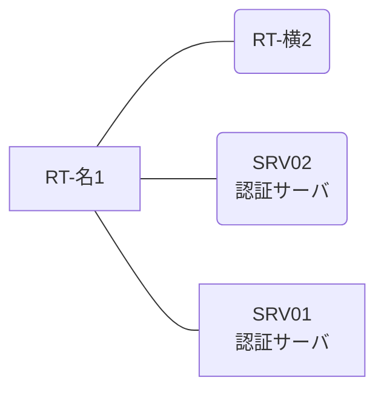

# 問題 20260813-016

> **本問は機器に接続せずに解答すること。追加の show 実行は認めない。**

## トポロジ

あなたは、ネットワークの運用を担当しています。2 つの拠点のルータが、共通の認証サーバ群を用いて、管理者の認証を行うように構成されています。一方のルータはサーバと直結しており、他方はそのルーターを経由してサーバに到達します。



### 認証サーバの仕様

| 項目 | SRV01 | SRV02 |
|---|---|---|
| アドレス | 10.99.92.2 | 10.99.93.2 |
| 待受ポート | 1812 / 1813 | 1645 / 1646 |
| 共有鍵 | Sh4red-Key | Sh4red-Key |
| 受理する送信元 | 10.0.0.1 ・ 10.4.0.2 | 同左 |
| 台帳 | adm-kato(15) ・ monitor-op(1) ・ SUZUKI(15) | 同左 |
| 現在の稼働状態 | 稼働中 | 稼働中 |

### ルータのアドレス

| ルータ | Loopback0 | 認証サーバ方向のインタフェース |
|---|---|---|
| RT-名1(名古屋) | 10.0.0.1 | Ethernet0/0 = 10.99.92.1 |
| RT-横2(横浜) | 10.4.0.2 | Ethernet0/0 = 10.53.12.2 |

## 要件

1. 名古屋・横浜 の両拠点で、利用者 adm-kato が権限レベル 15 で機器を操作できること。
2. 運用者の遠隔からの接続が失われないこと。
3. 緊急時にコンソールから操作できる経路を失わないこと。
4. 認証は認証サーバ群 RAD-GROUP を用いること。

## 現在の状態

一部の通信が、意図されているとおりに動作していない、という報告があります。示されているところの出力および構成に基づいて、要求されているところの動作が得られていない理由が、判断されなければなりません。

| 拠点 | ユーザ | 結果 |
|---|---|---|
| 名古屋 | adm-kato | ログイン可(権限レベル 15) |
| 名古屋 | monitor-op | ログイン可(権限レベル 1) |
| 名古屋 | emg-admin | ログイン不可 |
| 名古屋 | monitor-op からの特権昇格 | 昇格可(15) |
| 名古屋 | adm-kato(6 セッション目以降) | ログイン可(権限レベル 15) |
| 名古屋 | emg-admin(コンソールから) | ログイン可(権限レベル 15) |
| 名古屋 | adm-kato(ログインに要する時間) | 即時 |
| 横浜 | adm-kato | ログイン不可 |
| 横浜 | monitor-op | ログイン不可 |
| 横浜 | emg-admin | ログイン可(権限レベル 15) |
| 横浜 | adm-kato(6 セッション目以降) | ログイン不可 |
| 横浜 | emg-admin(コンソールから) | ログイン可(権限レベル 15) |
| 横浜 | adm-kato(ログインに要する時間) | 1 回目 約 18 秒 / 2 回目以降 即時 |

認証サーバがすべて停止した場合:

| 拠点 | ユーザ | 結果 |
|---|---|---|
| 名古屋 | emg-admin | ログイン可(権限レベル 15) |
| 名古屋 | SUZUKI | ログイン可(権限レベル 15) |
| 名古屋 | emg-admin(コンソールから) | ログイン可(権限レベル 15) |
| 横浜 | emg-admin | ログイン可(権限レベル 15) |
| 横浜 | SUZUKI | ログイン可(権限レベル 15) |
| 横浜 | emg-admin(コンソールから) | ログイン可(権限レベル 15) |


## 設定抜粋

```
RT-名1# show running-config | section aaa
aaa new-model
!
radius server RAD1
 address ipv4 10.99.92.2 auth-port 1812 acct-port 1813
 key Sh4red-Key
!
radius server RAD2
 address ipv4 10.99.93.2 auth-port 1645 acct-port 1646
 key Sh4red-Key
!
aaa group server radius RAD-GROUP
 server name RAD1
 server name RAD2
 deadtime 5
!
aaa authentication login default group RAD-GROUP local
aaa authentication login CONSOLE local
aaa authorization exec default group RAD-GROUP local
aaa authorization exec CONSOLE local
aaa authorization console
!
ip radius source-interface Loopback0
radius-server timeout 3
radius-server retransmit 2
radius-server dead-criteria time 3 tries 1
!
username emg-admin privilege 15 secret 5 $1$xxxx
username SUZUKI privilege 15 secret 5 $1$yyyy
!
line con 0
 exec-timeout 0 0
 logging synchronous
 login authentication CONSOLE
 authorization exec CONSOLE
line vty 0 4
 exec-timeout 0 0
 transport input ssh
line vty 5 15
 exec-timeout 0 0
 transport input ssh
```
```
RT-横2# show running-config | section aaa
aaa new-model
!
radius server RAD1
 address ipv4 10.99.92.2 auth-port 1812 acct-port 1813
 key Sh4red-Key
!
radius server RAD2
 address ipv4 10.99.93.2 auth-port 1645 acct-port 1646
 key Sh4red-Key
!
aaa group server radius RAD-GROUP
 server name RAD1
 server name RAD2
 deadtime 5
!
aaa authentication login default group RAD-GROUP local
aaa authentication login CONSOLE local
aaa authorization exec default group RAD-GROUP local
aaa authorization exec CONSOLE local
aaa authorization console
!
ip radius source-interface Loopback0
radius-server timeout 3
radius-server retransmit 2
radius-server dead-criteria time 3 tries 1
!
username emg-admin privilege 15 secret 5 $1$xxxx
username SUZUKI privilege 15 secret 5 $1$yyyy
!
ip access-list extended BORDER-IN
 deny   udp any any eq 1645
 deny   udp any any eq 1812
 permit ip any any
!
interface Ethernet0/0
 ip access-group BORDER-IN out
!
line con 0
 exec-timeout 0 0
 logging synchronous
 login authentication CONSOLE
 authorization exec CONSOLE
line vty 0 4
 exec-timeout 0 0
 transport input ssh
line vty 5 15
 exec-timeout 0 0
 transport input ssh
```

## 設問

次のうち、正しいものは、どれですか。

## 選択肢
**A.**
```
名古屋: User was successfully authenticated. (即時)
横浜: User was successfully authenticated. (即時)
```
**B.**
```
名古屋: User was successfully authenticated. (即時)
横浜: No authoritative response from any server. (1 回目 約 18 秒 / 2 回目以降 即時)
```
**C.**
```
名古屋: User authentication request was rejected by server. (即時)
横浜: User authentication request was rejected by server. (即時)
```
