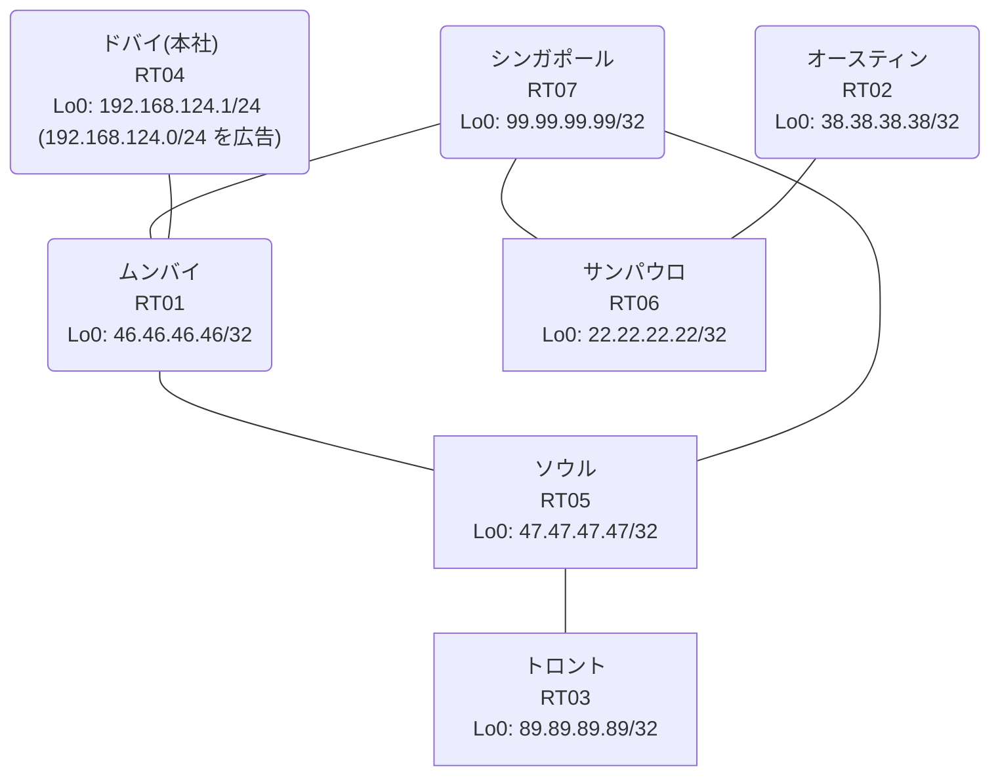

# 問題 20260813-018

> **本問は機器に接続せずに解答すること。追加の show 実行は認めない。**

## シナリオ

あなたは、下記のネットワークの保守を担当する技術者です。本社の顧客のネットワークは、BGP AS 65112 の RT04 によって、広告されています。あなたの会社の内部は、BGP / EIGRP / OSPF という 3 つのドメインから構成されています。サイトと、ルータおよびアドレスとの対応は、下記の表に示されているとおりです。ユーザーから、通信に関する事象が、報告されています。あなたは、示されているところの出力および構成に基づいて、その構成が、下記において記述されているとおりに動作していない理由を、判断する必要があります。すべてのルーターが、`192.168.124.0/24` を含むところのすべての宛先へ、到達することができること。ルーティング・プロトコルの種別およびプロセスの配置は、変更されてはなりません。`192.168.124.0/24` 宛のパケットが、広告元である RT04 の方向へ転送され、そして、転送のループが存在していないこと。本作業は、日中の時間帯において実施されるという理由により、対象外であるところのデバイスに対する構成の変更は、許可されていません。それぞれのドメインの間の再配送の設計は、維持されなければなりません。



| 拠点 | ルータ | 拠点網 / 広告網 |
|------|--------|------------------|
| オースティン | RT02 | 38.38.38.38/32 |
| サンパウロ | RT06 | 22.22.22.22/32 |
| シンガポール | RT07 | 99.99.99.99/32 |
| ソウル | RT05 | 47.47.47.47/32 |
| トロント | RT03 | 89.89.89.89/32 |
| ドバイ(本社) | RT04 | 192.168.124.1/24 (`192.168.124.0/24` を広告) |
| ムンバイ | RT01 | 46.46.46.46/32 |

リンク一覧:
```
  RT04:E0/0(.1) ── RT01:E0/0(.2)   10.42.154.0/30
  RT01:E0/1(.1) ── RT05:E0/0(.2)   10.163.202.0/30
  RT01:E0/2(.1) ── RT07:E0/0(.2)   10.81.146.0/30
  RT05:E0/1(.1) ── RT07:E0/1(.2)   10.42.162.0/30
  RT07:E0/2(.1) ── RT06:E0/0(.2)   10.206.121.0/30
  RT06:E0/1(.1) ── RT02:E0/0(.2)   10.15.214.0/30
  RT05:E0/2(.1) ── RT03:E0/0(.2)   10.98.138.0/30
```

## 出力

```
RT01# show ip route
Gateway of last resort is not set
      10.0.0.0/8 is variably subnetted, 10 subnets, 2 masks
O        10.15.214.0/30 [110/30] via 10.81.146.2, 00:04:32, Ethernet0/2
C        10.42.154.0/30 is directly connected, Ethernet0/0
L        10.42.154.2/32 is directly connected, Ethernet0/0
O        10.42.162.0/30 [110/20] via 10.81.146.2, 00:04:57, Ethernet0/2
C        10.81.146.0/30 is directly connected, Ethernet0/2
L        10.81.146.1/32 is directly connected, Ethernet0/2
O        10.98.138.0/30 [110/30] via 10.81.146.2, 00:04:29, Ethernet0/2
C        10.163.202.0/30 is directly connected, Ethernet0/1
L        10.163.202.1/32 is directly connected, Ethernet0/1
O        10.206.121.0/30 [110/20] via 10.81.146.2, 00:04:57, Ethernet0/2
      22.0.0.0/32 is subnetted, 1 subnets
O        22.22.22.22 [110/21] via 10.81.146.2, 00:04:32, Ethernet0/2
      38.0.0.0/32 is subnetted, 1 subnets
O        38.38.38.38 [110/31] via 10.81.146.2, 00:04:27, Ethernet0/2
      46.0.0.0/32 is subnetted, 1 subnets
C        46.46.46.46 is directly connected, Loopback0
      47.0.0.0/32 is subnetted, 1 subnets
O        47.47.47.47 [110/21] via 10.81.146.2, 00:04:52, Ethernet0/2
      89.0.0.0/32 is subnetted, 1 subnets
O        89.89.89.89 [110/31] via 10.81.146.2, 00:04:24, Ethernet0/2
      99.0.0.0/32 is subnetted, 1 subnets
O        99.99.99.99 [110/11] via 10.81.146.2, 00:04:57, Ethernet0/2
O E2  192.168.124.0/24 [110/20] via 10.81.146.2, 00:04:02, Ethernet0/2
```
```
RT01# show route-map
route-map RM-OLD1, deny, sequence 10
  Match clauses:
    ip address prefix-lists: PL-OLD1 
  Set clauses:
  Policy routing matches: 0 packets, 0 bytes
route-map RM-OLD1, permit, sequence 20
  Match clauses:
  Set clauses:
  Policy routing matches: 0 packets, 0 bytes
```
```
RT01# show ip prefix-list
ip prefix-list PL-OLD1: 2 entries
   seq 5 deny 22.22.22.22/32
   seq 10 permit 0.0.0.0/0 le 32
```
```
RT01# show access-lists
Standard IP access list 15
    10 deny   22.22.22.22
    20 permit any
```
```
RT01# show ip bgp
BGP table version is 14, local router ID is 46.46.46.46
Status codes: s suppressed, d damped, h history, * valid, > best, i - internal, 
              r RIB-failure, S Stale, m multipath, b backup-path, f RT-Filter, 
              x best-external, a additional-path, c RIB-compressed, 
              t secondary path, L long-lived-stale,
Origin codes: i - IGP, e - EGP, ? - incomplete
RPKI validation codes: V valid, I invalid, N Not found

     Network          Next Hop            Metric LocPrf Weight Path
 *>   10.15.214.0/30   10.81.146.2             30         32768 ?
 *>   10.42.162.0/30   10.81.146.2             20         32768 ?
 *>   10.81.146.0/30   0.0.0.0                  0         32768 ?
 *>   10.98.138.0/30   10.81.146.2             30         32768 ?
 *>   10.206.121.0/30  10.81.146.2             20         32768 ?
 *>   22.22.22.22/32   10.81.146.2             21         32768 ?
 *>   38.38.38.38/32   10.81.146.2             31         32768 ?
 *>   46.46.46.46/32   0.0.0.0                  0         32768 i
 *>   47.47.47.47/32   10.81.146.2             21         32768 ?
 *>   89.89.89.89/32   10.81.146.2             31         32768 ?
 *>   99.99.99.99/32   10.81.146.2             11         32768 ?
 r>i  192.168.124.0    10.42.154.1              0    100      0 i
```
```
RT06# traceroute 192.168.124.1 probe 1 timeout 1 ttl 1 8
Type escape sequence to abort.
Tracing the route to 192.168.124.1
VRF info: (vrf in name/id, vrf out name/id)
  1 10.206.121.1 1 msec
  2 10.42.162.1 1 msec
  3 10.163.202.1 1 msec
  4 10.81.146.2 1 msec
  5 10.42.162.1 17 msec
  6 10.163.202.1 2 msec
  7 10.81.146.2 8 msec
  8 10.42.162.1 1 msec
```
```
RT01# show running-config | section router
router eigrp 118
 network 10.163.202.0 0.0.0.3
 redistribute bgp 65112 metric 100000 100 255 1 1500
 redistribute ospf 38 metric 100000 100 255 1 1500
 passive-interface Loopback0
router ospf 38
 router-id 46.46.46.46
 network 10.81.146.0 0.0.0.3 area 0
 network 46.46.46.46 0.0.0.0 area 0
router bgp 65112
 bgp router-id 46.46.46.46
 bgp log-neighbor-changes
 bgp redistribute-internal
 network 46.46.46.46 mask 255.255.255.255
 redistribute ospf 38
 neighbor 10.42.154.1 remote-as 65112
```
```
RT05# show running-config | section router
router eigrp 118
 network 10.163.202.0 0.0.0.3
 redistribute ospf 38 metric 100000 100 255 1 1500
router ospf 38
 router-id 47.47.47.47
 redistribute eigrp 118
 network 10.42.162.0 0.0.0.3 area 0
 network 10.98.138.0 0.0.0.3 area 0
 network 47.47.47.47 0.0.0.0 area 0
```
```
RT07# show running-config | section router
router ospf 38
 router-id 99.99.99.99
 timers throttle spf 50 200 5000
 passive-interface Loopback0
 network 10.42.162.0 0.0.0.3 area 0
 network 10.81.146.0 0.0.0.3 area 0
 network 10.206.121.0 0.0.0.3 area 0
 network 99.99.99.99 0.0.0.0 area 0
```
```
RT04# show running-config | section router
router bgp 65112
 bgp router-id 192.168.124.1
 bgp log-neighbor-changes
 network 192.168.124.0
 neighbor 10.42.154.2 remote-as 65112
```

## 設問

次のうち、正しいものは、どれですか。

## 選択肢
A. RT01 の BGP テーブルにおいて当該経路が RIB-failure となり、ベストパスが選出できていない

B. RT04 からの広告が RT01 に到達していない

C. RT05 の相互再配送において経路が収束せず、振動している

D. RT05 と RT07 の間で等コストの複数経路が成立し、パケットが分散されている

E. RT01 において当該プレフィックスの外部経路タイプが E2 であり、内部コストが加算されていない

F. RT01 が、一周して戻ってきた外部経路を iBGP の経路より優先して採用している
