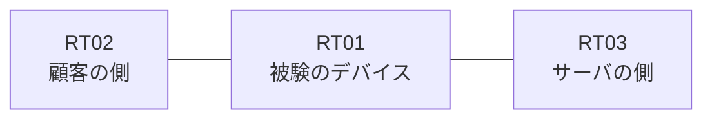

# 問題 20260813-021

> **本問は機器に接続せずに解答すること。追加の show 実行は認めない。**

## トポロジ

あなたの組織は、下記に示されているところのネットワークを運用しています。ある企業のネットワークにおいて、RT01 は、顧客の側のネットワークと、サーバの側のネットワークとの間に配置されており、IPv6 によって運用されています。



## 要件

1. アクセス・リストのエントリは、1行で構成される必要があります。
2. RT01 において、`2001:DB8:F4:30::/64`、`2001:DB8:F4:31::/64`、`2001:DB8:F4:32::/64` のネットワークからの通信のみが、`2001:DB8:F4:FF::10` の TCP ポート 443 に到達できなければなりません。
3. 管理のための構成に対して、変更が加えられてはなりません。
4. `2001:DB8:F4:35::/64` からの通信は、許可されてはなりません。

## 現在の状態

いくつかの宛先への通信について、報告が上がっています。示されているところの出力および構成に基づいて、要求されているところの動作が得られていない理由が、判断されなければなりません。

観測 | サーバへの到達
--- | ---
送信元が 2001:DB8:F4:30::/64 のネットワークにあるホストから、2001:DB8:F4:FF::10 の TCP ポート 443 宛ての通信 | 到達可
送信元が 2001:DB8:F4:31::/64 のネットワークにあるホストから、2001:DB8:F4:FF::10 の TCP ポート 443 宛ての通信 | 到達可
送信元が 2001:DB8:F4:32::/64 のネットワークにあるホストから、2001:DB8:F4:FF::10 の TCP ポート 443 宛ての通信 | 到達不可
送信元が 2001:DB8:F4:33::/64 のネットワークにあるホストから、2001:DB8:F4:FF::10 の TCP ポート 443 宛ての通信 | 到達不可
送信元が 2001:DB8:F4:35::/64 のネットワークにあるホストから、2001:DB8:F4:FF::10 の TCP ポート 443 宛ての通信 | 到達不可
送信元が 2001:DB8:F4:FA::/64 のネットワークにあるホストから、2001:DB8:F4:FF::10 の TCP ポート 443 宛ての通信 | 到達不可

```
RT01# show ipv6 access-list
IPv6 access list V6-EDGE-IN
    permit ipv6 2001:DB8:F4:30::/63 any sequence 10
```
```
RT01# show ipv6 neighbors
IPv6 Address                              Age Link-layer Addr State Interface
2001:DB8:F4:30::3                           0 aabb.cc02.4f00  REACH Et0/0
```

## 設定抜粋

```
RT01# show running-config | section ipv6 access-list|traffic-filter
ipv6 access-list V6-EDGE-IN
 sequence 10 permit ipv6 2001:DB8:F4:30::/63 any
interface Ethernet0/0
 ipv6 traffic-filter V6-EDGE-IN in
```

## 設問

次のうち、正しいものは、どれですか。

## 選択肢
A. アクセス・リストが `ip access-group` によって適用されている

B. 空のアクセス・リストが参照されているため、暗黙の拒否によってすべてが破棄されている

C. プレフィックスの長さが長く、対象としているネットワークの一部が一致の対象から外れている

D. 先行するエントリが広い範囲を許可しており、後続のエントリが評価されない

E. 参照されているアクセス・リストが定義されていない

F. ワイルドカードによる指定が受理されず、意図されたエントリが存在していない
