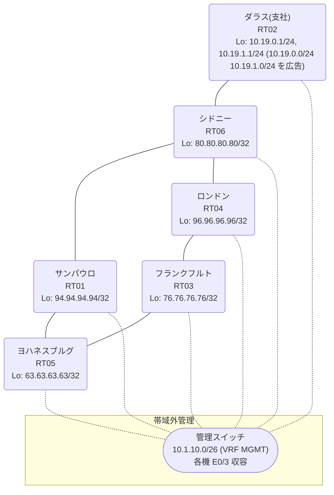

# 問題 20260813-025

> **本問は機器に接続せずに解答すること。追加の show 実行は認めない。**

## シナリオ

あなたは、ネットワークの運用を担当しています。あなたの会社のネットワークは、支社のドメインと、本社のコアのドメイン(OSPF)とが、2 台の境界のルータによって接続され、そして、それらは境界において接続されています。支社のネットワーク `10.19.0.0/24` および `10.19.1.0/24` は、RT02 によって、広告されています。どちらの境界が失われた場合においても、通信が継続されることができるように、設計されています。ルーティングの設計の詳細は、示されているところの出力から、読み取られることが、期待されています。いくつかの宛先への通信について、報告が上がっています。示されているところの出力および構成に基づいて、要求されているところの動作が得られていない理由が、判断されなければなりません。管理のための構成に対して、変更が加えられてはなりません。支社のネットワーク `10.19.0.0/24` / `10.19.1.0/24` への到達可能性が、すべてのサイトにおいて、確保されていること。二点相互再配送による、冗長の設計が、維持される必要があります。ルーティング・プロトコルの種別およびプロセスの配置は、変更されてはなりません。スタティック・ルートおよび既定のルートによる迂回は、実施されてはなりません。支社のネットワーク宛のトラフィックが RT02 へ配送され、経路の周回が、発生していないこと。



| 拠点 | ルータ | Loopback / 広告網 |
|------|--------|--------------------|
| サンパウロ | RT01 | 94.94.94.94/32 |
| シドニー | RT06 | 80.80.80.80/32 |
| ダラス(支社) | RT02 | 10.19.0.1/24, 10.19.1.1/24 (`10.19.0.0/24` `10.19.1.0/24` を広告) |
| フランクフルト | RT03 | 76.76.76.76/32 |
| ヨハネスブルグ | RT05 | 63.63.63.63/32 |
| ロンドン | RT04 | 96.96.96.96/32 |

リンク一覧:
```
  RT02:E0/0(.2) ── RT06:E0/0(.1)   10.153.5.0/30
  RT06:E0/1(.1) ── RT04:E0/0(.2)   10.152.14.0/30
  RT06:E0/2(.1) ── RT01:E0/0(.2)   10.187.241.0/30
  RT04:E0/1(.1) ── RT03:E0/0(.2)   172.16.234.0/30
  RT03:E0/1(.1) ── RT05:E0/0(.2)   172.16.179.0/30
  RT01:E0/1(.1) ── RT05:E0/1(.2)   172.16.7.0/30
```

## 出力

```
RT06# show ip route
Gateway of last resort is not set
      10.0.0.0/8 is variably subnetted, 8 subnets, 3 masks
R        10.19.0.0/24 [120/1] via 10.187.241.2, 00:00:22, Ethernet0/2
                      [120/1] via 10.153.5.2, 00:00:08, Ethernet0/0
R        10.19.1.0/24 [120/1] via 10.187.241.2, 00:00:22, Ethernet0/2
                      [120/1] via 10.153.5.2, 00:00:08, Ethernet0/0
C        10.152.14.0/30 is directly connected, Ethernet0/1
L        10.152.14.1/32 is directly connected, Ethernet0/1
C        10.153.5.0/30 is directly connected, Ethernet0/0
L        10.153.5.1/32 is directly connected, Ethernet0/0
C        10.187.241.0/30 is directly connected, Ethernet0/2
L        10.187.241.1/32 is directly connected, Ethernet0/2
      63.0.0.0/32 is subnetted, 1 subnets
R        63.63.63.63 [120/1] via 10.187.241.2, 00:00:22, Ethernet0/2
                     [120/1] via 10.152.14.2, 00:00:12, Ethernet0/1
      76.0.0.0/32 is subnetted, 1 subnets
R        76.76.76.76 [120/1] via 10.187.241.2, 00:00:22, Ethernet0/2
                     [120/1] via 10.152.14.2, 00:00:12, Ethernet0/1
      80.0.0.0/32 is subnetted, 1 subnets
C        80.80.80.80 is directly connected, Loopback0
      94.0.0.0/32 is subnetted, 1 subnets
R        94.94.94.94 [120/1] via 10.187.241.2, 00:00:22, Ethernet0/2
                     [120/1] via 10.152.14.2, 00:00:12, Ethernet0/1
      96.0.0.0/32 is subnetted, 1 subnets
R        96.96.96.96 [120/1] via 10.187.241.2, 00:00:22, Ethernet0/2
                     [120/1] via 10.152.14.2, 00:00:12, Ethernet0/1
      172.16.0.0/30 is subnetted, 3 subnets
R        172.16.7.0 [120/1] via 10.187.241.2, 00:00:22, Ethernet0/2
                    [120/1] via 10.152.14.2, 00:00:12, Ethernet0/1
R        172.16.179.0 [120/1] via 10.187.241.2, 00:00:22, Ethernet0/2
                      [120/1] via 10.152.14.2, 00:00:12, Ethernet0/1
R        172.16.234.0 [120/1] via 10.187.241.2, 00:00:22, Ethernet0/2
                      [120/1] via 10.152.14.2, 00:00:12, Ethernet0/1
```
```
RT04# show running-config | section router
router ospf 1
 router-id 96.96.96.96
 redistribute rip
 network 96.96.96.96 0.0.0.0 area 0
 network 172.16.234.0 0.0.0.3 area 0

router rip
 version 2
 redistribute ospf 1 metric 1
 network 10.0.0.0
 network 96.0.0.0
 no auto-summary
```
```
RT01# show running-config | section router
router ospf 1
 router-id 94.94.94.94
 redistribute rip
 network 94.94.94.94 0.0.0.0 area 0
 network 172.16.7.0 0.0.0.3 area 0
router rip
 version 2
 redistribute ospf 1 metric 1
 network 10.0.0.0
 network 94.0.0.0
 no auto-summary
```
```
RT03# traceroute 10.19.0.1 probe 1 timeout 1 ttl 1 8
Type escape sequence to abort.
Tracing the route to 10.19.0.1
VRF info: (vrf in name/id, vrf out name/id)
  1 172.16.234.1 1 msec
  2 10.152.14.1 1 msec
  3 10.187.241.2 1 msec
  4 172.16.7.2 2 msec
  5 172.16.179.1 1 msec
  6 172.16.234.1 3 msec
  7 10.152.14.1 2 msec
  8 10.187.241.2 2 msec
```
```
RT04# show ip route 10.19.0.0
Routing entry for 10.19.0.0/24
  Known via "rip", distance 120, metric 2
  Redistributing via ospf 1, rip
  Advertised by ospf 1 subnets
  Last update from 10.152.14.1 on Ethernet0/0, 00:00:12 ago
  Routing Descriptor Blocks:
  * 10.152.14.1, from 10.152.14.1, 00:00:12 ago, via Ethernet0/0
      Route metric is 2, traffic share count is 1
```

## 設問

次のうち、正しいものは、どれですか。

## 選択肢
A. 境界の OSPF→RIP の再配送でメトリックが無限大となり、経路が広告されていない

B. RT04 と RT01 の間で OSPF の隣接が確立しておらず、経路情報が同期していない

C. RT06 において、再注入された経路の管理距離が、正規の経路のそれより小さい

D. 支社網の経路が収束せず、境界の間で振動している

E. RT06 が、境界で再注入された経路を、RT02 からの正規の経路と等価に扱っている

F. 等コストの複数経路による正常な負荷分散であり、事象は仕様どおりである
