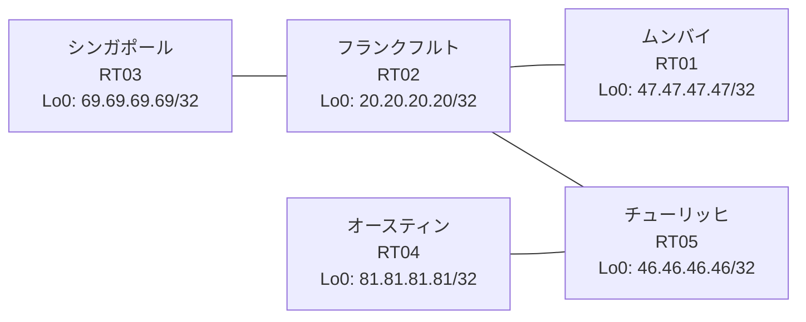

# 問題 20260813-026

> **本問は機器に接続せずに解答すること。追加の show 実行は認めない。**

## シナリオ

あなたの組織は、下記に示されているところのネットワークを運用しています。あなたの会社のネットワークは、複数のルーティング ドメインが、境界のルータによって接続され、そして、すべてのサイトの到達可能性が提供されている、というものです。ルーティングの設計の詳細は、示されているところのコンフィギュレーションから、読み取られることが、期待されています。各サイトのルーターと、サイトの網との対応は、下記の表に示されているとおりです。一部の通信が、意図されているとおりに動作していない、という報告があります。示されているところの出力および構成に基づいて、要求されているところの動作が得られていない理由が、判断されなければなりません。ルートの再配送に対して、フィルタが、適用されることはできません。存在しないプロセス/AS を参照するところの構成のステートメントが、残置されてはなりません。インタフェースの IP アドレッシングは、変更されてはなりません。シード メトリック `10000 10 255 1 1500` は、redistribute のステートメントごとに、個別に指定されなければなりません。いずれのサイトからも、他のすべてのサイトのネットワークへの、IP リーチアビリティが、確保されていること。



| 拠点 | ルータ | 拠点網 |
|------|--------|----------------------|
| オースティン | RT04 | `81.81.81.81/32` |
| シンガポール | RT03 | `69.69.69.69/32` |
| チューリッヒ | RT05 | `46.46.46.46/32` |
| フランクフルト | RT02 | `20.20.20.20/32` |
| ムンバイ | RT01 | `47.47.47.47/32` |

リンク一覧:
```
  RT02:E0/0(.1) ── RT05:E0/0(.2)   10.170.37.0/30
  RT05:E0/1(.1) ── RT04:E0/0(.2)   10.143.53.0/30
  RT02:E0/1(.1) ── RT03:E0/0(.2)   10.157.229.0/30
  RT02:E0/2(.1) ── RT01:E0/0(.2)   10.228.113.0/30
```

## 出力

```
RT02# show access-lists
Standard IP access list 35
    10 deny   47.47.47.47
    20 permit any
Standard IP access list 49
    10 deny   20.20.20.20
    20 permit any
```
```
RT01# show ip route
Gateway of last resort is not set
      10.0.0.0/8 is variably subnetted, 2 subnets, 2 masks
C        10.228.113.0/30 is directly connected, Ethernet0/0
L        10.228.113.2/32 is directly connected, Ethernet0/0
      20.0.0.0/32 is subnetted, 1 subnets
D        20.20.20.20 [90/409600] via 10.228.113.1, 00:04:34, Ethernet0/0
      47.0.0.0/32 is subnetted, 1 subnets
C        47.47.47.47 is directly connected, Loopback0
```
```
RT02# show route-map
route-map RM-STG2, deny, sequence 10
  Match clauses:
    ip address prefix-lists: PL-STG2 
  Set clauses:
  Policy routing matches: 0 packets, 0 bytes
route-map RM-STG2, permit, sequence 20
  Match clauses:
  Set clauses:
  Policy routing matches: 0 packets, 0 bytes
route-map RM-OLD1, deny, sequence 10
  Match clauses:
    ip address prefix-lists: PL-OLD1 
  Set clauses:
  Policy routing matches: 0 packets, 0 bytes
route-map RM-OLD1, permit, sequence 20
  Match clauses:
  Set clauses:
  Policy routing matches: 0 packets, 0 bytes
```
```
RT05# show ip route
Gateway of last resort is not set
      10.0.0.0/8 is variably subnetted, 6 subnets, 2 masks
C        10.143.53.0/30 is directly connected, Ethernet0/1
L        10.143.53.1/32 is directly connected, Ethernet0/1
O        10.157.229.0/30 [110/20] via 10.170.37.1, 00:04:29, Ethernet0/0
C        10.170.37.0/30 is directly connected, Ethernet0/0
L        10.170.37.2/32 is directly connected, Ethernet0/0
O E2     10.228.113.0/30 [110/20] via 10.170.37.1, 00:04:35, Ethernet0/0
      20.0.0.0/32 is subnetted, 1 subnets
O        20.20.20.20 [110/11] via 10.170.37.1, 00:04:35, Ethernet0/0
      46.0.0.0/32 is subnetted, 1 subnets
C        46.46.46.46 is directly connected, Loopback0
      47.0.0.0/32 is subnetted, 1 subnets
O E2     47.47.47.47 [110/20] via 10.170.37.1, 00:04:35, Ethernet0/0
      69.0.0.0/32 is subnetted, 1 subnets
O        69.69.69.69 [110/21] via 10.170.37.1, 00:04:24, Ethernet0/0
      81.0.0.0/32 is subnetted, 1 subnets
D        81.81.81.81 [90/409600] via 10.143.53.2, 00:05:00, Ethernet0/1
```
```
RT05# show running-config | section router
router eigrp 595
 timers active-time 5
 network 10.143.53.0 0.0.0.3
 network 46.46.46.46 0.0.0.0
 redistribute ospf 53 match internal external 1 external 2 metric 10000 10 255 1 1500
 passive-interface Loopback0
router ospf 53
 router-id 46.46.46.46
 redistribute eigrp 595
 network 10.170.37.0 0.0.0.3 area 0
 network 46.46.46.46 0.0.0.0 area 0
```
```
RT02# show ip prefix-list
ip prefix-list PL-OLD1: 2 entries
   seq 5 deny 47.47.47.47/32
   seq 10 permit 0.0.0.0/0 le 32
ip prefix-list PL-STG2: 2 entries
   seq 5 deny 20.20.20.20/32
   seq 10 permit 0.0.0.0/0 le 32
```
```
RT04# show running-config | section router
router eigrp 595
 network 10.143.53.0 0.0.0.3
 network 81.81.81.81 0.0.0.0
```
```
RT02# show running-config | section router
router eigrp 444
 network 10.228.113.0 0.0.0.3
 network 20.20.20.20 0.0.0.0
 redistribute ospf 53 match internal external 1 external 2
router ospf 53
 router-id 20.20.20.20
 redistribute eigrp 444
 passive-interface Loopback0
 network 10.157.229.0 0.0.0.3 area 0
 network 10.170.37.0 0.0.0.3 area 0
 network 20.20.20.20 0.0.0.0 area 0
```
```
RT01# show running-config | section router
router eigrp 444
 network 10.228.113.0 0.0.0.3
 network 47.47.47.47 0.0.0.0
```
```
RT04# show ip route
Gateway of last resort is not set
      10.0.0.0/8 is variably subnetted, 5 subnets, 2 masks
C        10.143.53.0/30 is directly connected, Ethernet0/0
L        10.143.53.2/32 is directly connected, Ethernet0/0
D EX     10.157.229.0/30 [170/284160] via 10.143.53.1, 00:04:17, Ethernet0/0
D EX     10.170.37.0/30 [170/284160] via 10.143.53.1, 00:04:45, Ethernet0/0
D EX     10.228.113.0/30 [170/284160] via 10.143.53.1, 00:04:17, Ethernet0/0
      20.0.0.0/32 is subnetted, 1 subnets
D EX     20.20.20.20 [170/284160] via 10.143.53.1, 00:04:17, Ethernet0/0
      46.0.0.0/32 is subnetted, 1 subnets
D        46.46.46.46 [90/409600] via 10.143.53.1, 00:04:45, Ethernet0/0
      47.0.0.0/32 is subnetted, 1 subnets
D EX     47.47.47.47 [170/284160] via 10.143.53.1, 00:04:17, Ethernet0/0
      69.0.0.0/32 is subnetted, 1 subnets
D EX     69.69.69.69 [170/284160] via 10.143.53.1, 00:04:05, Ethernet0/0
      81.0.0.0/32 is subnetted, 1 subnets
C        81.81.81.81 is directly connected, Loopback0
```
```
RT03# show running-config | section router
router ospf 53
 router-id 69.69.69.69
 passive-interface Loopback0
 network 10.157.229.0 0.0.0.3 area 0
 network 69.69.69.69 0.0.0.0 area 0
```

## 設問

次のうち、正しいものは、どれですか。

## 選択肢
A. RT02 の route-map RM-OLD1 が対象の経路を拒否している

B. RT02 の router eigrp 444 配下の redistribute が、実在しないプロセス/AS を参照している

C. RT01 の router eigrp 444 に Loopback0 の network 文が設定されていない

D. RT02 の router eigrp 444 への redistribute に seed metric が指定されていない

E. RT02 と RT01 側ドメインの間のリンクで MTU が一致していない

F. RT02 の router eigrp 444 配下に redistribute が設定されていない
