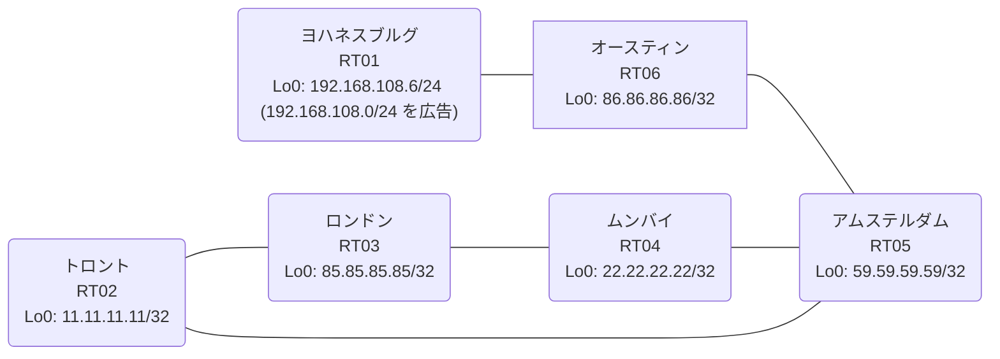

# 問題 20260813-027

> **本問は機器に接続せずに解答すること。追加の show 実行は認めない。**

## トポロジ

あなたは、下記のネットワークの保守を担当する技術者です。あなたの会社のネットワークは、OSPF のドメインと EIGRP のドメインとが、2 つの境界のルーターによって接続され、そして、それらは境界において接続されています。顧客のネットワーク `192.168.108.0/24` は、ヨハネスブルグ のサイトにおいて、別のルーティング・プロトコルによって学習され、そして、再配送によって、社内へ持ち込まれています。ルーティングの設計の詳細は、示されているところのコンフィギュレーションから、読み取られることが、期待されています。



| 拠点 | ルータ | 拠点網 / 広告網 |
|------|--------|------------------|
| アムステルダム | RT05 | 59.59.59.59/32 |
| オースティン | RT06 | 86.86.86.86/32 |
| トロント | RT02 | 11.11.11.11/32 |
| ムンバイ | RT04 | 22.22.22.22/32 |
| ヨハネスブルグ | RT01 | 192.168.108.6/24 (`192.168.108.0/24` を広告) |
| ロンドン | RT03 | 85.85.85.85/32 |

リンク一覧:
```
  RT03:E0/0(.1) ── RT02:E0/0(.2)   172.16.97.0/24
  RT03:E0/1(.1) ── RT04:E0/0(.3)   172.16.139.0/24
  RT02:E0/1(.2) ── RT05:E0/0(.4)   172.16.41.0/24
  RT04:E0/1(.3) ── RT05:E0/1(.4)   172.16.140.0/24
  RT05:E0/2(.4) ── RT06:E0/0(.5)   172.16.85.0/24
  RT06:E0/1(.5) ── RT01:E0/0(.6)   172.16.159.0/24
```

## 要件

1. 顧客のネットワーク `192.168.108.0/24` への到達可能性が、すべてのサイトにおいて、確保されていること。
2. スタティック・ルートおよび既定のルートによる迂回は、実施されることはできません。
3. 管理のための構成に対して、変更が加えられてはなりません。
4. `192.168.108.0/24` 宛のトラフィックが RT01 へ配送され、経路の周回が、発生していないこと。
5. スタティック・ルートおよび既定のルートによる迂回は、実施されてはなりません。
6. 既存の相互再配送の設計が、削除または停止されてはなりません。
7. 是正は、経路の出自に対するマーキングによって、実装されなければなりません。

## 現在の状態

一部の通信が、意図されているとおりに動作していない、という報告があります。示されているところの出力および構成に基づいて、要求されているところの動作が得られていない理由が、判断されなければなりません。

```
RT05# show ip eigrp topology 192.168.108.0 255.255.255.0
EIGRP-IPv4 Topology Entry for AS(23)/ID(59.59.59.59) for 192.168.108.0/24
  State is Passive, Query origin flag is 1, 1 Successor(s), FD is 281856
  Descriptor Blocks:
  172.16.140.3 (Ethernet0/1), from 172.16.140.3, Send flag is 0x0
      Composite metric is (281856/2816), route is External
      Vector metric:
        Minimum bandwidth is 10000 Kbit
        Total delay is 1010 microseconds
        Reliability is 255/255
        Load is 1/255
        Minimum MTU is 1500
        Hop count is 1
        Originating router is 22.22.22.22
      External data:
        AS number of route is 27
        External protocol is OSPF, external metric is 20
        Administrator tag is 0 (0x00000000)
  172.16.85.5 (Ethernet0/2), from 172.16.85.5, Send flag is 0x0
      Composite metric is (307456/281856), route is External
      Vector metric:
        Minimum bandwidth is 10000 Kbit
        Total delay is 2010 microseconds
        Reliability is 255/255
        Load is 1/255
        Minimum MTU is 1500
        Hop count is 2
        Originating router is 192.168.108.6
      External data:
        AS number of route is 0
        External protocol is RIP, external metric is 0
        Administrator tag is 0 (0x00000000)
```
```
RT05# show ip route
Gateway of last resort is not set
      11.0.0.0/32 is subnetted, 1 subnets
D EX     11.11.11.11 [170/281856] via 172.16.140.3, 00:04:05, Ethernet0/1
                     [170/281856] via 172.16.41.2, 00:04:05, Ethernet0/0
      22.0.0.0/32 is subnetted, 1 subnets
D EX     22.22.22.22 [170/281856] via 172.16.140.3, 00:04:01, Ethernet0/1
                     [170/281856] via 172.16.41.2, 00:04:01, Ethernet0/0
      59.0.0.0/32 is subnetted, 1 subnets
C        59.59.59.59 is directly connected, Loopback0
      85.0.0.0/32 is subnetted, 1 subnets
D EX     85.85.85.85 [170/281856] via 172.16.140.3, 00:04:05, Ethernet0/1
                     [170/281856] via 172.16.41.2, 00:04:05, Ethernet0/0
      86.0.0.0/32 is subnetted, 1 subnets
D        86.86.86.86 [90/409600] via 172.16.85.5, 00:04:52, Ethernet0/2
      172.16.0.0/16 is variably subnetted, 9 subnets, 2 masks
C        172.16.41.0/24 is directly connected, Ethernet0/0
L        172.16.41.4/32 is directly connected, Ethernet0/0
C        172.16.85.0/24 is directly connected, Ethernet0/2
L        172.16.85.4/32 is directly connected, Ethernet0/2
D EX     172.16.97.0/24 [170/281856] via 172.16.140.3, 00:04:05, Ethernet0/1
                        [170/281856] via 172.16.41.2, 00:04:05, Ethernet0/0
D EX     172.16.139.0/24 [170/281856] via 172.16.140.3, 00:04:10, Ethernet0/1
                         [170/281856] via 172.16.41.2, 00:04:10, Ethernet0/0
C        172.16.140.0/24 is directly connected, Ethernet0/1
L        172.16.140.4/32 is directly connected, Ethernet0/1
D        172.16.159.0/24 [90/307200] via 172.16.85.5, 00:04:52, Ethernet0/2
D EX  192.168.108.0/24 [170/281856] via 172.16.140.3, 00:04:05, Ethernet0/1
```
```
RT03# show ip route
Gateway of last resort is not set
      11.0.0.0/32 is subnetted, 1 subnets
O        11.11.11.11 [110/11] via 172.16.97.2, 00:04:47, Ethernet0/0
      22.0.0.0/32 is subnetted, 1 subnets
O        22.22.22.22 [110/11] via 172.16.139.3, 00:04:42, Ethernet0/1
      59.0.0.0/32 is subnetted, 1 subnets
O E2     59.59.59.59 [110/20] via 172.16.139.3, 00:04:42, Ethernet0/1
                     [110/20] via 172.16.97.2, 00:04:47, Ethernet0/0
      85.0.0.0/32 is subnetted, 1 subnets
C        85.85.85.85 is directly connected, Loopback0
      86.0.0.0/32 is subnetted, 1 subnets
O E2     86.86.86.86 [110/20] via 172.16.139.3, 00:04:42, Ethernet0/1
                     [110/20] via 172.16.97.2, 00:04:47, Ethernet0/0
      172.16.0.0/16 is variably subnetted, 8 subnets, 2 masks
O E2     172.16.41.0/24 [110/20] via 172.16.139.3, 00:04:42, Ethernet0/1
                        [110/20] via 172.16.97.2, 00:04:47, Ethernet0/0
O E2     172.16.85.0/24 [110/20] via 172.16.139.3, 00:04:42, Ethernet0/1
                        [110/20] via 172.16.97.2, 00:04:47, Ethernet0/0
C        172.16.97.0/24 is directly connected, Ethernet0/0
L        172.16.97.1/32 is directly connected, Ethernet0/0
C        172.16.139.0/24 is directly connected, Ethernet0/1
L        172.16.139.1/32 is directly connected, Ethernet0/1
O E2     172.16.140.0/24 [110/20] via 172.16.139.3, 00:04:42, Ethernet0/1
                         [110/20] via 172.16.97.2, 00:04:47, Ethernet0/0
O E2     172.16.159.0/24 [110/20] via 172.16.139.3, 00:04:42, Ethernet0/1
                         [110/20] via 172.16.97.2, 00:04:47, Ethernet0/0
O E2  192.168.108.0/24 [110/20] via 172.16.97.2, 00:04:47, Ethernet0/0
```
```
RT06# show ip route
Gateway of last resort is not set
      11.0.0.0/32 is subnetted, 1 subnets
D EX     11.11.11.11 [170/307456] via 172.16.85.4, 00:05:07, Ethernet0/0
      22.0.0.0/32 is subnetted, 1 subnets
D EX     22.22.22.22 [170/307456] via 172.16.85.4, 00:04:20, Ethernet0/0
      59.0.0.0/32 is subnetted, 1 subnets
D        59.59.59.59 [90/409600] via 172.16.85.4, 00:05:14, Ethernet0/0
      85.0.0.0/32 is subnetted, 1 subnets
D EX     85.85.85.85 [170/307456] via 172.16.85.4, 00:04:29, Ethernet0/0
      86.0.0.0/32 is subnetted, 1 subnets
C        86.86.86.86 is directly connected, Loopback0
      172.16.0.0/16 is variably subnetted, 8 subnets, 2 masks
D        172.16.41.0/24 [90/307200] via 172.16.85.4, 00:05:14, Ethernet0/0
C        172.16.85.0/24 is directly connected, Ethernet0/0
L        172.16.85.5/32 is directly connected, Ethernet0/0
D EX     172.16.97.0/24 [170/307456] via 172.16.85.4, 00:05:07, Ethernet0/0
D EX     172.16.139.0/24 [170/307456] via 172.16.85.4, 00:04:29, Ethernet0/0
D        172.16.140.0/24 [90/307200] via 172.16.85.4, 00:05:14, Ethernet0/0
C        172.16.159.0/24 is directly connected, Ethernet0/1
L        172.16.159.5/32 is directly connected, Ethernet0/1
D EX  192.168.108.0/24 [170/281856] via 172.16.159.6, 00:04:24, Ethernet0/1
```
```
RT03# traceroute 192.168.108.6 probe 1 timeout 1 ttl 1 8
Type escape sequence to abort.
Tracing the route to 192.168.108.6
VRF info: (vrf in name/id, vrf out name/id)
  1 172.16.97.2 1 msec
  2 172.16.41.4 2 msec
  3 172.16.140.3 1 msec
  4 172.16.139.1 1 msec
  5 172.16.97.2 1 msec
  6 172.16.41.4 14 msec
  7 172.16.140.3 2 msec
  8 172.16.139.1 5 msec
```

## 設定抜粋

```
RT03# show running-config | section router
router ospf 27
 router-id 85.85.85.85
 network 85.85.85.85 0.0.0.0 area 0
 network 172.16.97.0 0.0.0.255 area 0
 network 172.16.139.0 0.0.0.255 area 0
```
```
RT02# show running-config | section router
router eigrp 23
 network 172.16.41.0 0.0.0.255
 redistribute ospf 27 metric 1000000 1 255 1 1500
router ospf 27
 router-id 11.11.11.11
 redistribute eigrp 23
 network 11.11.11.11 0.0.0.0 area 0
 network 172.16.97.0 0.0.0.255 area 0
```
```
RT04# show running-config | section router
router eigrp 23
 network 172.16.140.0 0.0.0.255
 redistribute ospf 27 metric 1000000 1 255 1 1500
router ospf 27
 router-id 22.22.22.22
 redistribute eigrp 23
 network 22.22.22.22 0.0.0.0 area 0
 network 172.16.139.0 0.0.0.255 area 0
```
```
RT05# show running-config | section router
router eigrp 23
 network 59.59.59.59 0.0.0.0
 network 172.16.41.0 0.0.0.255
 network 172.16.85.0 0.0.0.255
 network 172.16.140.0 0.0.0.255
```
```
RT06# show running-config | section router
router eigrp 23
 network 86.86.86.86 0.0.0.0
 network 172.16.85.0 0.0.0.255
 network 172.16.159.0 0.0.0.255
```
```
RT01# show running-config | section router
router eigrp 23
 network 172.16.159.0 0.0.0.255
 redistribute rip metric 1000000 1 255 1 1500
router rip
 version 2
 network 192.168.108.0
 no auto-summary
```

## 設問

次のうち、正しいものは、どれですか。

## 選択肢
**A.**
```
clear ip route *
```

**B.**
```
! RT02 と RT04 の両方に投入
router ospf 27
 distance ospf external 180
```

**C.**
```
! RT02 にのみ投入
route-map SET-TAG permit 10
 set tag 208
route-map DENY-TAG deny 10
 match tag 208
route-map DENY-TAG permit 20
router ospf 27
 redistribute eigrp 23 subnets route-map SET-TAG
router eigrp 23
 redistribute ospf 27 metric 1000000 1 255 1 1500 route-map DENY-TAG
```

**D.**
```
router eigrp 23
 distance eigrp 90 200
```

**E.**
```
! RT02 と RT04 の両方に投入
route-map SET-TAG permit 10
 set tag 208
route-map DENY-TAG deny 10
 match tag 208
route-map DENY-TAG permit 20
router ospf 27
 redistribute eigrp 23 subnets route-map SET-TAG
router eigrp 23
 redistribute ospf 27 metric 1000000 1 255 1 1500 route-map DENY-TAG
```

**F.**
```
router eigrp 23
 redistribute rip metric 100 1 255 1 1500
```
