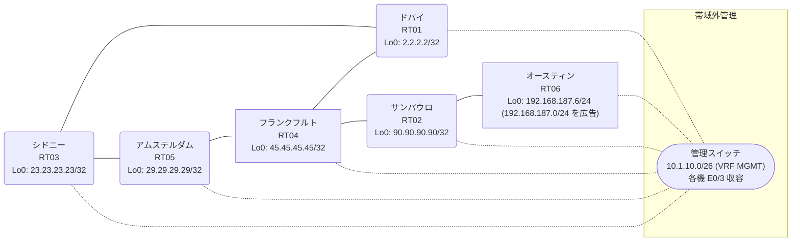

# 問題 20260814-001

> **本問は機器に接続せずに解答すること。追加の show 実行は認めない。**

## トポロジ

あなたは、ネットワークの運用を担当しています。あなたの会社のネットワークは、OSPF のドメインと EIGRP のドメインとが、2 つの境界のルーターによって接続され、そして、それらは境界において接続されています。顧客のネットワーク `192.168.187.0/24` は、オースティン のサイトにおいて、別のルーティング プロトコルによって学習され、そして、再配送によって、社内へ持ち込まれています。ルーティングの設計の詳細は、示されているところのコンフィギュレーションから、読み取られることが、期待されています。



| 拠点 | ルータ | 拠点網 / 広告網 |
|------|--------|------------------|
| アムステルダム | RT05 | 29.29.29.29/32 |
| オースティン | RT06 | 192.168.187.6/24 (`192.168.187.0/24` を広告) |
| サンパウロ | RT02 | 90.90.90.90/32 |
| シドニー | RT03 | 23.23.23.23/32 |
| ドバイ | RT01 | 2.2.2.2/32 |
| フランクフルト | RT04 | 45.45.45.45/32 |

リンク一覧:
```
  RT03:E0/0(.1) ── RT05:E0/0(.2)   172.16.78.0/24
  RT03:E0/1(.1) ── RT01:E0/0(.3)   172.16.142.0/24
  RT05:E0/1(.2) ── RT04:E0/0(.4)   172.16.100.0/24
  RT01:E0/1(.3) ── RT04:E0/1(.4)   172.16.117.0/24
  RT04:E0/2(.4) ── RT02:E0/0(.5)   172.16.174.0/24
  RT02:E0/1(.5) ── RT06:E0/0(.6)   172.16.112.0/24
```

## 要件

1. 既存の相互再配送の設計が、削除または停止されてはなりません。
2. スタティック ルートおよび既定のルートによる迂回は、実施されてはなりません。
3. 是正は、経路の出自に対するマーキングによって、実装されなければなりません。
4. スタティック・ルートおよび既定のルートによる迂回は、実施されることはできません。
5. ルーティング・プロトコルの種別およびプロセスの配置は、変更されることはできません。
6. `192.168.187.0/24` 宛のトラフィックが RT06 へ配送され、経路の周回が、発生していないこと。
7. すべてのサイトから、`192.168.187.0/24` を含むところのすべての宛先へ、到達することができること。

## 現在の状態

いくつかの宛先への通信について、報告が上がっています。あなたは、提示されているところの情報のみを使用して、要求されている状態が満たされていない理由を、特定しなければなりません。

```
RT04# show ip eigrp topology 192.168.187.0 255.255.255.0
EIGRP-IPv4 Topology Entry for AS(69)/ID(45.45.45.45) for 192.168.187.0/24
  State is Passive, Query origin flag is 1, 1 Successor(s), FD is 281856
  Descriptor Blocks:
  172.16.100.2 (Ethernet0/0), from 172.16.100.2, Send flag is 0x0
      Composite metric is (281856/2816), route is External
      Vector metric:
        Minimum bandwidth is 10000 Kbit
        Total delay is 1010 microseconds
        Reliability is 255/255
        Load is 1/255
        Minimum MTU is 1500
        Hop count is 1
        Originating router is 29.29.29.29
      External data:
        AS number of route is 67
        External protocol is OSPF, external metric is 20
        Administrator tag is 0 (0x00000000)
  172.16.174.5 (Ethernet0/2), from 172.16.174.5, Send flag is 0x0
      Composite metric is (307456/281856), route is External
      Vector metric:
        Minimum bandwidth is 10000 Kbit
        Total delay is 2010 microseconds
        Reliability is 255/255
        Load is 1/255
        Minimum MTU is 1500
        Hop count is 2
        Originating router is 192.168.187.6
      External data:
        AS number of route is 0
        External protocol is RIP, external metric is 0
        Administrator tag is 0 (0x00000000)
```
```
RT03# show ip route
Gateway of last resort is not set
      2.0.0.0/32 is subnetted, 1 subnets
O        2.2.2.2 [110/11] via 172.16.142.3, 00:04:44, Ethernet0/1
      23.0.0.0/32 is subnetted, 1 subnets
C        23.23.23.23 is directly connected, Loopback0
      29.0.0.0/32 is subnetted, 1 subnets
O        29.29.29.29 [110/11] via 172.16.78.2, 00:04:41, Ethernet0/0
      45.0.0.0/32 is subnetted, 1 subnets
O E2     45.45.45.45 [110/20] via 172.16.142.3, 00:04:44, Ethernet0/1
                     [110/20] via 172.16.78.2, 00:04:41, Ethernet0/0
      90.0.0.0/32 is subnetted, 1 subnets
O E2     90.90.90.90 [110/20] via 172.16.142.3, 00:04:44, Ethernet0/1
                     [110/20] via 172.16.78.2, 00:04:41, Ethernet0/0
      172.16.0.0/16 is variably subnetted, 8 subnets, 2 masks
C        172.16.78.0/24 is directly connected, Ethernet0/0
L        172.16.78.1/32 is directly connected, Ethernet0/0
O E2     172.16.100.0/24 [110/20] via 172.16.142.3, 00:04:44, Ethernet0/1
                         [110/20] via 172.16.78.2, 00:04:41, Ethernet0/0
O E2     172.16.112.0/24 [110/20] via 172.16.142.3, 00:04:44, Ethernet0/1
                         [110/20] via 172.16.78.2, 00:04:41, Ethernet0/0
O E2     172.16.117.0/24 [110/20] via 172.16.142.3, 00:04:44, Ethernet0/1
                         [110/20] via 172.16.78.2, 00:04:41, Ethernet0/0
C        172.16.142.0/24 is directly connected, Ethernet0/1
L        172.16.142.1/32 is directly connected, Ethernet0/1
O E2     172.16.174.0/24 [110/20] via 172.16.142.3, 00:04:44, Ethernet0/1
                         [110/20] via 172.16.78.2, 00:04:41, Ethernet0/0
O E2  192.168.187.0/24 [110/20] via 172.16.142.3, 00:04:44, Ethernet0/1
```
```
RT03# traceroute 192.168.187.6 probe 1 timeout 1 ttl 1 8
Type escape sequence to abort.
Tracing the route to 192.168.187.6
VRF info: (vrf in name/id, vrf out name/id)
  1 172.16.142.3 0 msec
  2 172.16.117.4 2 msec
  3 172.16.100.2 1 msec
  4 172.16.78.1 3 msec
  5 172.16.142.3 1 msec
  6 172.16.117.4 2 msec
  7 172.16.100.2 2 msec
  8 172.16.78.1 2 msec
```
```
RT04# show ip route
Gateway of last resort is not set
      2.0.0.0/32 is subnetted, 1 subnets
D EX     2.2.2.2 [170/281856] via 172.16.117.3, 00:04:04, Ethernet0/1
                 [170/281856] via 172.16.100.2, 00:04:04, Ethernet0/0
      23.0.0.0/32 is subnetted, 1 subnets
D EX     23.23.23.23 [170/281856] via 172.16.117.3, 00:04:04, Ethernet0/1
                     [170/281856] via 172.16.100.2, 00:04:04, Ethernet0/0
      29.0.0.0/32 is subnetted, 1 subnets
D EX     29.29.29.29 [170/281856] via 172.16.117.3, 00:04:02, Ethernet0/1
                     [170/281856] via 172.16.100.2, 00:04:02, Ethernet0/0
      45.0.0.0/32 is subnetted, 1 subnets
C        45.45.45.45 is directly connected, Loopback0
      90.0.0.0/32 is subnetted, 1 subnets
D        90.90.90.90 [90/409600] via 172.16.174.5, 00:04:48, Ethernet0/2
      172.16.0.0/16 is variably subnetted, 9 subnets, 2 masks
D EX     172.16.78.0/24 [170/281856] via 172.16.117.3, 00:04:08, Ethernet0/1
                        [170/281856] via 172.16.100.2, 00:04:08, Ethernet0/0
C        172.16.100.0/24 is directly connected, Ethernet0/0
L        172.16.100.4/32 is directly connected, Ethernet0/0
D        172.16.112.0/24 [90/307200] via 172.16.174.5, 00:04:48, Ethernet0/2
C        172.16.117.0/24 is directly connected, Ethernet0/1
L        172.16.117.4/32 is directly connected, Ethernet0/1
D EX     172.16.142.0/24 [170/281856] via 172.16.117.3, 00:04:04, Ethernet0/1
                         [170/281856] via 172.16.100.2, 00:04:04, Ethernet0/0
C        172.16.174.0/24 is directly connected, Ethernet0/2
L        172.16.174.4/32 is directly connected, Ethernet0/2
D EX  192.168.187.0/24 [170/281856] via 172.16.100.2, 00:04:04, Ethernet0/0
```
```
RT02# show ip route
Gateway of last resort is not set
      2.0.0.0/32 is subnetted, 1 subnets
D EX     2.2.2.2 [170/307456] via 172.16.174.4, 00:04:23, Ethernet0/0
      23.0.0.0/32 is subnetted, 1 subnets
D EX     23.23.23.23 [170/307456] via 172.16.174.4, 00:04:23, Ethernet0/0
      29.0.0.0/32 is subnetted, 1 subnets
D EX     29.29.29.29 [170/307456] via 172.16.174.4, 00:04:58, Ethernet0/0
      45.0.0.0/32 is subnetted, 1 subnets
D        45.45.45.45 [90/409600] via 172.16.174.4, 00:05:12, Ethernet0/0
      90.0.0.0/32 is subnetted, 1 subnets
C        90.90.90.90 is directly connected, Loopback0
      172.16.0.0/16 is variably subnetted, 8 subnets, 2 masks
D EX     172.16.78.0/24 [170/307456] via 172.16.174.4, 00:04:58, Ethernet0/0
D        172.16.100.0/24 [90/307200] via 172.16.174.4, 00:05:12, Ethernet0/0
C        172.16.112.0/24 is directly connected, Ethernet0/1
L        172.16.112.5/32 is directly connected, Ethernet0/1
D        172.16.117.0/24 [90/307200] via 172.16.174.4, 00:05:12, Ethernet0/0
D EX     172.16.142.0/24 [170/307456] via 172.16.174.4, 00:04:23, Ethernet0/0
C        172.16.174.0/24 is directly connected, Ethernet0/0
L        172.16.174.5/32 is directly connected, Ethernet0/0
D EX  192.168.187.0/24 [170/281856] via 172.16.112.6, 00:04:23, Ethernet0/1
```

## 設定抜粋

```
RT03# show running-config | section router
router ospf 67
 router-id 23.23.23.23
 network 23.23.23.23 0.0.0.0 area 0
 network 172.16.78.0 0.0.0.255 area 0
 network 172.16.142.0 0.0.0.255 area 0
```
```
RT05# show running-config | section router
router eigrp 69
 network 172.16.100.0 0.0.0.255
 redistribute ospf 67 metric 1000000 1 255 1 1500
router ospf 67
 router-id 29.29.29.29
 redistribute eigrp 69
 network 29.29.29.29 0.0.0.0 area 0
 network 172.16.78.0 0.0.0.255 area 0
```
```
RT01# show running-config | section router
router eigrp 69
 network 172.16.117.0 0.0.0.255
 redistribute ospf 67 metric 1000000 1 255 1 1500
router ospf 67
 router-id 2.2.2.2
 redistribute eigrp 69
 network 2.2.2.2 0.0.0.0 area 0
 network 172.16.142.0 0.0.0.255 area 0
```
```
RT04# show running-config | section router
router eigrp 69
 network 45.45.45.45 0.0.0.0
 network 172.16.100.0 0.0.0.255
 network 172.16.117.0 0.0.0.255
 network 172.16.174.0 0.0.0.255
```
```
RT02# show running-config | section router
router eigrp 69
 network 90.90.90.90 0.0.0.0
 network 172.16.112.0 0.0.0.255
 network 172.16.174.0 0.0.0.255
```
```
RT06# show running-config | section router
router eigrp 69
 network 172.16.112.0 0.0.0.255
 redistribute rip metric 1000000 1 255 1 1500
router rip
 version 2
 network 192.168.187.0
 no auto-summary
```

## 設問

次のうち、正しいものは、どれですか。

## 選択肢
**A.**
```
! RT05 と RT01 の両方に投入
route-map SET-TAG permit 10
 set tag 252
route-map DENY-TAG deny 10
 match tag 252
route-map DENY-TAG permit 20
router ospf 67
 redistribute eigrp 69 subnets route-map SET-TAG
router eigrp 69
 redistribute ospf 67 metric 1000000 1 255 1 1500 route-map DENY-TAG
```

**B.**
```
! RT05 にのみ投入
route-map SET-TAG permit 10
 set tag 252
route-map DENY-TAG deny 10
 match tag 252
route-map DENY-TAG permit 20
router ospf 67
 redistribute eigrp 69 subnets route-map SET-TAG
router eigrp 69
 redistribute ospf 67 metric 1000000 1 255 1 1500 route-map DENY-TAG
```

**C.**
```
router eigrp 69
 distance eigrp 90 200
```

**D.**
```
router eigrp 69
 redistribute rip metric 100 1 255 1 1500
```

**E.**
```
! RT05 と RT01 の両方に投入
router ospf 67
 distance ospf external 180
```

**F.**
```
clear ip route *
```
