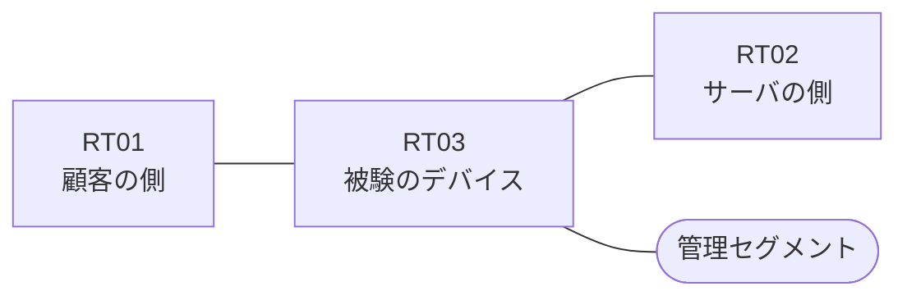

# 問題 20260814-003

> **本問は機器に接続せずに解答すること。追加の show 実行は認めない。**

## シナリオ

あなたは、下記のネットワークの保守を担当する技術者です。ある企業のネットワークにおいて、RT03 は、顧客の側のネットワークと、サーバの側のネットワークとの間に、配置されています。管理のための構成に対して、変更が加えられてはなりません。RT03 において、`10.64.32.0/24`、`10.64.33.0/24`、`10.64.36.0/24`、`10.64.37.0/24` のネットワークからの通信のみが、許可されなければなりません。アクセス・リストのエントリは、1行で構成されなければなりません。アクセス・リストは、顧客の側のインターフェイスである `Ethernet1/0` において、着信の方向に適用されなければなりません。`10.64.35.0/24` からの通信は、許可されてはなりません。`10.64.34.0/24` からの通信は、許可されてはなりません。



| 区間 | 被験デバイス側のインターフェイス | ネットワーク |
|------|----------------------------------|--------------|
| RT01（顧客の側） ⇔ RT03 | `Ethernet1/0` | 10.64.253.0/24 |
| RT03 ⇔ RT02（サーバの側） | `Ethernet1/1` | 10.64.254.0/24 |
| RT03 ⇔ 管理セグメント | `Ethernet1/2` | 10.64.255.0/24 |

## 出力

```
RT03# show logging | include SEC-6
%SEC-6-IPACCESSLOGP: list EDGE-IN denied tcp 10.64.35.7(19349) -> 172.27.62.55(80), 1 packet
```
```
RT03# show ip access-lists EDGE-IN
Extended IP access list EDGE-IN
    10 deny   tcp 10.64.35.0 0.0.0.255 host 172.27.62.55 eq www log
    20 deny   tcp 10.64.34.0 0.0.0.255 host 172.27.62.55 eq www
    30 permit ip any any
```

## 設問

示されているところの記録および構成から読み取ることができるものは、どれですか。(2つを選択してください)

## 選択肢
A. 拒否のエントリのうち、`log` のキーワードを伴うものは1つだけである。

B. `10.64.32.7` からの通信は、拒否された。

C. 記録に現れていない通信は、いずれも許可されたものである。

D. `10.64.34.7` からの通信は、許可された。

E. 記録されている通信の宛先ポートは 80 である。
