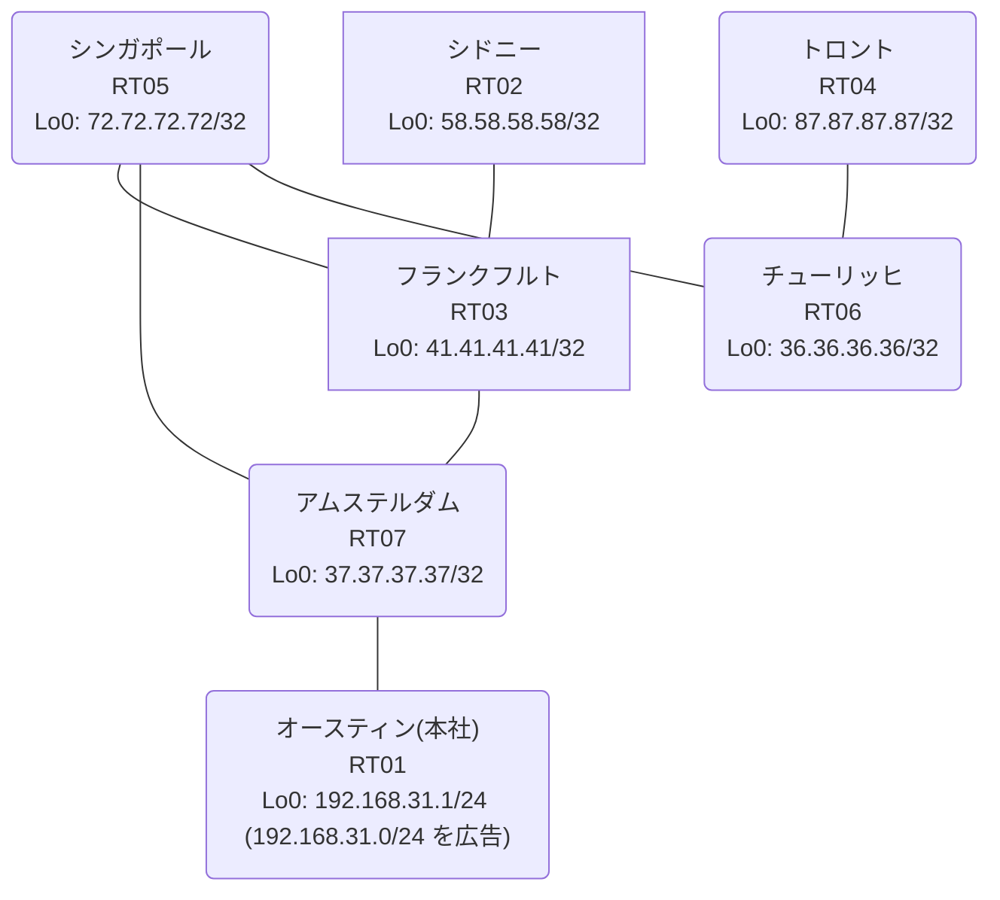

# 問題 20260814-004

> **本問は機器に接続せずに解答すること。追加の show 実行は認めない。**

## トポロジ

あなたは、下記のネットワークの保守を担当する技術者です。本社の顧客のネットワークは、BGP AS 65498 の RT01 によって、広告されています。あなたの会社の内部は、BGP / EIGRP / OSPF という 3 つのドメインから構成されています。サイトと、ルータおよびアドレスとの対応は、下記の表に示されているとおりです。



| 拠点 | ルータ | 拠点網 / 広告網 |
|------|--------|------------------|
| アムステルダム | RT07 | 37.37.37.37/32 |
| オースティン(本社) | RT01 | 192.168.31.1/24 (`192.168.31.0/24` を広告) |
| シドニー | RT02 | 58.58.58.58/32 |
| シンガポール | RT05 | 72.72.72.72/32 |
| チューリッヒ | RT06 | 36.36.36.36/32 |
| トロント | RT04 | 87.87.87.87/32 |
| フランクフルト | RT03 | 41.41.41.41/32 |

リンク一覧:
```
  RT01:E0/0(.1) ── RT07:E0/0(.2)   10.84.101.0/30
  RT07:E0/1(.1) ── RT03:E0/0(.2)   10.128.16.0/30
  RT07:E0/2(.1) ── RT05:E0/0(.2)   10.143.228.0/30
  RT03:E0/1(.1) ── RT05:E0/1(.2)   10.183.81.0/30
  RT05:E0/2(.1) ── RT06:E0/0(.2)   10.142.40.0/30
  RT06:E0/1(.1) ── RT04:E0/0(.2)   10.141.130.0/30
  RT03:E0/2(.1) ── RT02:E0/0(.2)   10.249.129.0/30
```

## 要件

1. 管理のための構成に対して、変更が加えられてはなりません。
2. `192.168.31.0/24` 宛のパケットが、広告元である RT01 の方向へ転送され、そして、転送のループが存在していないこと。
3. 顧客のネットワーク `192.168.31.0/24` を含むすべての宛先への到達可能性が、すべてのサイトにおいて、確保されていること。
4. 既存の再配送の設計が、変更または撤去されてはなりません。スタティック ルートによる回避も、許可されていません。
5. インタフェースの IP アドレッシングは、変更されてはなりません。

## 現在の状態

いくつかの宛先への通信について、報告が上がっています。示されているところの出力および構成に基づいて、要求されているところの動作が得られていない理由が、判断されなければなりません。

```
RT06# traceroute 192.168.31.1 probe 1 timeout 1 ttl 1 8
Type escape sequence to abort.
Tracing the route to 192.168.31.1
VRF info: (vrf in name/id, vrf out name/id)
  1 10.142.40.1 1 msec
  2 10.183.81.1 1 msec
  3 10.128.16.1 2 msec
  4 10.143.228.2 2 msec
  5 10.183.81.1 2 msec
  6 10.128.16.1 2 msec
  7 10.143.228.2 3 msec
  8 10.183.81.1 3 msec
```
```
RT07# show ip route
Gateway of last resort is not set
      10.0.0.0/8 is variably subnetted, 10 subnets, 2 masks
C        10.84.101.0/30 is directly connected, Ethernet0/0
L        10.84.101.2/32 is directly connected, Ethernet0/0
C        10.128.16.0/30 is directly connected, Ethernet0/1
L        10.128.16.1/32 is directly connected, Ethernet0/1
O        10.141.130.0/30 [110/30] via 10.143.228.2, 00:04:32, Ethernet0/2
O        10.142.40.0/30 [110/20] via 10.143.228.2, 00:05:03, Ethernet0/2
C        10.143.228.0/30 is directly connected, Ethernet0/2
L        10.143.228.1/32 is directly connected, Ethernet0/2
O        10.183.81.0/30 [110/20] via 10.143.228.2, 00:05:03, Ethernet0/2
O        10.249.129.0/30 [110/30] via 10.143.228.2, 00:04:36, Ethernet0/2
      36.0.0.0/32 is subnetted, 1 subnets
O        36.36.36.36 [110/21] via 10.143.228.2, 00:04:34, Ethernet0/2
      37.0.0.0/32 is subnetted, 1 subnets
C        37.37.37.37 is directly connected, Loopback0
      41.0.0.0/32 is subnetted, 1 subnets
O        41.41.41.41 [110/21] via 10.143.228.2, 00:05:03, Ethernet0/2
      58.0.0.0/32 is subnetted, 1 subnets
O        58.58.58.58 [110/31] via 10.143.228.2, 00:04:30, Ethernet0/2
      72.0.0.0/32 is subnetted, 1 subnets
O        72.72.72.72 [110/11] via 10.143.228.2, 00:05:03, Ethernet0/2
      87.0.0.0/32 is subnetted, 1 subnets
O        87.87.87.87 [110/31] via 10.143.228.2, 00:04:27, Ethernet0/2
O E2  192.168.31.0/24 [110/20] via 10.143.228.2, 00:04:17, Ethernet0/2
```
```
RT07# show route-map
route-map RM-OLD1, deny, sequence 10
  Match clauses:
    ip address prefix-lists: PL-OLD1 
  Set clauses:
  Policy routing matches: 0 packets, 0 bytes
route-map RM-OLD1, permit, sequence 20
  Match clauses:
  Set clauses:
  Policy routing matches: 0 packets, 0 bytes
```
```
RT07# show access-lists
Standard IP access list 79
    10 deny   41.41.41.41
    20 permit any
```
```
RT07# show ip bgp
BGP table version is 14, local router ID is 37.37.37.37
Status codes: s suppressed, d damped, h history, * valid, > best, i - internal, 
              r RIB-failure, S Stale, m multipath, b backup-path, f RT-Filter, 
              x best-external, a additional-path, c RIB-compressed, 
              t secondary path, L long-lived-stale,
Origin codes: i - IGP, e - EGP, ? - incomplete
RPKI validation codes: V valid, I invalid, N Not found

     Network          Next Hop            Metric LocPrf Weight Path
 *>   10.141.130.0/30  10.143.228.2            30         32768 ?
 *>   10.142.40.0/30   10.143.228.2            20         32768 ?
 *>   10.143.228.0/30  0.0.0.0                  0         32768 ?
 *>   10.183.81.0/30   10.143.228.2            20         32768 ?
 *>   10.249.129.0/30  10.143.228.2            30         32768 ?
 *>   36.36.36.36/32   10.143.228.2            21         32768 ?
 *>   37.37.37.37/32   0.0.0.0                  0         32768 i
 *>   41.41.41.41/32   10.143.228.2            21         32768 ?
 *>   58.58.58.58/32   10.143.228.2            31         32768 ?
 *>   72.72.72.72/32   10.143.228.2            11         32768 ?
 *>   87.87.87.87/32   10.143.228.2            31         32768 ?
 r>i  192.168.31.0     10.84.101.1              0    100      0 i
```
```
RT07# show ip prefix-list
ip prefix-list PL-OLD1: 2 entries
   seq 5 deny 41.41.41.41/32
   seq 10 permit 0.0.0.0/0 le 32
```

## 設定抜粋

```
RT07# show running-config | section router
router eigrp 157
 timers active-time 5
 network 10.128.16.0 0.0.0.3
 redistribute bgp 65498 metric 100000 100 255 1 1500
 redistribute ospf 4 metric 100000 100 255 1 1500
 passive-interface Loopback0
router ospf 4
 router-id 37.37.37.37
 network 10.143.228.0 0.0.0.3 area 0
 network 37.37.37.37 0.0.0.0 area 0
router bgp 65498
 bgp router-id 37.37.37.37
 bgp log-neighbor-changes
 bgp redistribute-internal
 network 37.37.37.37 mask 255.255.255.255
 redistribute ospf 4
 neighbor 10.84.101.1 remote-as 65498
```
```
RT03# show running-config | section router
router eigrp 157
 network 10.128.16.0 0.0.0.3
 redistribute ospf 4 metric 100000 100 255 1 1500
router ospf 4
 router-id 41.41.41.41
 redistribute eigrp 157
 network 10.183.81.0 0.0.0.3 area 0
 network 10.249.129.0 0.0.0.3 area 0
 network 41.41.41.41 0.0.0.0 area 0
```
```
RT05# show running-config | section router
router ospf 4
 router-id 72.72.72.72
 passive-interface Loopback0
 network 10.142.40.0 0.0.0.3 area 0
 network 10.143.228.0 0.0.0.3 area 0
 network 10.183.81.0 0.0.0.3 area 0
 network 72.72.72.72 0.0.0.0 area 0
```
```
RT01# show running-config | section router
router bgp 65498
 bgp router-id 192.168.31.1
 bgp log-neighbor-changes
 network 192.168.31.0
 neighbor 10.84.101.2 remote-as 65498
```

## 設問

次のうち、正しいものは、どれですか。

## 選択肢
A. RT03 の相互再配送において経路が収束せず、振動している

B. RT07 の BGP テーブルにおいて当該経路が RIB-failure となり、ベストパスが選出できていない

C. RT07 が、一周して戻ってきた外部経路を iBGP の経路より優先して採用している

D. BGP から EIGRP への再配送に seed metric が指定されておらず、経路が広告されていない

E. 当該プレフィックスの next-hop が最適でなく、遠回りの経路が選択されている

F. RT01 からの広告が RT07 に到達していない
