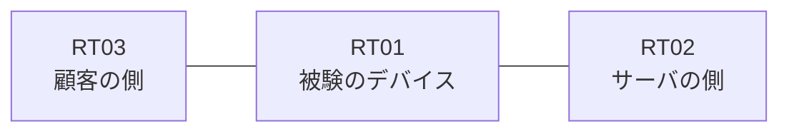

# 問題 20260814-005

> **本問は機器に接続せずに解答すること。追加の show 実行は認めない。**

## シナリオ

あなたは、下記のネットワークの保守を担当する技術者です。ある企業のネットワークにおいて、RT01 は、顧客の側のネットワークと、サーバの側のネットワークとの間に配置されており、IPv6 によって運用されています。RT01 において、`2001:DB8:78:20::/64`、`2001:DB8:78:21::/64`、`2001:DB8:78:22::/64` のネットワークからの通信のみが、`2001:DB8:78:FF::10` の TCP ポート 22 に到達できなければなりません。アクセス リストのエントリは、1行で構成される必要があります。`2001:DB8:78:25::/64` からの通信は、許可されてはなりません。インタフェースの IP アドレッシングは、変更されてはなりません。



## 出力

```
RT01# show running-config | section ipv6 access-list|traffic-filter
ipv6 access-list V6-EDGE-IN
 sequence 10 permit ipv6 2001:DB8:78:20::/63 any
interface Ethernet0/0
 ipv6 traffic-filter V6-EDGE-IN in
```
```
RT01# show ipv6 access-list
IPv6 access list V6-EDGE-IN
    permit ipv6 2001:DB8:78:20::/63 any sequence 10
```

## 設問

示されているところの構成において、転送されるものは、どれですか。(1つを選択してください)

## 選択肢
A. 送信元が 2001:DB8:78:22::/64 のネットワークにあるホストから、2001:DB8:78:FF::10 の TCP ポート 22 宛ての通信

B. 送信元が 2001:DB8:78:21::/64 のネットワークにあるホストから、2001:DB8:78:FF::10 の TCP ポート 22 宛ての通信

C. 送信元が 2001:DB8:78:23::/64 のネットワークにあるホストから、2001:DB8:78:FF::10 の TCP ポート 22 宛ての通信

D. 送信元が 2001:DB8:78:25::/64 のネットワークにあるホストから、2001:DB8:78:FF::10 の TCP ポート 22 宛ての通信

E. 送信元が 2001:DB8:78:FA::/64 のネットワークにあるホストから、2001:DB8:78:FF::10 の TCP ポート 22 宛ての通信
