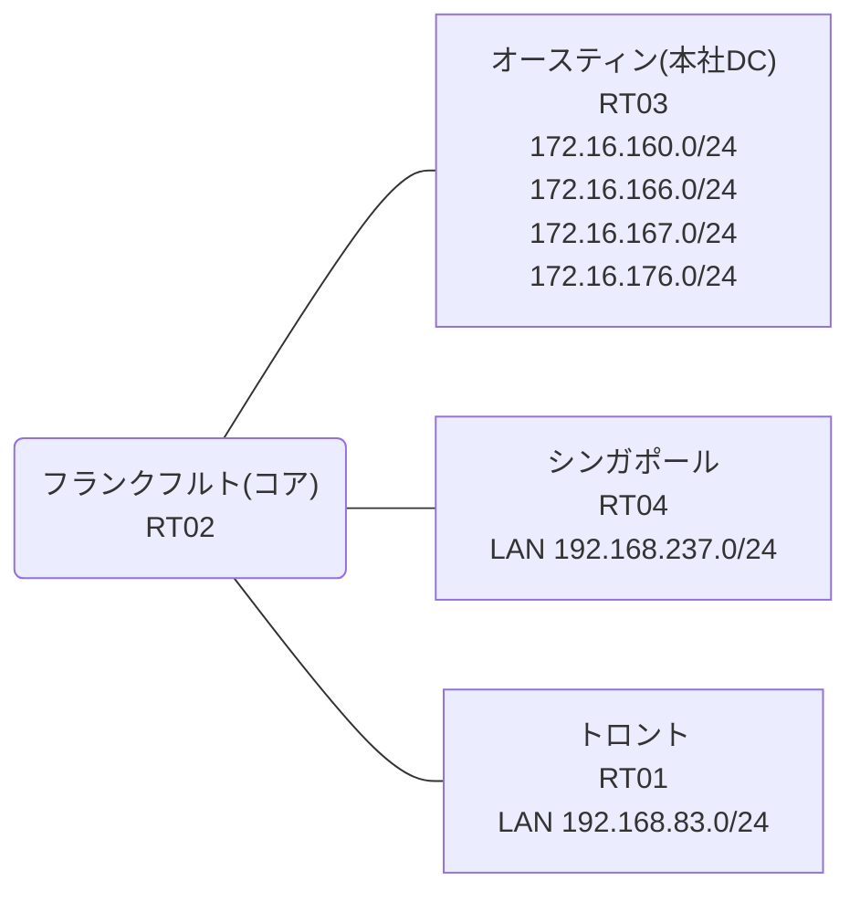

# 問題 20260814-006

> **本問は機器に接続せずに解答すること。追加の show 実行は認めない。**

## トポロジ

あなたは、ネットワークの運用を担当しています。コアのルータにおいて、それぞれのサイトの LAN から、本社のデータ・センターのサービスのネットワークへの転送が、制御されています。コアは、サービスのネットワークへのルーティングの情報を保持しておらず、そして、ポリシーに一致したトラフィックのみが、ネクスト・ホップへ転送されます。



リンク一覧:
```
  RT02(.1) ── RT03(.2)   192.168.250.0/29
  RT02(.254) ── RT01      192.168.83.0/24
  RT02(.254) ── RT04      192.168.237.0/24
```

## 要件

1. PBR が適用されるポイントおよびネクスト・ホップの設計は、変更されてはなりません。
2. 検証および隔離のためのネットワーク `172.16.167.0/24`・`172.16.176.0/24` へは、ポリシーによる転送が、実施されてはなりません。
3. インタフェースの IP アドレッシングは、変更されることはできません。
4. トロント および シンガポール のそれぞれのサイトから、業務のサービスのネットワーク `172.16.160.0/24`・`172.16.166.0/24` へ、到達することができること。
5. ポリシーの対象の指定は、1つのアクセス・リストのエントリによって、まかなわれなければなりません。

## 現在の状態

ユーザーから、通信に関する事象が、報告されています。あなたは、示されているところの出力および構成に基づいて、その構成が、下記において記述されているとおりに動作していない理由を、判断する必要があります。

```
RT02# show access-lists
Extended IP access list ACL-A
    10 permit ip 172.16.160.0 0.0.6.255 192.168.83.0 0.0.0.255
Extended IP access list ACL-B
    10 permit ip 192.168.237.0 0.0.0.255 172.16.160.0 0.0.6.255 (5 matches)
```
```
RT04# ping 172.16.166.1 repeat 5
Type escape sequence to abort.
Sending 5, 100-byte ICMP Echos to 172.16.166.1, timeout is 2 seconds:
!!!!!
Success rate is 100 percent (5/5), round-trip min/avg/max = 1/3/14 ms
```
```
RT01# ping 172.16.167.1 repeat 5
Type escape sequence to abort.
Sending 5, 100-byte ICMP Echos to 172.16.167.1, timeout is 2 seconds:
U.U.U
Success rate is 0 percent (0/5)
```
```
RT01# ping 172.16.176.1 repeat 5
Type escape sequence to abort.
Sending 5, 100-byte ICMP Echos to 172.16.176.1, timeout is 2 seconds:
.U.U.
Success rate is 0 percent (0/5)
```
```
RT02# show route-map
route-map MAP-A, permit, sequence 10
  Match clauses:
    ip address (access-lists): ACL-A 
  Set clauses:
    ip next-hop 192.168.250.2
  Policy routing matches: 0 packets, 0 bytes
route-map MAP-B, permit, sequence 10
  Match clauses:
    ip address (access-lists): ACL-B 
  Set clauses:
    ip next-hop 192.168.250.2
  Policy routing matches: 5 packets, 570 bytes
```
```
RT04# ping 172.16.167.1 repeat 5
Type escape sequence to abort.
Sending 5, 100-byte ICMP Echos to 172.16.167.1, timeout is 2 seconds:
U.U.U
Success rate is 0 percent (0/5)
```
```
RT01# ping 172.16.160.1 repeat 5
Type escape sequence to abort.
Sending 5, 100-byte ICMP Echos to 172.16.160.1, timeout is 2 seconds:
U.U.U
Success rate is 0 percent (0/5)
```
```
RT01# ping 172.16.166.1 repeat 5
Type escape sequence to abort.
Sending 5, 100-byte ICMP Echos to 172.16.166.1, timeout is 2 seconds:
.U.U.
Success rate is 0 percent (0/5)
```

## 設定抜粋

```
RT02# show running-config | section interface
interface Ethernet0/0
 ip address 192.168.250.1 255.255.255.248
interface Ethernet0/1
 ip address 192.168.83.254 255.255.255.0
 ip policy route-map MAP-A
interface Ethernet0/2
 ip address 192.168.237.254 255.255.255.0
 ip policy route-map MAP-B
interface Ethernet0/3
 description === MGMT (Ansible) ===
 vrf forwarding MGMT
 ip address 10.1.10.14 255.255.255.192
```
```
RT02# show running-config | section route-map|access-list
ip policy route-map MAP-A
 ip policy route-map MAP-B
ip access-list extended ACL-A
 10 permit ip 172.16.160.0 0.0.6.255 192.168.83.0 0.0.0.255
ip access-list extended ACL-B
 10 permit ip 192.168.237.0 0.0.0.255 172.16.160.0 0.0.6.255
route-map MAP-A permit 10 
 match ip address ACL-A
 set ip next-hop 192.168.250.2
route-map MAP-B permit 10 
 match ip address ACL-B
 set ip next-hop 192.168.250.2
```
```
RT03# show running-config | section interface|ip route
interface Loopback0
 ip address 172.16.160.1 255.255.255.0
interface Loopback1
 ip address 172.16.166.1 255.255.255.0
interface Loopback2
 ip address 172.16.167.1 255.255.255.0
interface Loopback3
 ip address 172.16.176.1 255.255.255.0
interface Ethernet0/0
 ip address 192.168.250.2 255.255.255.248
interface Ethernet0/1
 no ip address
 shutdown
interface Ethernet0/2
 no ip address
 shutdown
interface Ethernet0/3
 description === MGMT (Ansible) ===
 vrf forwarding MGMT
 ip address 10.1.10.15 255.255.255.192
ip route 192.168.83.0 255.255.255.0 192.168.250.1
ip route 192.168.237.0 255.255.255.0 192.168.250.1
```
```
RT01# show running-config | section interface|ip route
interface Ethernet0/0
 ip address 192.168.83.1 255.255.255.0
interface Ethernet0/1
 no ip address
 shutdown
interface Ethernet0/2
 no ip address
 shutdown
interface Ethernet0/3
 description === MGMT (Ansible) ===
 vrf forwarding MGMT
 ip address 10.1.10.13 255.255.255.192
ip route 0.0.0.0 0.0.0.0 192.168.83.254
```
```
RT04# show running-config | section interface|ip route
interface Ethernet0/0
 ip address 192.168.237.1 255.255.255.0
interface Ethernet0/1
 no ip address
 shutdown
interface Ethernet0/2
 no ip address
 shutdown
interface Ethernet0/3
 description === MGMT (Ansible) ===
 vrf forwarding MGMT
 ip address 10.1.10.16 255.255.255.192
ip route 0.0.0.0 0.0.0.0 192.168.237.254
```

## 設問

次のうち、正しいものは、どれですか。

## 選択肢
A. ACL-A の宛先ワイルドカードが、対象外のネットワークに一致し、対象の一部に一致していない

B. LAN インタフェースに ip policy が適用されていない

C. ACL-A の宛先ワイルドカードが、対象ネットワークの一部に一致していない

D. ACL-A の送信元と宛先の指定が逆になっている

E. MAP-A のシーケンスに match 条件が設定されていない

F. set ip next-hop の指定が誤っている
