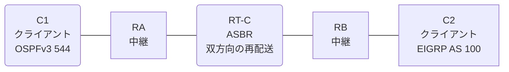

# 問題 20260814-007

> **本問は機器に接続せずに解答すること。追加の show 実行は認めない。**

## シナリオ

あなたの組織は、下記に示されているところのネットワークを運用しています。クライアントである C1 は OSPFv3 の ドメイン に、そして、C2 は EIGRP の ドメイン に、それぞれ収容されています。RT-C は、2 つの ドメイン の境界に位置しており、双方向の 再配送 が構成されています。通信の一部において、想定されていない挙動が、観測されています。あなたは、示されているところの出力および構成に基づいて、その構成が、下記において記述されているとおりに動作していない理由を、判断する必要があります。C1 と C2 は、相互に 通信 できなければなりません。再配送 に対する フィルタの 構成は、監査の対象であるという理由により、変更されることはできません。RT-C 以外の デバイス に対する 構成の変更は、許可されていません。本作業は、日中の時間帯において実施されるという理由により、対象外であるところのデバイスに対する構成の変更は、許可されていません。



| ルータ | 位置づけ | 参加プロトコル |
|--------|----------|----------------|
| C1 | クライアント | OSPFv3 544 area 0 |
| RA | 中継 | OSPFv3 544 area 0 |
| RT-C | **ASBR(2 つの ドメイン の 境界)** | 双方向の 再配送 |
| RB | 中継 | EIGRP LAB AS 100 |
| C2 | クライアント | EIGRP LAB AS 100 |

リンク一覧:
```
  (a) C1:Et0/0         ── RA:Et0/1                  2001:DB8:10:10::/64   C1 = 2001:DB8:10:10::2
  (b) RA:Et0/0         ── RT-C:GigabitEthernet0/0   2001:DB8:20:AA::/64
  (c) RT-C:Ethernet0/1 ── RB:Et0/0                  2001:DB8:1A:AA::/64
  (d) RB:Et0/1         ── C2:Et0/0                  2001:DB8:A:1A::/64    C2 = 2001:DB8:A:1A::2
```

OSPFv3 の ドメイン には、RA によって注入されたところの 外部の ルート `2001:DB8:1A:2A::/64` が存在する。

## 出力

```
RT-C# show running-config
Building configuration...
!
interface GigabitEthernet0/0
 description === to RA ===
 no ip address
 ipv6 address 2001:DB8:20:AA::1/64
 ipv6 enable
 ipv6 ospf 544 area 0
!
interface Ethernet0/1
 description === to RB ===
 no ip address
 ipv6 address 2001:DB8:1A:AA::1/64
 ipv6 enable
!
router eigrp LAB
 !
 address-family ipv6 unicast autonomous-system 100
  !
  af-interface GigabitEthernet0/0
   shutdown
  exit-af-interface
  !
  topology base
   redistribute ospf 544 match internal metric 100000 100 255 1 1500 route-map RM-OSPF include-connected
  exit-af-topology
  eigrp router-id 9.7.5.9
 exit-address-family
!
router ospfv3 544
 router-id 6.4.4.9
 !
 address-family ipv6 unicast
  redistribute eigrp 100 route-map EMAP01 include-connected
 exit-address-family
!
ipv6 prefix-list E5400 seq 5 permit 2001:DB8:10:10::/64
ipv6 prefix-list E5400 seq 10 permit 2001:DB8:A:1A::/64
ipv6 prefix-list O544 seq 5 permit 2001:DB8:A:1A::/64
ipv6 prefix-list PL-EIGRP seq 5 permit 2001:DB8:10:10::/64
ipv6 prefix-list PL-OSPF seq 5 permit 2001:DB8:20:AA::/64
!
route-map EMAP01 deny 10
 match ipv6 address prefix-list O544
route-map EMAP01 permit 20
route-map MAP-IN permit 10
 match ipv6 address prefix-list PL-EIGRP
route-map RM-OSPF deny 10
 match ipv6 address prefix-list PL-EIGRP
route-map RM-OSPF permit 20
!
```
```
C1# show ipv6 route ospf | include ^O|via
OE2 2001:DB8:1A:2A::/64 [110/20]
     via FE80::A8BB:CCFF:FE01:6C00, Ethernet0/0
OE2 2001:DB8:1A:AA::/64 [110/20]
     via FE80::A8BB:CCFF:FE01:6C00, Ethernet0/0
```
```
C1# ping 2001:DB8:A:1A::2
Type escape sequence to abort.
Sending 5, 100-byte ICMP Echos to 2001:DB8:A:1A::2, timeout is 2 seconds:

% No valid route for destination
Success rate is 0 percent (0/1)

C2# ping 2001:DB8:10:10::2
Type escape sequence to abort.
Sending 5, 100-byte ICMP Echos to 2001:DB8:10:10::2, timeout is 2 seconds:

% No valid route for destination
Success rate is 0 percent (0/1)
```
```
RB# show ipv6 route eigrp | include ^D|^EX|via
EX  2001:DB8:20:AA::/64 [170/1536000]
     via FE80::A8BB:CCFF:FE01:8C00, Ethernet0/0
```

## 設問

次のうち、正しいものは、どれですか。

## 選択肢
A. 双方の プレフィックス・リスト が、隣接している リンク の ネットワーク のみを許可している

B. 一方の 方向 の プレフィックス・リスト のみが、対向の クライアント の ネットワーク を許可している

C. redistribute が参照しているところの名前の route-map が、定義されていない

D. C1 および C2 において、それぞれの ドメイン の ルーティング・プロトコル が構成されていない

E. 双方の ドメイン の 間で ルーティング・ループ が発生しており、 ルート が抑制されている

F. route-map の 先頭の エントリ が、対向の クライアント の ネットワーク を拒否している
