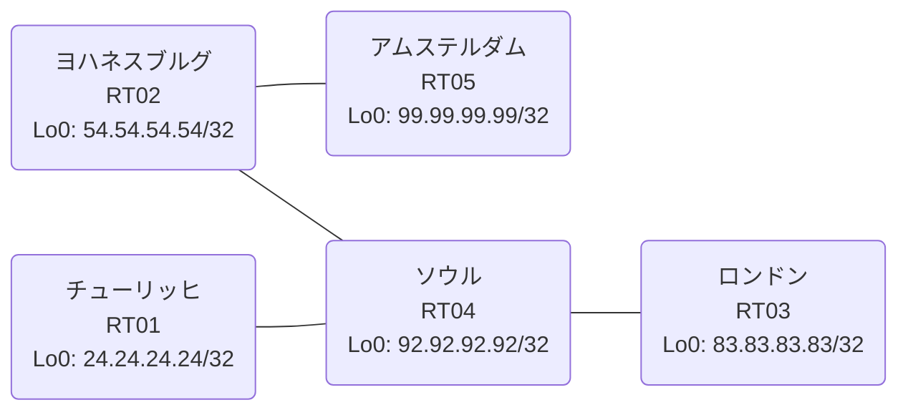

# 問題 20260814-008

> **本問は機器に接続せずに解答すること。追加の show 実行は認めない。**

## トポロジ

あなたは、下記のネットワークの保守を担当する技術者です。あなたの会社のネットワークは、複数のルーティング・ドメインが、境界のルーターによって接続され、そして、すべてのサイトのリーチアビリティが提供されている、というものです。ルーティングの設計の詳細は、示されているところのコンフィギュレーションから、読み取られることが、期待されています。各サイトのルーターと、サイトのネットワークとの対応は、下記の表に示されているとおりです。



| 拠点 | ルータ | 拠点網 |
|------|--------|----------------------|
| アムステルダム | RT05 | `99.99.99.99/32` |
| ソウル | RT04 | `92.92.92.92/32` |
| チューリッヒ | RT01 | `24.24.24.24/32` |
| ヨハネスブルグ | RT02 | `54.54.54.54/32` |
| ロンドン | RT03 | `83.83.83.83/32` |

リンク一覧:
```
  RT02:E0/0(.1) ── RT05:E0/0(.2)   10.141.215.0/30
  RT04:E0/0(.1) ── RT01:E0/0(.2)   10.247.204.0/30
  RT04:E0/1(.1) ── RT03:E0/0(.2)   10.14.227.0/30
  RT04:E0/2(.1) ── RT02:E0/1(.2)   10.25.86.0/30
```

## 要件

1. EIGRP へ再配送される際の初期のメトリックは `1000000 100 255 1 1500` とし、そして、それぞれの redistribute のステートメントに、直接に記述されなければなりません。
2. 本作業は、日中の時間帯において実施されるという理由により、対象外であるところのデバイスに対する構成の変更は、許可されていません。
3. 再配送される経路の、選択的な制限は、実施されてはなりません。
4. 各サイトのネットワークは、ドメインをまたいで、すべてのサイトから、到達されることができること。
5. 存在しないプロセス/AS を参照するところの構成のステートメントが、残置されることはできません。

## 現在の状態

一部の通信が、意図されているとおりに動作していない、という報告があります。あなたは、示されているところの出力および構成に基づいて、その構成が、下記において記述されているとおりに動作していない理由を、判断する必要があります。

```
RT03# show ip route
Gateway of last resort is not set
      10.0.0.0/8 is variably subnetted, 3 subnets, 2 masks
C        10.14.227.0/30 is directly connected, Ethernet0/0
L        10.14.227.2/32 is directly connected, Ethernet0/0
D        10.247.204.0/30 [90/307200] via 10.14.227.1, 00:04:30, Ethernet0/0
      24.0.0.0/32 is subnetted, 1 subnets
D        24.24.24.24 [90/435200] via 10.14.227.1, 00:04:30, Ethernet0/0
      83.0.0.0/32 is subnetted, 1 subnets
C        83.83.83.83 is directly connected, Loopback0
      92.0.0.0/32 is subnetted, 1 subnets
D        92.92.92.92 [90/409600] via 10.14.227.1, 00:04:30, Ethernet0/0
```
```
RT02# show ip route
Gateway of last resort is not set
      10.0.0.0/8 is variably subnetted, 6 subnets, 2 masks
O E2     10.14.227.0/30 [110/20] via 10.25.86.1, 00:04:14, Ethernet0/1
C        10.25.86.0/30 is directly connected, Ethernet0/1
L        10.25.86.2/32 is directly connected, Ethernet0/1
C        10.141.215.0/30 is directly connected, Ethernet0/0
L        10.141.215.1/32 is directly connected, Ethernet0/0
O E2     10.247.204.0/30 [110/20] via 10.25.86.1, 00:04:14, Ethernet0/1
      24.0.0.0/32 is subnetted, 1 subnets
O E2     24.24.24.24 [110/20] via 10.25.86.1, 00:04:14, Ethernet0/1
      54.0.0.0/32 is subnetted, 1 subnets
C        54.54.54.54 is directly connected, Loopback0
      83.0.0.0/32 is subnetted, 1 subnets
O E2     83.83.83.83 [110/20] via 10.25.86.1, 00:04:14, Ethernet0/1
      92.0.0.0/32 is subnetted, 1 subnets
O        92.92.92.92 [110/11] via 10.25.86.1, 00:04:14, Ethernet0/1
      99.0.0.0/32 is subnetted, 1 subnets
O        99.99.99.99 [110/11] via 10.141.215.2, 00:04:06, Ethernet0/0
```
```
RT05# show ip route
Gateway of last resort is not set
      10.0.0.0/8 is variably subnetted, 5 subnets, 2 masks
O E2     10.14.227.0/30 [110/20] via 10.141.215.1, 00:04:23, Ethernet0/0
O        10.25.86.0/30 [110/20] via 10.141.215.1, 00:04:23, Ethernet0/0
C        10.141.215.0/30 is directly connected, Ethernet0/0
L        10.141.215.2/32 is directly connected, Ethernet0/0
O E2     10.247.204.0/30 [110/20] via 10.141.215.1, 00:04:23, Ethernet0/0
      24.0.0.0/32 is subnetted, 1 subnets
O E2     24.24.24.24 [110/20] via 10.141.215.1, 00:04:23, Ethernet0/0
      54.0.0.0/32 is subnetted, 1 subnets
O        54.54.54.54 [110/11] via 10.141.215.1, 00:04:23, Ethernet0/0
      83.0.0.0/32 is subnetted, 1 subnets
O E2     83.83.83.83 [110/20] via 10.141.215.1, 00:04:23, Ethernet0/0
      92.0.0.0/32 is subnetted, 1 subnets
O        92.92.92.92 [110/21] via 10.141.215.1, 00:04:23, Ethernet0/0
      99.0.0.0/32 is subnetted, 1 subnets
C        99.99.99.99 is directly connected, Loopback0
```
```
RT04# show route-map
route-map RM-LEGACY1, deny, sequence 10
  Match clauses:
    ip address prefix-lists: PL-LEGACY1 
  Set clauses:
  Policy routing matches: 0 packets, 0 bytes
route-map RM-LEGACY1, permit, sequence 20
  Match clauses:
  Set clauses:
  Policy routing matches: 0 packets, 0 bytes
route-map RM-LEGACY2, deny, sequence 10
  Match clauses:
    ip address prefix-lists: PL-LEGACY2 
  Set clauses:
  Policy routing matches: 0 packets, 0 bytes
route-map RM-LEGACY2, permit, sequence 20
  Match clauses:
  Set clauses:
  Policy routing matches: 0 packets, 0 bytes
```
```
RT04# show ip prefix-list
ip prefix-list PL-LEGACY1: 2 entries
   seq 5 deny 24.24.24.24/32
   seq 10 permit 0.0.0.0/0 le 32
ip prefix-list PL-LEGACY2: 2 entries
   seq 5 deny 24.24.24.24/32
   seq 10 permit 0.0.0.0/0 le 32
```
```
RT04# show access-lists
Standard IP access list 13
    10 deny   24.24.24.24
    20 permit any
Standard IP access list 85
    10 deny   24.24.24.24
    20 permit any
```

## 設定抜粋

```
RT01# show running-config | section router
router eigrp 332
 network 10.247.204.0 0.0.0.3
 network 24.24.24.24 0.0.0.0
 passive-interface Loopback0
```
```
RT02# show running-config | section router
router ospf 33
 router-id 54.54.54.54
 network 10.25.86.0 0.0.0.3 area 0
 network 10.141.215.0 0.0.0.3 area 0
 network 54.54.54.54 0.0.0.0 area 0
```
```
RT03# show running-config | section router
router eigrp 332
 network 10.14.227.0 0.0.0.3
 network 83.83.83.83 0.0.0.0
```
```
RT04# show running-config | section router
router eigrp 332
 network 10.14.227.0 0.0.0.3
 network 10.247.204.0 0.0.0.3
 network 92.92.92.92 0.0.0.0
 redistribute ospf 33 match internal external 1 external 2
router ospf 33
 router-id 92.92.92.92
 timers throttle spf 50 200 5000
 redistribute eigrp 332
 passive-interface Loopback0
 network 10.25.86.0 0.0.0.3 area 0
 network 92.92.92.92 0.0.0.0 area 0
```
```
RT05# show running-config | section router
router ospf 33
 router-id 99.99.99.99
 timers throttle spf 50 200 5000
 passive-interface Loopback0
 network 10.141.215.0 0.0.0.3 area 0
 network 99.99.99.99 0.0.0.0 area 0
```

## 設問

次のうち、正しいものは、どれですか。

## 選択肢
A. RT04 と RT03 側ドメインの間のリンクで MTU が一致していない

B. RT04 の router eigrp 332 配下に redistribute が設定されていない

C. RT04 の router eigrp 332 への redistribute に seed metric が指定されていない

D. RT04 の route-map RM-LEGACY1 が対象の経路を拒否している

E. RT03 と隣接ルータの間で EIGRP のネイバー(隣接関係)が確立していない

F. RT04 の router eigrp 332 配下の redistribute が、実在しないプロセス/AS を参照している
