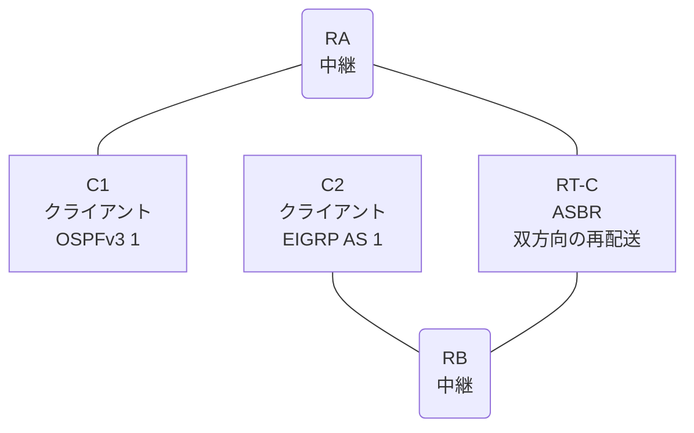

# 問題 20260814-009

> **本問は機器に接続せずに解答すること。追加の show 実行は認めない。**

## シナリオ

あなたの組織は、下記に示されているところのネットワークを運用しています。クライアントである C1 は OSPFv3 の ドメイン に、そして、C2 は EIGRP の ドメイン に、それぞれ収容されています。RT-C は、2 つの ドメイン の境界に位置しており、双方向の 再配送 が構成されています。一部の通信が、意図されているとおりに動作していない、という報告があります。あなたは、提示されているところの情報のみを使用して、要求されている状態が満たされていない理由を、特定しなければなりません。C1 と C2 は、相互に 通信 できなければなりません。明示的に許可されたところの ネットワーク のみが 再配送 される必要があります。スタティック ルート および デフォルト の ルート の 生成は、認められていません。本作業は、日中の時間帯において実施されるという理由により、対象外であるところのデバイスに対する構成の変更は、許可されていません。トランジット の リンク の ネットワークは、引き続き、対向する ドメイン において受信されなければなりません。



| ルータ | 位置づけ | 参加プロトコル |
|--------|----------|----------------|
| C1 | クライアント | OSPFv3 1 area 0 |
| RA | 中継 | OSPFv3 1 area 0 |
| RT-C | **ASBR(2 つの ドメイン の 境界)** | 双方向の 再配送 |
| RB | 中継 | EIGRP NAMED AS 1 |
| C2 | クライアント | EIGRP NAMED AS 1 |

リンク一覧:
```
  (a) C1:Et0/0         ── RA:Et0/1                  2001:DB8:AA:C::/64   C1 = 2001:DB8:AA:C::2
  (b) RA:Et0/0         ── RT-C:GigabitEthernet0/0   2001:DB8:C:2::/64
  (c) RT-C:Ethernet0/1 ── RB:Et0/0                  2001:DB8:1:1C::/64
  (d) RB:Et0/1         ── C2:Et0/0                  2001:DB8:1:10::/64   C2 = 2001:DB8:1:10::2
```

OSPFv3 の ドメイン には、RA によって注入されたところの 外部の ルート `2001:DB8:1:AA::/64` が存在する。

## 出力

```
RT-C# show running-config
Building configuration...
!
interface GigabitEthernet0/0
 description === to RA ===
 no ip address
 ipv6 address 2001:DB8:C:2::1/64
 ipv6 enable
 ipv6 ospf 1 area 0
!
interface Ethernet0/1
 description === to RB ===
 no ip address
 ipv6 address 2001:DB8:1:1C::1/64
 ipv6 enable
!
router eigrp NAMED
 !
 address-family ipv6 unicast autonomous-system 1
  !
  af-interface GigabitEthernet0/0
   shutdown
  exit-af-interface
  !
  topology base
   redistribute ospf 1 match internal metric 1000 10 255 1 1500 route-map REDIST-MAP1 include-connected
  exit-af-topology
  eigrp router-id 8.2.6.2
 exit-address-family
!
router ospfv3 1
 router-id 5.7.6.8
 !
 address-family ipv6 unicast
  redistribute eigrp 1 route-map MAP-IN include-connected
 exit-address-family
!
ipv6 prefix-list E5400 seq 5 permit 2001:DB8:1:1C::/64
ipv6 prefix-list E5400 seq 10 permit 2001:DB8:1:10::/64
ipv6 prefix-list PL-CORE seq 5 permit 2001:DB8:AA:C::/64
ipv6 prefix-list PL-CORE seq 10 permit 2001:DB8:1:10::/64
ipv6 prefix-list PL-EIGRP seq 5 permit 2001:DB8:C:2::/64
ipv6 prefix-list PL-EIGRP seq 10 permit 2001:DB8:AA:C::/64
ipv6 prefix-list PL-REDIST seq 5 permit ::/0 le 64
!
route-map MAP-IN permit 10
 match ipv6 address prefix-list E5400
route-map REDIST-MAP permit 10
 match ipv6 address prefix-list PL-EIGRP
route-map RM-OSPF permit 10
 match ipv6 address prefix-list PL-REDIST
!
```
```
C1# ping 2001:DB8:1:10::2
Type escape sequence to abort.
Sending 5, 100-byte ICMP Echos to 2001:DB8:1:10::2, timeout is 2 seconds:
.....
Success rate is 0 percent (0/5)

C2# ping 2001:DB8:AA:C::2
Type escape sequence to abort.
Sending 5, 100-byte ICMP Echos to 2001:DB8:AA:C::2, timeout is 2 seconds:

% No valid route for destination
Success rate is 0 percent (0/1)
```

## 設問

次のうち、正しいものは、どれですか。

## 選択肢
**A.**
```
RB# show ipv6 route eigrp | include ^D|^EX|via
D   ::/0 [90/1536000]
     via FE80::A8BB:CCFF:FE01:2000, Ethernet0/0
```
**B.**
```
RB# show ipv6 route eigrp | include ^D|^EX|via
(no entries)
```
**C.**
```
RB# show ipv6 route eigrp | include ^D|^EX|via
EX  2001:DB8:C:2::/64 [170/1536000]
     via FE80::A8BB:CCFF:FE01:2000, Ethernet0/0
EX  2001:DB8:AA:C::/64 [170/1536000]
     via FE80::A8BB:CCFF:FE01:2000, Ethernet0/0
```
**D.**
```
RB# show ipv6 route eigrp | include ^D|^EX|via
EX  2001:DB8:AA:C::/64 [170/1536000]
     via FE80::A8BB:CCFF:FE01:2000, Ethernet0/0
```
