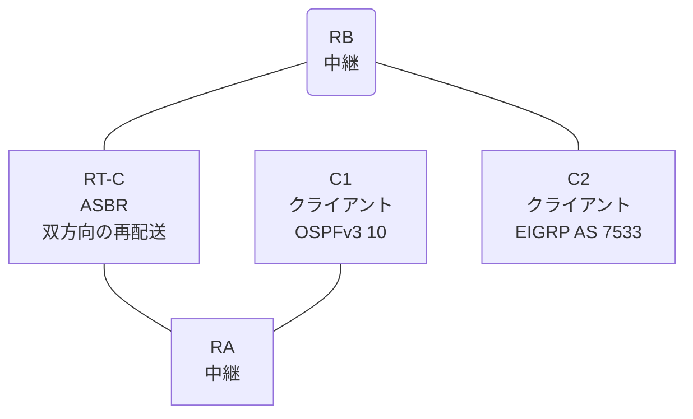

# 問題 20260814-010

> **本問は機器に接続せずに解答すること。追加の show 実行は認めない。**

## トポロジ

あなたは、ネットワークの運用を担当しています。クライアントである C1 は OSPFv3 の ドメイン に、そして、C2 は EIGRP の ドメイン に、それぞれ収容されています。RT-C は、2 つの ドメイン の境界に位置しており、双方向の 再配送 が構成されています。



| ルータ | 位置づけ | 参加プロトコル |
|--------|----------|----------------|
| C1 | クライアント | OSPFv3 10 area 0 |
| RA | 中継 | OSPFv3 10 area 0 |
| RT-C | **ASBR(2 つの ドメイン の 境界)** | 双方向の 再配送 |
| RB | 中継 | EIGRP LAB AS 7533 |
| C2 | クライアント | EIGRP LAB AS 7533 |

リンク一覧:
```
  (a) C1:Et0/0                ── RA:Et0/1                  2001:DB8:B:B::/64     C1 = 2001:DB8:B:B::2
  (b) RA:Et0/0                ── RT-C:GigabitEthernet0/0   2001:DB8:2A:1C::/64
  (c) RT-C:GigabitEthernet0/1 ── RB:Et0/0                  2001:DB8:A:B::/64
  (d) RB:Et0/1                ── C2:Et0/0                  2001:DB8:1:2A::/64    C2 = 2001:DB8:1:2A::2
```

OSPFv3 の ドメイン には、RA によって注入されたところの 外部の ルート `2001:DB8:AA:1C::/64` が存在する。

## 要件

1. C1 と C2 は、相互に 通信 できなければなりません。
2. C1 において、2001:DB8:1:2A::/64 は、タイプ 1 の 外部の ルート として受信されなければなりません。
3. 本作業は、日中の時間帯において実施されるという理由により、対象外であるところのデバイスに対する構成の変更は、許可されていません。

## 現在の状態

一部の通信が、意図されているとおりに動作していない、という報告があります。あなたは、示されているところの出力および構成に基づいて、その構成が、下記において記述されているとおりに動作していない理由を、判断する必要があります。

```
C1# ping 2001:DB8:1:2A::2
Type escape sequence to abort.
Sending 5, 100-byte ICMP Echos to 2001:DB8:1:2A::2, timeout is 2 seconds:

% No valid route for destination
Success rate is 0 percent (0/1)

C2# ping 2001:DB8:B:B::2
Type escape sequence to abort.
Sending 5, 100-byte ICMP Echos to 2001:DB8:B:B::2, timeout is 2 seconds:

% No valid route for destination
Success rate is 0 percent (0/1)
```

## 設定抜粋

```
RT-C# show running-config
Building configuration...
!
interface GigabitEthernet0/0
 description === to RA ===
 no ip address
 ipv6 address 2001:DB8:2A:1C::1/64
 ipv6 enable
 ipv6 ospf 10 area 0
!
interface GigabitEthernet0/1
 description === to RB ===
 no ip address
 ipv6 address 2001:DB8:A:B::1/64
 ipv6 enable
!
router eigrp LAB
 !
 address-family ipv6 unicast autonomous-system 7533
  !
  af-interface GigabitEthernet0/0
   shutdown
  exit-af-interface
  !
  topology base
   redistribute ospf 10 match internal metric 10000 100 255 1 1500 route-map EMAP01 include-connected
  exit-af-topology
  eigrp router-id 8.8.3.3
 exit-address-family
!
router ospfv3 10
 router-id 1.8.2.1
 !
 address-family ipv6 unicast
  redistribute eigrp 7533 route-map MAP-IN include-connected
 exit-address-family
!
ipv6 prefix-list PL-CORE seq 5 permit 2001:DB8:2A:1C::/64
ipv6 prefix-list PL-OSPF seq 5 permit 2001:DB8:1:2A::/64
ipv6 prefix-list PL-REDIST seq 5 permit 2001:DB8:B:B::/64
!
route-map EMAP01 deny 10
 match ipv6 address prefix-list PL-REDIST
route-map EMAP01 permit 20
route-map MAP-IN deny 10
 match ipv6 address prefix-list PL-OSPF
route-map MAP-IN permit 20
route-map RM-EIGRP permit 10
 match ipv6 address prefix-list PL-REDIST
!
```

## 設問

次のうち、正しいものは、どれですか。

## 選択肢
**A.**
```
RB# show ipv6 route eigrp | include ^D|^EX|via
EX  2001:DB8:B:B::/64 [170/1536000]
     via FE80::A8BB:CCFF:FE01:5100, Ethernet0/0
EX  2001:DB8:2A:1C::/64 [170/1536000]
     via FE80::A8BB:CCFF:FE01:5100, Ethernet0/0
```
**B.**
```
RB# show ipv6 route eigrp | include ^D|^EX|via
EX  2001:DB8:2A:1C::/64 [170/1536000]
     via FE80::A8BB:CCFF:FE01:5100, Ethernet0/0
```
**C.**
```
RB# show ipv6 route eigrp | include ^D|^EX|via
D   ::/0 [90/1536000]
     via FE80::A8BB:CCFF:FE01:5100, Ethernet0/0
```
**D.**
```
RB# show ipv6 route eigrp | include ^D|^EX|via
(no entries)
```
